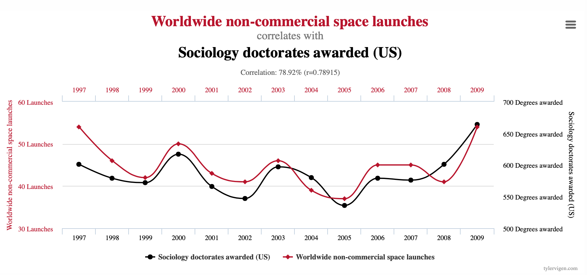
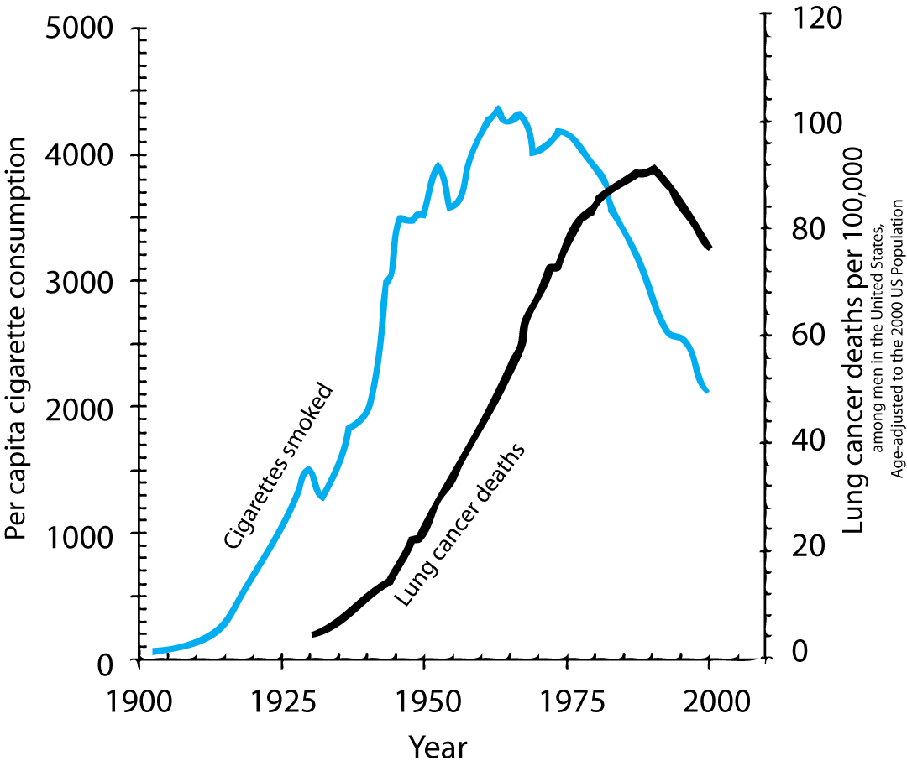

```{r setup, include=FALSE,warning=FALSE,message=FALSE}
options(htmltools.dir.version = FALSE)
knitr::opts_chunk$set(
  message = FALSE,
  warning = FALSE,
  dev = "svg",
  cache = TRUE,
  fig.align = "center",
  comment = "##"
  #fig.width = 11,
  #fig.height = 5
)

# define vars
om = par("mar")
lowtop = c(om[1],om[2],0.1,om[4])

overwrite = FALSE

library(tidyverse)
library(ggplot2)
library(dplyr)
library(png)
library(grid)
library(pander)
library(countdown)

# countdown style
countdown(
  color_border              = "#d90502",
  color_text                = "black",
  color_running_background  = "#d90502",
  color_running_text        = "white",
  color_finished_background = "white",
  color_finished_text       = "#d90502",
  color_finished_border     = "#d90502"
)
```

------------------------------------------------------------------------

## Today's Agenda

-   인과관계(Causality) vs. 상관관계(Correlation)

-   잠재 결과 프레임워크(Potential Outcomes Framework)

-   무작위 통제 실험(Randomized Controlled Trials, RCTs)

-   학급 규모(class size)와 학생 성취(student performance)에 대한 실증 분석 심화

------------------------------------------------------------------------

## 상관관계 vs. 인과관계

-   ***"상관관계는 인과관계가 아니다"***라는 말은 매우 흔하게 사용됨.\
    그런데 왜 이것이 사실인지 설명할 수 있는가?

-   **일부 상관관계는 명백히 인과관계를 의미하지 않음.**\
    (예: 가짜 상관관계 모음 [링크](https://www.tylervigen.com/spurious-correlations))

::: {style="text-align: center;"}
{width=80%}
:::


------------------------------------------------------------------------

## 상관관계 vs. 인과관계: 흡연과 폐암

-   상관관계와 인과관계를 구분하기 어려운 경우가 잦음.

-   **흡연이 폐암을 유발하는가?**

::::: columns
::: {.column width="50%"}
-   오늘날 우리는 답이 *"예(YES)"*라는 것을 알고 있음!

-   하지만 **1950년대**에는...

    -   당시 폐암 사망률이 급격히 증가하기 시작함...\
    -   … 그리고 그 이전에 **담배 소비가 빠르게 증가**했음.
:::

::: {.column width="50%"}

::: {style="text-align: center;"}

:::

:::
:::::

-   이 그래프만 보면, "흡연이 폐암을 유발한다"고 쉽게 결론 내릴 수 있음.

------------------------------------------------------------------------

## 상관관계 vs. 인과관계: 흡연과 폐암

-   하지만 당시 회의적인 사람들이 많았으며, 유명한 통계학자들조차도 이 관계를 의심했음.

::::: columns
::: {.column width="50%"}
**거시적 교란 요인 (Macro Confounding Factors)**

-   폐암을 유발할 수 있는 *다른 거시적 요인*들도 1900년\~1950년 사이에 변화했음:

    -   도로 포장(tarring of roads),
    -   자동차 배기가스(납 함유 가솔린 연기) 흡입,
    -   전반적인 대기 오염 증가.
:::

::: {.column width="50%"}
**자기 선택 편향 (Self Selection)**

-   흡연자와 비흡연자는 원래부터 다를 가능성이 있음:

    -   **관측 가능한 특징에 따른 선택(selection on observables):** 연령, 교육 수준, 소득 등.

    -   **관측 불가능한 특징에 따른 선택(selection on unobservables):** 유전자? 
:::
:::::

------------------------------------------------------------------------

## 상관관계 vs. 인과관계: 다른 예시들

::: incremental
-   ***교육 연수(years of education)*** $\rightarrow$ ***소득***?
    -   개인이 교육 수준을 선택하는 방식이 다를 수 있음. 고등 교육을 받는 사람들은 원래부터 높은 선천적 능력을 가졌거나, 학교 생활을 즐기며 학업에 강한 성향을 가질 가능성이 높음. $\rightarrow$ ***자기 선택 편향(Self-selection)***

-    ***최저임금*** $\rightarrow$ ***고용률(employment rate)***?
    -   정책 결정자들은 고용률이 높은 시기에 최저임금을 인상할 가능성이 있음. $\rightarrow$ ***역인과관계(reverse causality) / 동시성(simultaneity)***

-   ***금융 발전***  $\rightarrow$ ***경제 성장***?
    -   **경제 성장이 금융 발전을 촉진하는 것일 수도 있음** (반대로 금융 발전이 경제 성장을 유발하는 것이 아닐 가능성) $\rightarrow$ ***역인과관계(reverse causality) / 동시성(simultaneity)***
:::

------------------------------------------------------------------------

## 내생성 (Endogeneity)

::: incremental
-   개인은 자신의 **효용(utility)을 극대화(maximise)하기 위해 행동**한다면...

-   개인들은 **무작위(random ways)**로 행동하지 않음. $\rightarrow$ 즉, 개인의 행동은 **내생적(endogenous)**이라고 볼 수 있음.

-   **데이터에서 발견된 상관관계를 무조건 믿어서는 안 됨.** 언제나 *의심하는 태도*가 필요함.

-   📌 그렇다면, 어떻게 **인과적 주장(causal claims)**을 할 수 있을까?

-   **잠재 결과 프레임워크(Potential Outcomes Framework)**가 유용한 길잡이.
:::


------------------------------------------------------------------------

## 인과관계의 개념

***인과관계(Causality)***란 무엇을 의미하는가?

-   `X`가 `Y`를 *유발한다(causes)*... 의미?

-   만약 ***다른 모든 것은 그대로 둔 채*** 우리가 `X`의 값을 **변경(intervene and change)**한다면,

-   그 결과로 `Y`도 ***변화***하게 된다는 의미.

-   여기서 핵심은 **"다른 모든 것은 그대로 둔다"**는 가정임.\
    이는 흔히 **"세테리스 파리부스(ceteris paribus, all else equal)"** 가정이라고 불림.

-   **하지만,** 이것은 `X`가 `Y`를 유발하는 **유일한 요인**이라는 뜻이 아님!


# Causal Inference

------------------------------------------------------------------------

## The Potential Outcomes Framework

이 모델은 **Rubin의 인과 모델(Rubin Causal Model)**이라고도 불리며, 통계학자 **Donald Rubin**이 1970년대에 이를 일반화하고 체계화함.

-   핵심 아이디어 (Key Idea)

    -   각 개인은 **여러 개의 대체적 처치 상태(alternative treatment states)**에 노출될 수 있음.

        -   담배를 피우거나, 시가를 피우거나, 아예 피우지 않거나.
        -   소규모 학급과 대규모 학급에서 배우는 것.

-   처치 변수 $D_i$를 **이진 변수(binary variable)**로 정의 $$

::::: columns
::: {.column width="50%"}
$$
D_i = \begin{cases} 
                    1 \textrm{ if individual $i$ is treated} \\\\ 
                    0 \textrm{ if individual $i$ is not treated} 
      \end{cases}
$$
:::

::: {.column width="50%"}
***✅ Treatment group***\
all the individuals such that $D_i = 1$.

***❌ Control group***\
all the individuals such that $D_i = 0$.
:::
:::::

------------------------------------------------------------------------

## The Potential Outcomes Framework

-   이 프레임워크에서는 각 개인이 두 개의 **잠재적 결과(potential outcomes)**를 가짐. 하지만 실제로는 **하나의 관측된 결과(observed outcome)** $Y_i$만 확인 가능함.

    -   $Y_i^1$: *개인* $i$가 처치를 받았을 경우의 잠재적 결과 $(D_i = 1)$\
    -   $Y_i^0$: *개인* $i$가 처치를 받지 않았을 경우의 잠재적 결과 $(D_i = 0)$

-   현실에서는 단 하나의 결과 $Y_i$만을 관측할 수 있으며, 이는 다음과 같이 표현됨:
$$
Y_i = D_i \times Y_i^1 + (1- D_i) \times Y_i^0
$$

-   🔥 **인과 추론의 근본적인 문제 (Fundamental Problem of Causal Inference)** 어떤 개인 $i$에 대해, **두 개의 잠재적 결과 중 오직 하나만 관측할 수 있음**. [(Holland, 1986)](http://people.umass.edu/~stanek/pdffiles/causal-holland.pdf).

------------------------------------------------------------------------

## The Potential Outcomes Framework

-   관측되지 않은 잠재적 결과도 이론적으로 존재한다고 보며, 이를 **반사실적 결과(counterfactual outcome)**라고 함.

| Group | $Y_i^1$ | $Y_i^0$ |
|--------------------|:------------------------:|:------------------------:|
| **처치 그룹** $(D_i = 1)$ | ✅ **관측 가능 (Observed as** $Y_i$) | ❌ *반사실적 결과 (Counterfactual)* |
| **통제 그룹** $(D_i = 0)$ | ❌ *반사실적 결과 (Counterfactual)* | ✅ **관측 가능 (Observed as** $Y_i$) |

-   위 개념을 바탕으로, **개별 처치 효과(individual treatment effect)** $\delta_i$를 정의할 수 있음.
$$
\delta_i = Y_i^1 - Y_i^0
$$

-   $\delta_i$는 처치 $(D_i)$가 개인 $i$의 결과 변수 $Y$에 미치는 **인과적 효과(causal effect)**를 측정함.

-   ⚠️ **핵심 문제**: 개별 처치 효과 $\delta_i$는 **개인 수준에서는 절대 관측할 수 없음!** 대안: **집단 평균(population averages)**을 이용.

------------------------------------------------------------------------

## 보충 설명: 기대값 (Expectation)

-   🎲 주사위를 무한히 던지면 평균적으로 몇이 나올까?

    -   $X$가 나온 숫자를 나타내는 **확률 변수(random variable)**라 하면, 기대값(expectation)은:

$$
\mathop{\mathbb{E}}(X) = \frac{1}{6} \times 1 + \frac{1}{6} \times 2 + \frac{1}{6} \times 3 + \frac{1}{6} \times 4 + \frac{1}{6} \times 5 + \frac{1}{6} \times 6 = 3.5
$$

-   $\mathop{\mathbb{E}}(\cdot)$ 연산자는 **기대값(expectation)** 또는 **모집단 평균(population mean)**을 의미함.

-   $\mathop{\mathbb{E}}(\cdot)$ 연산자는 **선형(linear) 연산자**이므로,

$$
\mathop{\mathbb{E}}(X+Y) = \mathop{\mathbb{E}}(X) + \mathop{\mathbb{E}}(Y)
$$ 
    - 여기서 $X$와 $Y$는 두 개의 확률 변수임.

------------------------------------------------------------------------

## 보충 설명: 조건부 기대값

-   🎲 두 개의 주사위를 던질 때, 한 주사위가 5일 경우, 합의 평균은?

-   $X$가 첫 번째 주사위의 숫자를 나타내는 확률 변수, $Y$가 두 번째 주사위의 숫자를 나타내는 확률 변수라 하면:

$$
\begin{align}
\mathop{\mathbb{E}}(X+Y|Y = 5) &= \mathop{\mathbb{E}}(X|Y = 5) + \mathop{\mathbb{E}}(Y|Y = 5) \\  
&= \mathop{\mathbb{E}}(X) + 5 \\  
&= 3.5 + 5 \\  
&= 8.5  
\end{align}
$$

-   $\mathop{\mathbb{E}}(\cdot|D = x)$ 연산자는 **조건부 기대값(conditional expectation)**을 의미함. 이는 모집단 전체가 아니라, **특정 조건(**$D = x$)을 만족하는 하위 집단(subcategory)에 대한 기대값을 계산하는 것.

------------------------------------------------------------------------

## 평균 처치 효과 (Average Treatment Effect, ATE) {#ate}

-   가장 포괄적인 평균 효과

$$
\begin{align}
ATE &= \mathop{\mathbb{E}}(\delta_i) \\  
    &= \mathop{\mathbb{E}}(Y_i^1 - Y_i^0) \\  
    &= \mathop{\mathbb{E}}(Y_i^1) - \mathop{\mathbb{E}}(Y_i^0)  
\end{align}
$$

-   ATE는 단순히 **전체 모집단에서 개별 처치 효과(individual treatment effects)의 평균**을 측정하는 것.

🔗 [**부록(Appendix):**](#attandatu) 처치군에 대한 평균 처치 효과(ATT)와 비처치군에 대한 평균 처치 효과(ATU)

------------------------------------------------------------------------

## 예제: 소규모 vs. 대규모 학급

-   학생이 **소규모 학급($Y^1$)** 또는 **대규모 학급($Y^0$)**에서 수업을 들을 경우, 평균 평점(GPA, 0-10)의 잠재적 결과(potential outcomes).

::::: columns
::: {.column width="40%"}
### 📊 잠재적 결과 테이블

::: {.center}
| 학생     |  $Y^1$  |  $Y^0$  | $\delta$ |
|----------|:-------:|:-------:|:--------:|
| 1        |    5    |    2    |    3     |
| 2        |    6    |    4    |    2     |
| 3        |    3    |    6    |    -3    |
| 4        |    5    |    4    |    1     |
| 5        |   10    |    8    |    2     |
| 6        |    2    |    4    |    -2    |
| 7        |    5    |    2    |    3     |
| 8        |    6    |    4    |    2     |
| 9        |    2    |    9    |    -7    |
| 10       |    8    |    2    |    6     |
| **평균** | **5.2** | **4.5** | **0.7**  |
:::
:::

::: {.column width="60%"}
### 평균 처치 효과 (ATE) 계산

$$
\begin{align}
\color{#d90502}{\text{ATE}} &= \mathbb{E}(\delta) \\  
&=\mathbb{E}(Y^1) - \mathbb{E}(Y^0) \\  
&= 5.2 - 4.5 \\  
&= 0.7
\end{align}
$$

$\rightarrow$ **소규모 학급이 대규모 학급보다 평균적으로 GPA를 0.7점 높이는 효과**가 있음.

-   ⚠️ 하지만 모든 학생이 **동일한 처치 효과를 경험한 것은 아님!**
:::
:::::

------------------------------------------------------------------------

## 인과 추론의 문제 (The Problem of Causal Inference)

-   실제로 ATE를 계산할 때, **결측 데이터 문제(missing data problem)**가 발생함.\
    $\delta_i$를 계산할 때와 마찬가지로, **각 개인에 대해** $Y_i^1$ 또는 $Y_i^0$ 중 하나가 항상 누락됨.

-📊 데이터를 이용하면, 처치군과 통제군의 **단순 평균 차(Simple Difference in mean Outcomes, SDO)**가 계산됨.

$$
\begin{align}
SDO &= \mathop{\mathbb{E}}(Y_i^1|D_i=1) - \mathop{\mathbb{E}}(Y_i^0|D_i=0) \\  
&= \underbrace{\frac{1}{N_T}\sum_{i=1}^{N_T}(Y_i|D_i=1)}_{\text{처치군의 평균 결과}}  
- \underbrace{\frac{1}{N_C}\sum_{i=1}^{N_C}(Y_i|D_i=0)}_{\text{통제군의 평균 결과}}
\end{align}
$$

------------------------------------------------------------------------

## 단순 평균 차이 (SDO): 예제

-   🎓 **학교장이 학생을 최적의 처치 그룹에 배정한다고 가정하자.**

::: {.center}
| 학생     | $Y^1$ | $Y^0$ | $\delta$ | $Y$ | $D$ |
|----------|:-----:|:-----:|:--------:|:---:|:---:|
| 1        |   5   |   2   |    3     |    |    |
| 2        |   6   |   4   |    2     |    |    |
| 3        |   3   |   6   |    -3    |    |    |
| 4        |   5   |   4   |    1     |    |    |
| 5        |  10   |   8   |    2     |    |    |
| 6        |   2   |   4   |    -2    |    |    |
| 7        |   5   |   2   |    3     |    |    |
| 8        |   6   |   4   |    2     |    |    |
| 9        |   2   |   9   |    -7    |    |    |
| 10       |   8   |   2   |    6     |    |    |
| **평균** |       |       | **0.7**  |     |     |
:::


------------------------------------------------------------------------

## 단순 평균 차이 (SDO): 예제

-   🎓 **학교장이 학생을 최적의 처치 그룹에 배정한다고 가정하자.**

::: {.center}
| 학생     | $Y^1$ | $Y^0$ | $\delta$ | $Y$ | $D$ |
|----------|:-----:|:-----:|:--------:|:---:|:---:|
| 1        |   5   |   2   |    3     |  5  |  1  |
| 2        |   6   |   4   |    2     |  6  |  1  |
| 3        |   3   |   6   |    -3    |  6  |  0  |
| 4        |   5   |   4   |    1     |  5  |  1  |
| 5        |  10   |   8   |    2     | 10  |  1  |
| 6        |   2   |   4   |    -2    |  4  |  0  |
| 7        |   5   |   2   |    3     |  5  |  1  |
| 8        |   6   |   4   |    2     |  6  |  1  |
| 9        |   2   |   9   |    -7    |  9  |  0  |
| 10       |   8   |   2   |    6     |  8  |  1  |
| **평균** |       |       | **0.7**  |     |     |
:::

------------------------------------------------------------------------

## 단순 평균 차이 (SDO): 계산

::::: columns
::: {.column width="40%"}
| 학생     | $Y$ (관측값) | $D$ | $\delta$ |
|----------|:------------:|:---:|:--------:|
| 1        |      5       |  1  |    3     |
| 2        |      6       |  1  |    2     |
| 3        |      6       |  0  |    -3    |
| 4        |      5       |  1  |    1     |
| 5        |      10      |  1  |    2     |
| 6        |      4       |  0  |    -2    |
| 7        |      5       |  1  |    3     |
| 8        |      6       |  1  |    2     |
| 9        |      9       |  0  |    -7    |
| 10       |      8       |  1  |    6     |
| **평균** |              |     | **0.7**  |
:::

::: {.column width="60%"}
🔢 **단순 평균 차이 (SDO) 계산**

$$
\begin{align}
SDO &= \frac{5+6+5+10+5+6+8}{7} - \frac{6+4+9}{3} \\  
&\approx 6.43 - 6.33 \approx 0.1
\end{align}
$$

📌 SDO 값이 ATE(0.7)보다 작음!

📌 이러한 차이는 인과관계를 제대로 반영하지 못할 가능성이 높음.

📌 이런 "단순 비교"를 하면 안됨.
:::
:::::

------------------------------------------------------------------------

## 단순 비교의 문제점 {#naive_comp}

📌 단순 평균 차이 (SDO)를 다시 작성하여 개별 처치 효과 $(\delta_i)$가 나타나도록 변형
$$
\begin{align}
  SDO &= \mathop{\mathbb{E}}(Y_i^1|D_i=1) - \mathop{\mathbb{E}}(Y_i^0|D_i=0) \\  
  &= \mathop{\mathbb{E}}(Y_i^0 + \delta_i | D_i = 1) - \mathop{\mathbb{E}}(Y_i^0 | D_i = 0)
\end{align}
$$

✨ 가정: 모든 개인에 대해 처치 효과가 일정하다고 가정 하자. (즉, $\delta_i = \delta$) 
$$
  SDO = \delta + \mathop{\mathbb{E}}(Y_i^0 | D_i = 1) - \mathop{\mathbb{E}}(Y_i^0 | D_i = 0)
$$

그리고,
$$
ATE = \mathop{\mathbb{E}}(\delta_i) = \mathop{\mathbb{E}}(\delta) = \delta
$$

(위 가정에 의해) 따라서:
$$
\begin{equation}
  SDO = ATE + \underbrace{\mathop{\mathbb{E}}(Y_i^0 | D_i = 1) - \mathop{\mathbb{E}}(Y_i^0 | D_i = 0)}_\text{선택 편향 (Selection Bias)}
\end{equation}
$$

🔗 [**부록(Appendix)**](#naive_comp_extended): 만약 처치 효과가 일정하다는 가정이 완화되면, **추가적인 편향 항(bias term)**이 나타남.

------------------------------------------------------------------------

## Task 1 {background-color="#ffebf0"}

::: {style="position: absolute; top: -30px; right: 10px; font-size: 0.8em;"}
`r countdown(minutes = 10, top = 0)`
:::

```{r, echo = FALSE, eval = FALSE}
set.seed(1)
id = 1:10000
group = sample(c("treatment","control"), replace = T, size = 10000)
Y0 = sample(c(1:10), replace = T, size = 10000) + ifelse(group == "treatment",1,0)
delta = sample(c(1:3), replace = T, size = 10000) + 0.2*ifelse(group == "treatment",1,0)
cor(Y0, ifelse(group == "treatment",1,0))
cor(delta, ifelse(group == "treatment",1,0))
Y1 = Y0 + delta
set.seed(3)
group_random = sample(c("treatment","control"), replace = T, size = 10000)
cor(Y0, ifelse(group_random == "treatment",1,0))
cor(delta, ifelse(group_random == "treatment",1,0))

toy_data = data.frame(id, group, Y0, Y1)
toy_data <- toy_data %>%
  mutate(group_dummy = ifelse(group == "treatment", 1, 0)) %>%
  select(id, group, group_dummy, Y0, Y1)
toy_data_random = data.frame(id, group_random, Y0, Y1)
toy_data_random <- toy_data_random %>%
  mutate(group_random_dummy = ifelse(group_random == "treatment", 1, 0)) %>%
  select(id, group_random, group_random_dummy, Y0, Y1)

# fwrite(toy_data, here::here("../ScPoEconometrics/introduction/pierre_gustave/toy_data_2.csv"))
# fwrite(toy_data_random, here::here("../ScPoEconometrics/introduction/pierre_gustave/toy_data_random.csv"))
```

📂 **1. 데이터 불러오기 및 변수 생성**

-   데이터 다운로드 [링크](https://chung-jiwoong.github.io/FMB819-Slides/chapter_causality/data/toy_data_2.csv). `read.csv()`를 사용하여 데이터를 불러오기.


-   **변수 설명**

    -   `group_dummy`: 처치를 받았는지 여부 (`1 = 처치군`, `0 = 통제군`).\
    -   `Y0`: 처치를 받지 않았을 경우의 잠재적 결과 $(Y_i^0)$.\
    -   `Y1`: 처치를 받았을 경우의 잠재적 결과 $(Y_i^1)$.

-   **다음 변수들을 생성하시오.**

    -   **관측된 결과** $Y_i = D_i \times Y_i^1 + (1 - D_i) \times Y_i^0$
    -   **개별 처치 효과** $\delta_i = Y_i^1 - Y_i^0$

📊 **2. ATE 및 SDO 계산**

-   **ATE (Average Treatment Effect) 계산하시오.**
-   **SDO (Simple Difference in Mean Outcomes) 계산하시오.**
-   *Bias가 존재하는가? 크기는 얼마나 큰가?*

🔀 **3. 무작위 배정된 데이터에서 SDO 계산**

-   새로운 데이터 다운로드 [링크](https://chung-jiwoong.github.io/FMB819-Slides/chapter_causality/data/toy_data_random.csv).  이 데이터에서는 동일한 개인을 **임의로 무작위 배정(random assignment)**하였음.

-   $Y_i$ 재계산 하시오. 새로운 처치 배정에 맞춰 다시 계산해야 함.

-   **무작위 배정에서 SDO 계산**

    -   편향이 **0**에 가까운가?
    -   하지만 정확히 0이 되지 않는 이유는 무엇일까?

📌 **4. (Optional) 편향 요소 확인**

1.  **선택 편향(Selection Bias) 계산하시오.**\
2.  **이질적 처치 효과 편향(Heterogeneous Treatment Effect Bias) 계산하시오.**\
3.  아래 식이 성립하는지 확인: 
    $$
    SDO = ATE + \text{Selection Bias} + \text{Heterogeneous Treatment Effect Bias}
    $$

------------------------------------------------------------------------


## 무작위 배정(Randomization)을 통한 인과 추론 문제 해결

**📌 무작위 실험(Randomized experiments)**:\
- 사람들을 **무작위(randomly)**로 처치군과 통제군에 배정함.\
- 이 경우, 처치 배정은 **잠재적 결과(potential outcomes)와 독립적(independent)**. \ 
- 즉 $\mathbb{E}(Y_i^0 | D_i = 1)$과 $\mathbb{E}(Y_i^0 | D_i = 0)$이 서로 다를 이유가 없음. \
- 따라서, **선택 편향(selection bias)이 0이 됨**.

✅ 무작위 배정이 이루어진다면:

$$
SDO = \mathop{\mathbb{E}}(Y_i^1|D_i=1) - \mathop{\mathbb{E}}(Y_i^0|D_i=0) = ATE
$$

👉 **즉, 데이터를 이용해 직접 ATE를 추정할 수 있음!**


# Randomized Experiments

------------------------------------------------------------------------

## 무작위 실험 (Randomized Experiments)

-   흔히 **무작위 통제 실험(Randomized Controlled Trials, RCTs)**이라고 불림.

-   최초의 RCT는 **18\~19세기**에 주로 **의학** 분야에서 수행됨.

-   **20세기 초반**, 통계학자 **J. Neyman**과 **R.A. Fisher**에 의해 널리 보급됨.

-   이후 **공공정책 평가(public policy evaluation)의 신뢰할 수 있는 도구**로 점차 자리 잡음. 

-   **경제학(Economics)에서도 RCT의 영향력 증가**

    -   **2019년 노벨 경제학상(Nobel Prize in Economics)**이 RCT 연구자들에게 수여됨. [Abhijit Banerjee, Esther Duflo, Michael Kremer](https://www.economist.com/finance-and-economics/2019/10/17/a-nobel-economics-prize-goes-to-pioneers-in-understanding-poverty)\
    -   📌 *"실험적 접근을 통해 글로벌 빈곤을 완화하는 연구"*에 기여.

------------------------------------------------------------------------

## 학급 규모와 학생 성취: 예제

지난 주, **학생들의 평균 수학 또는 읽기 점수(math/reading score)를 학급 규모(class size)에 대해 회귀 분석**하였음.

$$
\textrm{math score}_i = b_0 + b_1 \textrm{class size}_i + e_i
$$

그러나 $b_1^{OLS}$는 인과관계(causal relationship)가 아니라 단순한 상관관계(association)만을 보여줌. 

📌 왜 OLS 계수 $b_1$이 인과관계를 추정할 수 없는가?

::: {.incremental}
1.  **학생의 자기 선택(Student sorting)**: 학부모들이 **작은 학급이 더 낫다**는 선입견을 가지고 있다면, 자녀를 그런 학교에 보내려고 할 것.

2.  **교사의 자기 선택(Teacher sorting)**: **작은 학급이 가르치기 더 쉬움** → 교사들은 작은 학급이 있는 학교로 이동하려 할 것. 만약 작은 학급이 있는 학교에 **경쟁이 존재한다면**, **우수한 교사(high-quality teachers)**가 더 유리할 가능성이 큼.

3.  **지역(Location effect)**: **대규모 학급**은 **부유한 대도시**에서 더 흔할 수 있음. **소규모 학급**은 **가난한 농촌 지역**에서 더 흔할 가능성이 있음.

✅ **RCT를 수행하면 이러한 모든 편향(bias)을 제거할 가눙성이 높아짐**
:::

------------------------------------------------------------------------

## 프로젝트 STAR 실험 (The Project STAR Experiment)

**테네시 학생-교사 성취 비율 실험 (Tennessee Student/Teacher Achievement Ratio Experiment)** 📖 [Krueger (1999)](http://piketty.pse.ens.fr/files/Krueger1999.pdf) 참고.

-   **테네시 주의회(Tennessee legislature)에서 총 약 1,200만 달러(\$12 million) 예산 지원**.  **1985-1986 학년도에 시작**, 총 **4년간 진행됨**.

🔬 **실험 설계**

-   **11,600명의 학생과 교사**가 **무작위로(randomly assigned)** 아래 3개 그룹 중 하나에 배정됨.  실험은 **유치원부터 3학년까지(Kindergarten \~ 3rd grade) 지속됨.**

    1️⃣ **소규모 학급**: **학생 수: 13\~17명 / 교사 1인**

    2️⃣ **일반 학급** :**학생 수: 22\~25명 / 교사 1인**

    3️⃣ **일반 학급 + 보조 교사**: **학생 수: 22\~25명 / 교사 1인 + 풀타임 보조 교사**

📊 **실험 과정**

-   **각 학교 내에서 무작위 배정(randomization within schools)** 진행.\
-   **매년 3월경 학생들의 수학(Math) 및 읽기(Reading) 능력 평가 실시**.

⚠️ **비랜덤 탈락 문제(Non-random Attrition)**

-   일부 학생들이 **무작위 배정 이후 실험에서 이탈**하는 문제 발생.\
-   **그러나 여기에서는 해당 문제를 무시함.**

------------------------------------------------------------------------

## Task 2 {background-color="#ffebf0"}

::: {style="position: absolute; top: -30px; right: 10px; font-size: 0.8em;"}
`r countdown(minutes = 10, top = 0)`
:::

1. **데이터 불러오기**: 데이터 다운로드 [링크](https://chung-jiwoong.github.io/FMB819-Slides/chapter_causality/data/star_data.csv)\
- 데이터를 `star_df` 객체에 저장. 변수 설명 [**도움말 확인**](https://rdrr.io/cran/AER/man/STAR.html).\
(📌**데이터가 재구성(reshaped)되어, 변수명 끝의 "k", "1" 등의 숫자는 무시.**)


```{r, echo=FALSE}
star_df = read_csv("https://chung-jiwoong.github.io/FMB819-Slides/chapter_causality/data/star_data.csv")
```

2. **데이터의 기본 정보 확인**

-   **관찰 단위(Unit of observation)**는 무엇인가?
-   (i) 랜덤 학급 배정(random class assignment): `star`, (ii) 학생의 학년(class grade): `grade`, (iii) 결과 변수(outcomes of interest): `read` & `math`


3. **데이터 크기 및 결측값(NA) 분석**

-   총 관측치 수는 몇 개인가? 원래는 학생별로 관측단위였는데, 학년-학생 단위로 데이터를 재구조화하였기 때문에 NA 값이 많음. 또한 `NA`는 여러 가지 이유로 실험을 떠나게 된 학생들임.


4. **결측값 처리 (NA 제거)**

-   다음 코드 실행하여 결측값이 없는 경우만 유지:

```{r, echo=TRUE}
star_df <- star_df[complete.cases(star_df),] # 또는 star_df <- na.omit(star_df)
```

5. **무작위 배정 확인 (Balancing Checks)**

-   랜덤 배정이 잘 이루어졌는지 확인하기 위해, 그룹별 기초 통계량을 계산.
-   다음 항목별 평균 비율(%)을 학년별(grade) 및 처치군별(treatment class)로 비교: 1️⃣ 여학생 비율 (percentage of girls), 2️⃣ 아프리카계 미국인 비율 (percentage of African Americans), 3️⃣ 무료 급식 대상 비율 (percentage of free lunch qualifiers)을 살펴보자.

(📌 힌트: 다음 코드로 여학생 비율 계산 가능 (dplyr 활용 필요): `share_female = mean(gender == "female") * 100`.)


------------------------------------------------------------------------

## 프로젝트 STAR 실험

✅ RCT에서 평균 처치 효과(ATE) 추정 방법

-   **무작위 통제 실험(RCT)**에서는 **처치군(treatment group)과 통제군(control group)의 결과 차이**를 이용해 **평균 처치 효과(ATE)**를 추정할 수 있음.

다음과 같은 설정:

-   **처치군(Treatment Group)**: **소규모 학급(Small class)**\
-   **통제군(Control Group)**: **일반 학급(Regular class)**\
-   **대상 학년(Grade)**: **유치원(Kindergarten, k)**


```{r, echo = FALSE}
diff_table = data.frame(
    grade = rep(c("1","2","3","k"), each = 2),
    test = rep(c("math","read"), times = 4),
    star_df  %>%
        pivot_longer(cols = c("math","read"), names_to = "test", values_to = "score") %>%
        filter(star == "regular") %>%
        group_by(grade, test) %>%
        summarise(mean_regular = round(mean(score), 3)) %>%
        ungroup() %>%
        select(mean_regular),
    star_df %>%
        pivot_longer(cols = c("math","read"), names_to = "test", values_to = "score") %>%
        filter(star == "small") %>% group_by(grade, test) %>%
        summarise(mean_small = round(mean(score), 3)) %>%
        ungroup() %>%
        select(mean_small),
    star_df %>%
        pivot_longer(cols = c("math","read"), names_to = "test", values_to = "score") %>%
        filter(star == "regular+aide") %>%
        group_by(grade, test) %>%
        summarise(mean_regular_aide = round(mean(score), 3)) %>%
        ungroup() %>%
        select(mean_regular_aide)) %>%
    mutate(
        diff_small_regular = round(mean_small - mean_regular, 3),
        diff_regular_aide_regular = round(mean_regular_aide - mean_regular, 3)
    ) %>%
    arrange(factor(grade, levels = c("k","1","2","3")))

# diff_table    
```

grade | test | mean regular | mean small | ATE
--------|---------|:---------:|:---------:|:---------:
k | math | `r round(diff_table[1,3], 2)` | `r round(diff_table[1,4], 2)` | `r round(diff_table[1,4] - diff_table[1,3], 2)`
k | read | `r round(diff_table[2,3], 2)` | `r round(diff_table[2,4], 2)` | `r round(diff_table[2,4] - diff_table[2,3], 2)`

<!-- 
| grade | test | mean regular | mean small | ATE |
|---------------|---------------|:-------------:|:-------------:|:-------------:|
| k | math | 484.45 | 493.34 | 8.9 |
| k | read | 435.76 | 441.13 | 5.37 | -->

📌 이 ATE 값들의 해석은?

📉 회귀분석(regression)으로 표현할 수 있을까?

------------------------------------------------------------------------

## RCT를 회귀 분석 형태로 표현하기

🎯 **RCT에서 결과 변수의 기본 표현**

$$
Y_i = D_i Y_i^1 + (1 - D_i) Y_i^0
$$

✨ $D_i$로 묶어주고, $Y_i^1 - Y_i^0$를 $\delta_i$로 대체하면:

$$
\begin{align} 
Y_i &= Y_i^0 + D_i (Y_i^1 - Y_i^0) \\  
&= Y_i^0 + D_i \delta_i  
\end{align}
$$

📌 $\delta_i = \delta$ (모든 $i$에 대해 동일한 처치 효과 가정)

$$
Y_i = Y_i^0 + D_i \delta
$$

🔄 **우항에** $\mathbb{E}[Y_i^0] - \mathbb{E}[Y_i^0] = 0$을 추가하면:

$$
\begin{align} 
Y_i &= \mathbb{E}[Y_i^0] + D_i \delta + Y_i^0 - \mathbb{E}[Y_i^0] \\  
&= b_0 + \delta D_i + e_i  
\end{align}
$$

여기서,\
- $b_0 = \mathbb{E}[Y_i^0]$ (통제군의 평균 결과)\
- $e_i = Y_i^0 - \mathbb{E}[Y_i^0]$ (오차항, 개별적 변동)

✅ **즉, RCT를 단순한 회귀 분석 형태로 나타낼 수 있음!**\
이제 실제 데이터에서 이를 어떻게 추정할지 살펴보자. 🚀

------------------------------------------------------------------------

## 프로젝트 STAR 실험: 회귀 분석

✅ **소규모 학급에 배정된 것이 수학 성적에 미치는 ATE를 추정해보자.**

📊 **추정할 회귀 모델**: $\text{math score}_i = b_0 + \delta \text{small}_i + e_i
$

여기서,\
$$
\text{small}_i = 
\begin{cases} 
1 \quad \text{(소규모 학급 배정)}  \\\\ 
0 \quad \text{(일반 학급 배정)}
\end{cases}
$$

```{r, echo = TRUE}
star_df_k_small <- star_df %>%
    filter(star %in% c("regular", "small") &
           grade == "k") %>% 
    mutate(small = (star == "small"))

star_df_k_small %>% count(star, grade)
```


------------------------------------------------------------------------

## 프로젝트 STAR 실험: 회귀 분석

📌 추정할 회귀 모델 $\text{math score}_i = b_0 + \delta \text{small}_i + e_i$

```{r}
# 회귀 분석 실행
lm(math ~ small, data = star_df_k_small)
```

📌 회귀 분석 계수 의미 정리: $b_0 = \mathbb{E}[Y_i^0]$ and $\delta = \mathbb{E}[Y_i | D_i = 1] - \mathbb{E}[Y_i | D_i = 0]$

-   $b_0$: 통제군(일반 학급)의 평균 수학 점수
-   $\delta$: 소규모 학급과 일반 학급의 평균 점수 차이

::::: columns
::: {.column width="50%"}

```{r, echo=TRUE}
b_0 = mean(star_df_k_small$math[star_df_k_small$small == FALSE])
b_0
```

:::

::: {.column width="50%"}
```{r, echo=TRUE}
delta = mean(star_df_k_small$math[star_df_k_small$small == TRUE]) - mean(star_df_k_small$math[star_df_k_small$small == FALSE])
delta
```
:::
:::::


------------------------------------------------------------------------

## 더미 변수를 사용한 회귀 분석: 그래프

**📌 회귀 분석의 독립 변수(regressor)는 더미 변수(dummy variable)**

```{r, echo = F, fig.height=4.75, fig.width = 8}
# 더미 변수를 숫자로 변환하여 시각화
baseline_graph <- star_df_k_small %>%
    mutate(small = ifelse(small == "TRUE",1,0)) %>%
    ggplot(aes(x = small, y = math)) +
    geom_count(alpha = .7) +
    labs(
      x = "Assigned to a small class", 
      y = "Math score", 
      size = "Number of students"
    ) +
    scale_x_continuous(
      lim = c(-.5,1.5), 
      breaks = c(0,1), 
      labels = c("0\nFALSE", "1\nTRUE")
    ) +
    theme_bw(base_size = 20) +
    theme(
      legend.position = c(0,1),
      legend.justification = c(0,1),
      legend.background = element_blank(),
      legend.key = element_blank(),
      legend.text = element_text(size = 12),
      legend.title = element_text(size = 12, face = "italic")
    ) 

baseline_graph
```

------------------------------------------------------------------------

## 더미 변수를 사용한 회귀 분석: 그래프

**📌 회귀 분석의 독립 변수(regressor)는 더미 변수(dummy variable)**

```{r, echo = F, fig.height=4.75, fig.width = 8}
# 기존 baseline 그래프에 평균값 표시 추가
baseline_graph_mean = baseline_graph + 
    stat_summary(fun = mean, colour = c("#d90502","#DE9854"), size = .75, alpha = 0.9) +
    annotate("text", x = 0.04, y = b_0 - 12, hjust = 0, 
             label = "E(Y | small = 0)", size = 5, colour = "#d90502") +
    annotate("text", x = 0.04 + 1, y = b_0 + delta + 16, hjust = 0, 
             label = "E(Y | small = 1)", size = 5, colour = "#DE9854")

# 그래프 출력
baseline_graph_mean
```

------------------------------------------------------------------------

## 더미 변수를 사용한 회귀 분석: 그래프

**📌 회귀 분석의 독립 변수(regressor)는 더미 변수(dummy variable)**


```{r, echo = F, fig.height=4.75, fig.width = 8}
# b_0 <- 484.4464  # Replace with actual value
# delta <- 8.895193  # Replace with actual value
# 회귀선(Regression Line) 추가
baseline_graph_mean + 
  geom_abline(slope = delta, intercept = b_0, linewidth = .5) +
  geom_curve(x = -0.3, xend = -0.2, y = 425, yend = b_0 - .5 * delta - 5, 
             linewidth = .5, linetype = 1, colour = "black", 
             arrow = arrow(length = unit(0.3, "cm"))) +
  annotate("text", x = -0.5, y = 415, hjust = 0, label = "Regression line", size = 5)
```

------------------------------------------------------------------------

## 더미 변수를 사용한 회귀 분석: 그래프

**📌 회귀 분석의 독립 변수(regressor)는 더미 변수(dummy variable)**

```{r, echo = FALSE, fig.height=4.75, fig.width = 8}
# b_0 <- 484.4464  # Replace with actual value
# delta <- 8.895193  # Replace with actual value
#더미 변수(small = 1 또는 small = 0)에 따른 수학 점수(Math Score) 분포 확인
star_df_k_small %>%
    mutate(small = ifelse(small == "TRUE",1,0)) %>%
    filter(math >= 475 & math <= 500) %>%
    ggplot(aes(x = small, y = math)) +
    geom_segment(aes(x = 0, xend = 1.25, y = b_0, yend = b_0), 
                 size = .5, linetype = 2, colour = "grey") +
    geom_segment(aes(x = 1, xend = 1.25, y = b_0 + delta, yend = b_0 + delta), 
                 size = .5, linetype = 2, colour = "grey") +
    geom_count(alpha = .7) +
    stat_summary(data = star_df_k_small %>%
                     mutate(small = ifelse(small == "TRUE",1,0)), 
                 fun = mean, colour = c("#d90502","#DE9854"), 
                 size = .75, alpha = 0.9) +
    geom_abline(slope = delta, intercept = b_0) +
    geom_segment(aes(x = 1.25, xend = 1.25, y = b_0, yend = b_0 + delta), 
                 size = .5, linetype = 1, colour = "black", 
                 arrow = arrow(length = unit(0.3, "cm"), ends = "both")) +
    annotate("text", x = 0.06, y = b_0 - 1, hjust = 0, 
             label = "E(Y | small = 0)", col = "#d90502", size = 5) +
    annotate("text", x = 0.5, y = b_0 + delta + .5, hjust = 0, 
             label = "E(Y | small = 1)", col = "#DE9854", size = 5) +
    annotate("text", x = 1.28, y = b_0 + (delta/2), hjust = 0, 
             parse = TRUE, label = "delta", col = "black", size = 8) +
    labs(x = "Assigned to a small class", 
         y = "Math score", 
         size = "Number of students") +
    scale_x_continuous(lim = c(-.5,1.5), 
                       breaks = c(0,1), 
                       labels = c("0\nFALSE","1\nTRUE")) +
    theme_bw(base_size = 20) +
    theme(legend.position = c(0,1),
          legend.justification = c(0,1),
          legend.background = element_blank(),
          legend.key=element_blank(),
          legend.text = element_text(size = 12),
          legend.title = element_text(size = 12, face = "italic"))
```

------------------------------------------------------------------------

## 더미 변수를 사용한 회귀 분석: 공식으로 표현

📌 회귀 모델: $\text{math score}_i = b_0 + \delta \text{small}_i + e_i$

📌 일반 학급(통제군, $small_i = 0$)에서의 기대값 $$
\begin{align} 
\mathbb{E}[\textrm{math score} | \text{small}_i = 0] 
&= \mathbb{E}[b_0 + \delta \text{small}_i + e_i | \text{small}_i = 0] \\  
&= b_0 + \delta \mathbb{E}[\text{small}_i| \text{small}_i = 0] + \mathbb{E}[e_i|\text{small}_i = 0] \\  
&= b_0  
\end{align}
$$

📌 소규모 학급(처리군, $small_i = 1$)에서의 기대값 $$
\begin{align} 
\mathbb{E}[\textrm{math score} | \text{small}_i = 1]  
&= \mathbb{E}[b_0 + \delta \text{small}_i + e_i | \text{small}_i = 1] \\  
&= b_0 + \delta \mathbb{E}[\text{small}_i| \text{small}_i = 1] + \mathbb{E}[e_i|\text{small}_i = 1] \\  
&= b_0 + \delta  
\end{align}
$$

📌 평균 처치 효과 (ATE) 계산 $$
\begin{align} 
ATE &= \mathbb{E}[\textrm{math score} | \text{small}_i = 1] - \mathbb{E}[\textrm{math score} | \text{small}_i = 0] \\  
&= b_0 + \delta - b_0 \\  
&= \delta  
\end{align}
$$

✅ **이미 알고 있었지만, 이제 이 결과가 왜 성립하는지 공식적으로 이해할 수 있음!** 🎉

------------------------------------------------------------------------

## Task 3 {background-color="#ffebf0"}

::: {style="position: absolute; top: -30px; right: 10px; font-size: 0.8em;"}
`r countdown(minutes = 10, top = 0)`
:::

1. 아래 코드를 실행하여 **1학년(grade == "1")이며, 일반 학급(regular) 또는 소규모 학급(small)에 속한 학생들만 선택**.

```{r, echo=TRUE}
star_df_clean <- star_df %>%
    filter(grade == "1" & star %in% c("small", "regular"))
```

2. 두 그룹의 평균 수학 점수 및 차이 계산 (Base R 사용)

```{r, echo=FALSE, eval = FALSE}
# 일반 학급(regular)과 소규모 학급(small) 평균 수학 점수 계산
mean_math_regular <- mean(star_df_clean$math[star_df_clean$star == "regular"])
mean_math_small <- mean(star_df_clean$math[star_df_clean$star == "small"])

# 두 그룹 간 차이 계산
diff_math <- mean_math_small - mean_math_regular

# 결과 출력
mean_math_regular
mean_math_small
diff_math
```

3. 더미 변수 생성: 소규모 학급(small) = 1 (TRUE), 일반 학급(regular) = 0 (FALSE) **힌트**: `treatment = (star == "small")`.

```{r, echo=FALSE, eval = FALSE}
star_df_clean <- star_df_clean %>%
    mutate(treatment = (star == "small"))
```

📈 4. 회귀 분석 실행

```{r, echo=FALSE, eval = FALSE}
lm_result <- lm(math ~ treatment, data = star_df_clean)
summary(lm_result)
```

❓ 5. 결과 해석: 회귀 분석 결과가 2번 질문에서 구한 평균 차이와 일치하는가?

------------------------------------------------------------------------

## RCT의 한계

✅ **RCTs는 강력한 내부 타당성(Internal Validity)을 가지며, 인과관계를 명확히 확인할 수 있음.** 하지만 몇 가지 중요한 한계점이 존재함.

-   ⚠️ **1. RCT 실행의 어려움**
    -   **RCT는 종종 실행이 불가능함.**
        -   🏦 **비용 문제**, **윤리적 문제**, **시간 제약**
-   🔍 **2. 결과 해석의 어려움**
    -   🌍 **외부 타당성(External Validity)**:
        -   특정 RCT의 결과가 다른 **국가, 인구집단 등으로 일반화 가능할까?**\
        -   연구 대상이 제한적이면 **다른 환경에서도 같은 결과가 나올까?**
    -   🔬 **메커니즘 분석의 어려움**:
        -   어떤 **메커니즘**이 작동했는지 분석하는 것이 어려울 수 있음
    -   🎲 **완벽하지 않은 무작위 배정**
        -   **실제 RCT에서는 완전한 랜덤화가 어렵고**, **이탈(Attrition) 문제가 발생할 수 있음**

✅ **RCT는 인과관계를 분석하는 강력한 도구지만, 한계를 이해하고 보완할 필요가 있음!** 🎯

------------------------------------------------------------------------

## 🚀 앞으로 배울 내용

✅ **RCT에 의존할 수 없다면?**\
- 우리는 ***실험 데이터(Experimental Data)*** 가 아닌, ***관측 데이터(Observational Data)*** 를 이용하여 **인과 추론(Causal Inference)** 을 수행할 수 있음.

📌 두 가지 주요한 경우

-   **✅ 선택이 관측 가능한 특성(Observable Characteristics)에서 발생하는 경우**
    -   **다중 회귀(Multiple Regression)** 
-   **⚠️ 선택이 관측 불가능한 특성(Unobservable Characteristics)에서 발생하는 경우**
    -   **회귀 불연속 설계(Regression Discontinuity Design, RDD)** → Optional
    -   **이중 차분법(Difference-in-Differences, DID)** → Optional

------------------------------------------------------------------------

## 🔍 인과 관계를 찾아가는 길

✅ ***데이터를 어떻게 다룰까?*** : 읽기(Read), 정리(Tidy), 시각화(Visualize)...

🚧 ***변수간 관계를 어떻게 요약할까?*** ...단순 선형 회귀(Simple Linear Regression) ...계속 학습

✅ 인과 관계(Causality)란 무엇인가?

❌ 전체 모집단을 관측하지 못하면 어떻게 할까?

❌ 우리의 연구 결과가 단순한 무작위(Randomness) 때문일 수도 있을까?

❌ 실제로 외생성을 어떻게 찾아낼 수 있을까?

------------------------------------------------------------------------


<link href="https://fonts.googleapis.com/css2?family=Pacifico&display=swap" rel="stylesheet">

::: {style="display: flex; justify-content: center; align-items: center; height: 70vh;"}
<h2 style="color: #ff6666; text-align: center; font-family: &#39;Pacifico&#39;, cursive; font-size: 50px;">

THE END!

</h2>
:::


# Appendix

---


## **처리 집단과 통제 집단에서의 평균 처치 효과** (Average Treatment on the Treated and on the Untreated) {#attandatu}

**다른 조건부(Conditional) 평균 처치 효과도 중요할 수 있음.**  

**📌 처리 집단에서의 평균 처치 효과 (ATT)** (Average Treatment on the Treated, **ATT**)  

$$
\begin{align}
 ATT &= \mathop{\mathbb{E}}(\delta_i | D_i = 1) \\
     &= \mathop{\mathbb{E}}(Y_i^1 - Y_i^0 | D_i = 1) \\
     &= \mathop{\mathbb{E}}(Y_i^1 | D_i = 1) - \mathop{\mathbb{E}}(Y_i^0 | D_i = 1)
\end{align}
$$

  - **ATT는 처치 그룹(Treatment Group)에 속한 개인들의 평균 처치 효과를 측정함.**  
  - *예제:* 직업 훈련 프로그램(**처치**)을 받은 사람들에게 미치는 효과 (**처치 그룹** 내에서 평가).


**📌 통제 집단에서의 평균 처치 효과 (ATU)**  (Average Treatment on the Untreated, **ATU**)  

$$
\begin{align}
 ATU &= \mathop{\mathbb{E}}(\delta_i | D_i = 0) \\
     &= \mathop{\mathbb{E}}(Y_i^1 - Y_i^0 | D_i = 0) \\
     &= \mathop{\mathbb{E}}(Y_i^1 | D_i = 0) - \mathop{\mathbb{E}}(Y_i^0 | D_i = 0)
\end{align}
$$

  - **ATU는 통제 그룹(Control Group)에 속한 개인들이 처치를 받았을 경우의 평균 처치 효과를 측정함.** 
  - *예제:* 사립학교(**처치**)에 다니는 것이 공립학교 학생(**통제 그룹**)에게 미칠 효과를 추정.


📌 **중요:** 대부분의 경우, **ATE ≠ ATT ≠ ATU!**  

🔙 [이전으로 돌아가기](#ate)

---


## **단순 비교의 문제점** {#naive_comp_extended}

**처치 효과가 모든 개인에게 동일하다는 가정을 완화해 보자.**  
수식을 전개하면 다음과 같은 형태로 **SDO**(Simple Difference in Outcomes)를 분해할 수 있음:

$$
\begin{align}
  SDO &= ATE + \underbrace{\mathop{\mathbb{E}}(Y_i^0 | D_i = 1) - \mathop{\mathbb{E}}(Y_i^0 | D_i = 0)}_\text{Selection bias} \\
  & \quad \quad  \quad \quad + \underbrace{(1-\pi)(ATT - ATU)}_\text{Heterogeneous treatment effect bias}
\end{align}
$$

여기서 $1 - \pi$는 **통제 그룹(Control Group)의 비율**을 의미함.  

📌 새로운 편향 요소: **개인별 처치 효과의 이질성 (Heterogeneity)** 

  1️⃣ **선택 편향(Selection Bias):**  
    - 대학에 진학하는 학생들은 **기본적인 인지 능력이 더 높을 가능성**이 높음 (대학 여부와 관계없이).  
  2️⃣ **이질적 처치 효과 편향(Heterogeneous Treatment Effect Bias):**  
    - 대학에 가는 학생들이 **대학에서 더 많은 학습 효과를 얻을 가능성**이 높음 (더 동기 부여된 학생들일 수 있음).  

🔙 [이전으로 돌아가기](#naive_comp)

