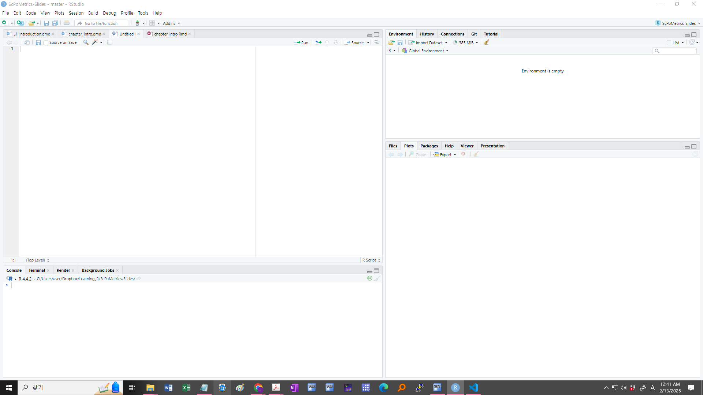

```{r setup, include = FALSE, warning = FALSE, message = FALSE}
options(htmltools.dir.version = FALSE)
knitr::opts_chunk$set(
  message = FALSE,
  warning = FALSE,
  dev = "svg",
  cache = TRUE,
  fig.align = "center",
  comment = "##"
  #fig.width = 11,
  #fig.height = 5
)

# Load packages
library(tidyverse)
library(pander)
library(ggthemes)
library(gapminder)
library(countdown)
library(xaringanExtra)

```

## Welcome to FMB 819!

-   수업의 목표

    1.  통계 소프트웨어 R과 친숙해지고,
    2.  데이터를 수집, 가공, 표현할 수 있으며
    3.  기본적 통계 개념 이해하여
    4.  데이터 분석의 결과를 해석할 수 있다.


    

------------------------------------------------------------------------

## 데이터 분석의 목표

1.  **기술 요약(Description)**: 현상을 설명
2.  **예측(Prediction)**: 관측되지 않는 값을 예측
3.  **인과 관계(Causality)**: 한 변수가 다른 변수에 미치는 영향 분석

-   많은 경우 의사 결정을 위해서 기술/예측/인과 관계를 조합적으로 파악할 필요

------------------------------------------------------------------------

## `R`이란?

-   `R`은 강력한 통계 및 그래픽 기능을 갖춘 **프로그래밍 언어**.

    1.  **무료**이며 **오픈소스(open source)**
    2.  **유연하고 강력함** → 데이터 정리, 시각화, 기계학습 등 거의 모든 분석 가능.\
    3.  [활발한 온라인 커뮤니티](https://stackoverflow.com/questions/tagged/r), 대부분의 문제에 대한 해결책 존재.

-   `R`의 많은 기능들 중 우리가 주로 사용할 기능
    -   **데이터 수집**: 웹에서 데이터 직접 불러오기
    -   **데이터 가공**: 데이터 정리, 변환, 요약
    -   **데이터 시각화**: 고급 그래프와 차트 생성
    -   **통계 분석**: 회귀분석, 가설검정 등 다양한 통계 기법 적용
---

## 금융 데이터의 현실

-   **데이터의 폭발적 증가:** 틱(Tick) 데이터, 대체 데이터(Alternative Data), 비정형 뉴스 텍스트 등 엑셀로 처리하기 힘듬.
-   **엑셀의 치명적 한계:**
    -   **인적 오류:** 복잡한 수식과 매크로는 추적이 어려움.
    -   **재현성(Reproducibility) 부족:** 데이터 업데이트 시 매번 수작업으로 복사/붙여넣기를 반복.
-   강력한 통계 엔진과 프로그래밍이 결합된 **R**이 유용.

---

## 1. 완벽한 재현성과 업무 자동화

-   R은 "데이터 수집 → 전처리 → 분석 → 시각화 → 보고서 작성"의 전 과정을 **하나의 코드 파이프라인**으로 통합.

```{r eval=TRUE, echo=TRUE, fig.width=8, fig.height=4, fig.align="center"}
library(tidyquant)
# 1. 삼성전자(005930.KS) 최근 1년 주가 수집
samsung <- tq_get("005930.KS", from = Sys.Date() - 365)
# 2. ggplot을 이용한 시각화 (autoplot 대신 사용)
samsung %>%
  ggplot(aes(x = date, y = close)) +
  geom_line(color = "darkblue", linewidth = 1) +
  labs(title = "Samsung (recent 1 year)", 
       x = "Date", 
       y = "Close Price (KRW)") +
  theme_tq() # 금융 데이터에 어울리는 깔끔한 테마
```

---

## 2. 금융에 적합한 생태계

파이썬(Python)이 범용 프로그래밍 언어라면, **R은 통계와 데이터 분석을 위해 만든 '데이터를 위한 언어'**

-   퀀트 투자, 리스크 관리, 알고리즘 트레이딩 분야에서 광범위하게 사용.
-   **강력한 금융 생태계:** 수백 개의 전용 패키지 존재.
    -   시계열 분석 (`xts`, `zoo`)
    -   재무 데이터 처리 (`tidyquant`, `quantmod`)
    -   포트폴리오 최적화 (`PortfolioAnalytics`) 등
    -   기타 금융 관련 패키지들 <https://cran.r-project.org/web/views/Finance.html>

---

## 3. 시각화 및 커뮤니케이션

-   **ggplot2** R의 시각화 생태계는 글로벌 언론사(NYT, BBC 등)와 헤지펀드에서 사용할 만큼 유연하고 미려함.
-   **Quarto** 분석한 결과를 클릭 한 번으로 PDF, HTML, PPT 보고서로 변환 (지금 보는 이 슬라이드처럼).
-   **Shiny**를 통해 직접 조작해볼 수 있는 '인터랙티브 웹 대시보드' 구축.

---


## Finance MBA가 R을 무기로 삼아야 하는 이유

1.  단순 엑셀 모델러를 넘어, 대용량 데이터를 다루는 역량.
2.  수작업 리포팅에 낭비되는 시간을 줄이고, 중요한 문제에 시간을 쏟을 수 있음.
3.  최신 통계 및 기계학습 모델을 금융 데이터에 즉각적으로 적용 가능.


------------------------------------------------------------------------

## R / RStudio 설치 시 주의사항 (한글 경로 이슈)

### **사용자 폴더 경로에 한글/특수문자(non-ASCII) 들어가면** R/RStudio 패키지 설치 과정에서 이유 모를 오류 뜨는 경우 있음

- 예: `C:\Users\홍길동\...` 처럼 **프로필 경로에 한글** 들어간 케이스

### 제일 안전한 예방책: 영문 사용자 계정으로 설치/사용
- 설치 전에 **Windows 사용자 폴더 경로** 확인
  - `C:\Users\사용자이름\...`
- 사용자 이름(프로필 폴더명)에 한글 들어가 있으면
  - **영문 이름 새 계정(가능하면 관리자 권한)** 하나 만들고
  - 그 계정으로 R/RStudio 설치·사용
- 주의할 점 있음: Windows에서 “표시 이름”만 바꿔도 실제 **프로필 폴더명은 그대로**인 경우 많음  
  → 그래서 **새 계정 생성**이 더 확실함
- 프로젝트/과제 폴더를 영문 경로에 두는 게 안전
  - 예: ~/projects/finance_mba/ (폴더명 영문/숫자/언더스코어)
  

------------------------------------------------------------------------

## `R` 설치 방법 (Windows / macOS)

-   **Windows: 공식 웹사이트에서 다운로드하여 설치**

    1.  [CRAN 공식 웹사이트](https://posit.co/download/rstudio-desktop/)에 접속
    2.  "Download R for Windows" 클릭
    3.  "base" 패키지를 선택하고 최신 버전을 다운로드
    4.  `.exe`파일 실행 후 기본 설정으로 설치

-   **macOS: 공식 웹사이트에서 다운로드하여 설치**

    1.  [CRAN 공식 웹사이트](https://posit.co/download/rstudio-desktop/)에 접속
    2.  "Download R for macOS" 클릭
    3.  본인 칩셋(Apple Silicon / Intel)에 맞는 설치 파일 다운로드
    4.  `.pkg` 파일 실행 후 기본 설정으로 설치


------------------------------------------------------------------------

## `RStudio` 설치 방법 (Windows / macOS)

R 프로그래밍 언어를 위한 통합 개발 환경(IDE, Integrated Development Environment)

-   **공식 웹사이트에서 다운로드하여 설치 (Windows/macOS 공통)**

    1.  [CRAN 공식 웹사이트](https://posit.co/download/rstudio-desktop/) 접속
    2.  "RStudio Desktop"의 선택하여 다운로드
    3.  다운로드한 설치 파일 실행 후 기본 설정으로 설치
    4.  설치 완료 후 RStudio 실행하여 정상 작동하는지 확인


------------------------------------------------------------------------

## 설치가 어려울 때: Posit Cloud(온라인)

로컬 설치가 어렵거나 권한 문제가 있을 경우, 브라우저에서 바로 R을 실행할 수 있음.

1.  [Posit Cloud](https://posit.cloud/)에 접속 후 회원가입/로그인
2.  `New RStudio Project`를 눌러 새 프로젝트 생성
3.  좌측 `Files`/`Console`/`Terminal`을 이용해 로컬 RStudio처럼 실습 진행

------------------------------------------------------------------------

## 설치 확인

설치가 정상적으로 완료되었는지 확인하기 위해 R과 RStudio 실행.

1.  **RStudio 실행**

    -   Windows는 검색창, macOS는 Spotlight(`Command + Space`)에서 "RStudio" 검색 후 실행.
    -   콘솔에서 `version` 입력하여 설치된 R 버전 확인.

    ```{r, echo=F, eval=F}
    version
    ```

2.  **R에서 간단한 코드 실행**

    -   다음 코드를 console에서 실행하여 정상 동작하는지 확인.

    ```{r, echo=T, eval=T}
    print("R과 RStudio 설치 완료!")
    ```

------------------------------------------------------------------------

## R 및 RStudio 업데이트 방법

- R 엔진(코어)과 RStudio(편집기)는 별개 프로그램이므로 각각 따로 업데이트해야 함.

::::: columns
::: {.column width="50%"}
**1. R 엔진 업데이트**

- **Windows:** `installr` 패키지 활용 (오류 방지를 위해 RStudio가 아닌 기본 R GUI에서 실행하는 것을 권장)
  ```r
  install.packages("installr")
  installr::updateR()
  ```
- **Mac:** [CRAN 홈페이지](https://cran.r-project.org/)에 접속해서 최신 `.pkg` 버전을 다운로드하고 그대로 덮어씌워서 설치함.
:::

::: {.column width="50%"}
**2. RStudio 업데이트**

- RStudio 상단 메뉴: **Help** -> **Check for Updates** 클릭함.
- 업데이트 팝업창이 뜨면 안내에 따라 최신 버전 다운로드 및 설치 진행함.


<br>

**3. 패키지 일괄 업데이트 (중요 포인트)**

- R 버전을 올리고 나면 기존에 깔아둔 패키지들도 버전에 맞게 새로고침 해줘야 에러가 안 남.
  ```r
  update.packages(ask = FALSE, checkBuilt = TRUE)
  ```
:::
:::::

---

## `RStudio` 화면 구조

<!-- ```{r, echo = F, out.width = "300px"}

``` -->

{fig-align="center" width="85%"}

------------------------------------------------------------------------

## `RStudio` 환경

RStudio를 실행하면 여러 창(윈도우)으로 구성되어 있음.

-   **콘솔(Console)**: 명령어를 입력하고 실행하는 창. `>` 프롬프트에서 R 코드 입력 후 실행

-   **스크립트 편집기 (Source Editor)**: `.R` 파일을 열거나 작성. 여러 줄의 코드를 작성/실행 가능

-   **환경 창 (Environment)**: 현재 사용 중인 변수와 데이터 프레임을 확인. 데이터 구조를 파악

-   **파일 및 플롯 창 (Files, Plots, Packages, Help)**

    -   **Files**: 작업 디렉터리 내 파일 목록 확인
    -   **Plots**: 생성된 그래프 확인
    -   **Packages**: 설치된 패키지 목록 및 관리
    -   **Help**: R 함수 및 패키지 도움말 검색 가능

------------------------------------------------------------------------

## 콘솔과 프롬프트

-   기본적인 실행 방법

    -   `>` 뒤에 명령어 입력 후 `Enter`를 누르면 실행.

    ```{r, echo=T}
    2 + 2 
    ```

-   R 콘솔 사용 팁

    -   **이전 명령어 불러오기**: 위쪽 화살표(`↑`) 키를 사용하면 이전에 입력한 명령어를 불러옴

    -   **명령어 자동 완성**: Tab 키를 사용하여 변수 및 함수 자동 완성 가능.

    -   **여러 줄 입력**:

        -   긴 명령어 입력 시 자동으로 다음 줄로 넘어감 (`+` 기호 표시됨).
        -   `Shift + Enter`를 누르면 줄바꿈만 하고 실행되지 않음.

        ```{r, echo=T}
        x <- 10 +       # Shift + Enter 
               20 +     # Shift + Enter 
               30       # Shift + Enter
        print(x)
        ```

------------------------------------------------------------------------

## `R` 스크립트 (Script)

-   **새로운 R 스크립트 생성**: `File > New File > R Script` 선택.
-   **스크립트에서 코드 실행**:
    -   `Ctrl + Enter`: 현재 줄 실행.
    -   `Ctrl + Alt + R`: 전체 스크립트 실행.
-   **주석 작성**: `#` 을 사용하여 코드 설명 추가 가능.

```{r, echo=T}
# 변수 선언
a <- 5
b <- 10

# 변수 더하기
c <- a + b
print(c)  # 결과: 15
```

---

## 몇 가지 유용한 설정

### 배경 및 글자 색상 변경

- R 스튜디오는 기본적으로 흰색 바탕에 검은색 글씨. 어두운 화면으로 설정을 변경 가능
  - RStudio 상단 메뉴: **Tools** -> **Global Options** -> **Appearance** 탭에서 테마 선택 가능 (예: "Tomorrow Night Bright" 등 어두운 테마)

### 스크림트 한글 깨짐 방지

- 스크립트 내용 중 한글이 깨지는 것을 방지하기 위해 인코딩 방식을 설정
  - RStudio 상단 메뉴: **Tools** -> **Global Options** -> **Code** 탭에서 "Saving" 섹션의 "Default text encoding"을 "UTF-8"로 설정
  - 한글 깨짐이 해결되지 않는 경우, [File → Reopen with Encoding] 메뉴에서 [UTF-8] 항목을 선택
  - [Set as default encoding for source files] 항목을 선택한 후 [OK]. UTF-8로 인코딩이 설정된 후 파일을 다시 열림
  

---

## 몇 가지 유용한 설정

### 프로젝트 만들기

- 코딩 전에 **Project 만들면** 해당 과제/분석에 쓰는 코드·이미지·문서 파일을 **한 폴더 체계로 관리** 가능
    - RStudio 상단 **육각형(Project) 버튼** 누르거나 `File → New Project` 클릭함
      - `Create Project`에서 `New Directory` 선택함  
      - `Project Type`에서 `New Project` 클릭함
      - `Directory name`에 프로젝트 이름 입력함
      - `Create project as subdirectory of`에서 프로젝트 폴더 만들 위치 선택함 (`Browse`로 고르면 됨)
      - 아래 `Create Project` 클릭하면 RStudio가 재시작되면서 프로젝트 이름이 우측 상단에 표시되고, 파일 창도 프로젝트 폴더로 이동됨. 폴더 안에 `*.Rproj` 파일도 생성됨 (예: `fmb819.Rproj`). 이후 스크립트/데이터/이미지 전부 프로젝트 폴더에 저장하면서 작업하면 됨.
      - 프로젝트 이름/폴더 경로에 한글 들어가면 오류 날 수 있으니 영문 추천


------------------------------------------------------------------------

## Task 1 {background-color="#ffebf0"}

1.  새로운 R 스크립트를 생성하시오 (`File > New File > R Script`) 파일을 `lecture_intro.R`로 저장하시오.

2.  다음 코드를 스크립트에 입력하고 실행하시오. 코드를 실행하려면 `Ctrl` + `Enter` (코드를 강조 표시하거나 커서를 코드 줄 끝에 놓으면 실행).

    ``` r
    4 * 8
    ```

3.  첫 번째 줄만 실행하면 무슨 일이 일어나는지 확인하시오. (객체 생성)

    ``` r
    x = 5 # 또는 x <- 5
    x
    ```

4.  `x`의 세제곱을 할당하는 `x_3`이라는 새로운 객체를 만드시오. 할당할 때 `=` 또는 `<-`를 사용.

------------------------------------------------------------------------

## 도움말 찾는 방법

`R` built-in `help`:

``` r
?lm  # 함수 앞에 ?를 붙이면 해당 함수의 도움말(설명서)을 확인할 수 있음

help(lm)   # help() 함수도 동일한 역할을 하며, 특정 함수의 도움말을 출력함

args(lm)  # lm 함수의 인자(argument) 목록을 출력함

example(lm)  # lm 함수의 사용 예제(example)를 실행하여 출력함

??lm  # "lm"과 관련된 모든 도움말 문서를 검색하여 표시함
```

{width="60%"}

------------------------------------------------------------------------

## 패키지 (Packages)

-   `R` 패키지는 특정 기능을 제공하는 코드와 데이터를 포함한 소프트웨어 패키지

-   패키지 설치는 간단. `install.packages` 함수를 사용:

    ``` r
    install.packages("ggplot2")
    ```

-   패키지의 내용을 사용하려면, Library에서 불러와야 함. 이를 위해 `library` 함수를 사용:

    ``` r
    library(ggplot2)
    ```

-   업데이트 하려면

    ``` r
    update.packages(ggplot2)
    ```


# 데이터 형태 (Data Type)

------------------------------------------------------------------------

## 데이터 형태 (Data Type)

- R에서 데이터를 원활하게 다루기 위해 가장 먼저 알아야 할 것은 데이터의 형태(Type)임. 
- 금융 데이터 분석에서는 주로 숫자, 문자열, 날짜 형태를 다룸.

---

## 숫자 형태

R에서 기본적으로 다루는 숫자 데이터는 실수(Double) 형태임.

```{r, echo=T, eval=F}
dbl_var = c(1, 2.5, 4.5)
typeof(dbl_var)
```
```{r, echo=T, eval=F}
int_var = c(1L, 6L, 5L)
typeof(int_var)
```
- 숫자 뒤에 L을 붙이면, 정수(Integer) 형태의 숫자가 만들어짐.

- 수열 (*range*) 생성

```{r, echo=T, eval=F}
1:10
10:1
seq(0:10)
seq(0, 10, by=2.5)
seq(0, 10, length=5)
rep(1:5, each=1)
rep(1, 5)
```

---

## 문자열 형태

---


# 데이터 구조 (Data Structures)

---


---

## 벡터 (Vectors)

-   `c` 함수를 사용하여 벡터, 즉 *1차원 배열*을 생성.

```{r, echo=T}
c(1, 3, 5, 7, 8, 9)
```

-   여러 형태의 요소를 벡터로 만들 수 있음. 모두 문자로 변환

```{r, echo=T}
(v <- c(42, "Statistics", TRUE))
```

```         
* 소괄호: 객체 값을 바로 출력    
```

-   변수 목록보기/삭제하기

```{r, echo=T}
ls()
rm()
```

-   벡터의 결합

```{r, echo=T}
v1 <- c(1, 2, 3)
v2 <- c(4, 5, 6)
c(v1, v2)
```


------------------------------------------------------------------------

## 비교 논리 연산

```{r, echo=T}
x <- 1
x < 2

x/0

-x/0

0/0
```

**Scalar vs. Scalar 비교**

```{r, echo=T}
a <- 3
a == pi

a != pi

a > pi

a <= pi
```

**Vector vs. Vector 비교**

```{r, echo=T}
v <- c(0, pi, 4)
w <- rep(pi, 3)
v == w

v != w

v < w

v >= w
```

**Scalar vs. Vector 비교**

```{r, echo=T}
v == pi

v > pi

any(v == pi)

all(v == 0)

```

------------------------------------------------------------------------

## 비교 논리 연산

**is.*() 함수 : 개체의 속성을 묻는 함수**

```{r, echo=T}
u <- c(3, pi, Inf, NULL, NaN, NA)

is.finite(u)

is.infinite(u)

is.na(u)

is.nan(u)

is.null(u)
```

-   `NULL`은 완전히 비어 있는 값으로, 벡터에 포함될 경우 자동으로 삭제됨.

-   `na`는 not available, `nan`는 not a number (예, 0/0, sqrt(-1)).

-   `nan`은 숫자형 결측값, `na`는 모든 종류의 결측값이라 생각하면 됨.

------------------------------------------------------------------------

## 인덱스의 활용

-   대괄호 연산자 `[index]`를 사용하여 벡터 요소 위치 지정. 제외하고 싶은 원소의 인덱스는 음수 $-$로.

```{r, echo=T}
fib <- c(0,1,1,2,3,5,8)

fib[1]

fib[1:3]

fib[c(1,2,4)]

fib[-1]

fib[c(-1,-2)]

fib < 5

fib[fib < 5]
```

-   `which()`: 조건에 해당하는 인덱스를 찾아줌

```{r, echo=T}
which(fib == 0)

which(fib > 2)

which.max(fib)

which.min(fib)
```

------------------------------------------------------------------------

## R 연산자 정리

**1. 기초 연산자 (Arithmetic Operators)**

| 연산자        | 설명        | 예제      | 결과     |
|---------------|-------------|-----------|----------|
| `+`           | 덧셈        | `5 + 3`   | `8`      |
| `-`           | 뺄셈        | `5 - 3`   | `2`      |
| `*`           | 곱셈        | `5 * 3`   | `15`     |
| `/`           | 나눗셈      | `5 / 3`   | `1.6667` |
| `^` 또는 `**` | 거듭제곱    | `5^3`     | `125`    |
| `%%`          | 나머지      | `5 %% 3`  | `2`      |
| `%/%`         | 정수 나눗셈 | `5 %/% 3` | `1`      |

**2. 관계 연산자 (Comparison Operators)**

| 연산자 | 설명 | 예제     | 결과    |
|--------|------|----------|---------|
| `==`   | 같음 | `5 == 3` | `FALSE` |
| `!=`   | 다름 | `5 != 3` | `TRUE`  |
| `>`    | 초과 | `5 > 3`  | `TRUE`  |
| `<`    | 미만 | `5 < 3`  | `FALSE` |
| `>=`   | 이상 | `5 >= 3` | `TRUE`  |
| `<=`   | 이하 | `5 <= 3` | `FALSE` |

**3. 논리 연산자 (Logical Operators)**

| 연산자 | 설명               | 예제                               | 결과         |
|---------------------|-----------------|-----------------|-----------------|
| `&`    | AND (벡터 연산)    | `c(TRUE, FALSE) & c(TRUE, TRUE)`   | `TRUE FALSE` |
| `|`    | OR (벡터 연산)     | `c(TRUE, FALSE) | c(FALSE, FALSE)` | `TRUE FALSE` |
| `!`    | NOT                | `!TRUE`                            | `FALSE`      |
| `&&`   | AND (단일 값 연산) | `TRUE && FALSE`                    | `FALSE`      |
| `||`   | OR (단일 값 연산)  | `TRUE || FALSE`                    | `TRUE`       |

```{=html}
<!--
& 둘 다 TRUE이면 TRUE
| 하나라도 TRUE이면 TRUE
-->
```

------------------------------------------------------------------------

## `data.frame`

`data.frame`은 **표 형식(tabular)의 데이터**를 나타냄. 엑셀 스프레드시트와 유사.

```{r, echo=T}
example_data = data.frame(x = c(1, 3, 5, 7),
                          y = c(rep("Hello", 3), "Goodbye"),
                          z = c("one", 2, "three", 4))
example_data
```

-   `data.frame`은 *행(rows)* 과 *열(columns)* 의 두 가지 차원을 가짐. *행렬(matrix)* 과 유사하며, `[row_index,col_index]` 형식으로 요소를 선택 가능.

```{r, echo=T}
example_data[2,2]
```

-   실제로는 `data.frame`을 직접 생성하기보다는, 데이터를 포함하는 파일을 `R`로 불러오는 방식이 일반적.

------------------------------------------------------------------------

## `data.frame`

Dataframe을 설명하는 데 유용한 함수

```{r, echo=T}
str(example_data) # `str` 함수는 R 객체의 구조를 설명
```

```{r, echo=T}
names(example_data) # column names
```

```{r, echo=T}
nrow(example_data) # number of rows
```

```{r, echo=T}
ncol(example_data) # number of columns
```

------------------------------------------------------------------------

## Task 2 {background-color="#ffebf0"}

```{r, echo=F}
murders <- read.csv("https://raw.githubusercontent.com/chung-jiwoong/FMB819-Slides/main/data/gun_murders.csv")
```

1.  `help(read.csv)` 또는 웹서치를 통해 R에서 `.csv` 파일을 가져오는 방법을 찾아보시오. 단, "Import Dataset" 버튼을 사용하거나 패키지를 설치하지 마시오.

2.  [gun_murders.csv](https://raw.githubusercontent.com/chung-jiwoong/FMB819-Slides/main/data/gun_murders.csv) 파일을 새로운 객체 `murders`에 저장하시오. 이 파일은 2010년 미국 주별 총기 살인 사건 데이터를 포함. (힌트: 객체는 `=` 또는 `<-`를 사용하여 생성)

3.  `murders`가 `data.frame` 형식인지 확인하시오: `class(murders)`

4.  `murders`에 포함된 변수를 확인하시오:

5.  작업 공간에서 `murders`를 클릭하여 내용을 확인하시오 `total` 변수는 무엇을 의미하는 것일까?

------------------------------------------------------------------------

## 데이터프레임 열 (column) 접근하기

-   한 개의 열을 **벡터 형태로 추출**하려면 `$` 연산자 (`murders$state`) 또는 대괄호 연산자 `[which_index]`를 이름이나 위치 인덱스와 함께 사용할 수 있음:

```{r, echo=T}
first5 <- murders[1:5, ]  # 처음 5개 주만 선택
first5$state  # $ 연산자로 추출
first5[ ,"state"]  # 열 이름으로 추출
first5[ ,1] # 첫 번째 열 가져오기
```

-   객체의 `class` 확인 (데이터구조):

```{r, echo=T}
class(murders)
```

-   `typeof` 함수: 데이터 저장 방식

```{r, echo=T}
typeof(murders)
```

<!-- .footnote[ -->

<!-- ```{r} -->

<!-- x <- c(1, 2, 3)  # 숫자 벡터 -->

<!-- class(x)   # 벡터의 추상적 유형 -->

<!-- typeof(x)  # 내부 저장 방식 -->

<!-- ``` -->

<!-- ] -->

------------------------------------------------------------------------

## `data.frames`: subset

-   데이터프레임에서 특정 부분을 선택하려면 `murders[행 조건, 열 번호]` 또는 `murders[행 조건, "열 이름"]`을 사용.

```{r, echo=T}
# 총기 살인 사건이 500건 이상인 주만 선택하고 "state"와 "total" 변수만 유지
murders[murders$total > 500, c("state", "total")]
    
# 캘리포니아와 텍사스만 선택하고 "state"와 "total" 변수만 유지
murders[murders$state %in% c("California", "Texas"), c("state", "total")]
```

-   `subset` 명령어 사용 가능 (종종 더 직관적)

``` r
subset(murders, total > 500, select = c(state, total))
subset(murders, state %in% c("California", "Texas"), select = c(state, total))
```

------------------------------------------------------------------------

## Task 3 {background-color="#ffebf0"}

1.  `murders` 데이터프레임에는 몇 개의 관측값(observations)이 있는가?

2.  몇 개의 변수? 각 변수의 데이터 유형(data type)은 무엇인가?

3.  "`:`" 연산자는 `1:10`처럼 사용하면 *1부터 10까지의 연속된 숫자 생성*을 의미함. 이를 활용하여 `murders`의 10번부터 25번 행을 포함하는 새로운 객체 `murders_2`를 만드시오.

4.  `state`와 `total` 열만 포함하는 `murders_3` 객체를 만드시오. (`c` 함수가 벡터를 생성함)

5.  아래 코드를 실행하여 10,000명당 살인 사건 수를 나타내는 `total_percap` 변수를 생성하시오.

``` r
murders$total_percap = (murders$total / murders$population) * 10000
```

`murders` 객체를 클릭하여 새 변수를 확인해 보시오.

# 강의 관련 정보

------------------------------------------------------------------------

## 성적 산출

1.  수업에서 **in-class assignment (`task`)** 를 완성해서 제출 $\rightarrow$ 30%: 과제당 점수: 30/과제 개수

2.  **기말 시험** $\rightarrow$ 70%

3.  출석은 확인하지 않음.

4.  보통 A는 30%이내 (A+는 아주 뛰어난 경우), C는 총점 50점 미만의 경우, D/F 는 아주 저조한 경우

------------------------------------------------------------------------

## 수업 정책

<p style="text-align: center; font-weight: bold; font-size: 1.5em;">

Be nice. Be honest. Don't cheat.

</p>

<br>

-   **숙제는 늦게 제출하면 안됨**: 수업 당일 저녁 11시까지 LMS에 제출

-   **부정행위 및 타인의 과제 무단 활용 금지**: C나 F 중 불리한 등급 받게 됨

-   **그룹으로 협력**: 협력 장려, 다만 개인이 작성하여 제출

------------------------------------------------------------------------

## 과제 제출 방법

Quarto Document로 작성 LMS에 제출.

#### 1. 새 Quarto 문서 생성

-   RStudio에서 **File → New File → Quarto Document...** 선택
-   title과 포맷(HTML) 선택 후 **Create** 버튼 클릭
-   생성된 `.qmd` 파일에서 문서를 작성.

#### 2. 과제 템플릿 예시

-   다음 양식을 이용하여 과제 제출: [과제 양식 링크](https://github.com/chung-jiwoong/FMB819-Slides/blob/main/chapter_intro/tasks/intro_tasks.qmd)

-   과제 작성 후 적당한 곳에 저장, 예: `C:\Users\user\Documents\assignment\assign1.qmd`

#### 3. Quarto 문서 렌더링

-   RStudio에서 **Render 버튼** 클릭

-   HTML 문서가 생성됨 (`홍길동.html` 생성됨)

#### 4. 과제 제출

-   Quarto 문서와 함께 출력된 HTML 문서를 LSM시스템에 업로드

------------------------------------------------------------------------

## 강의 계획

주제 1: ***Introduction***

주제 2: ***Tidying, Visualising and Summarising Data***

주제 3: ***Simple Linear Regression***

주제 4: ***Introduction to Causality***

주제 5: ***Multiple Linear Regression***

주제 6: ***Linear Regression Extensions***

주제 7: ***Sampling***

주제 8: ***Confidence Intervals and Hypothesis Testing***

주제 9: ***Statistical Inference***

주제 10: ***Difference-in-Differences*** (Optional)

주제 11: ***Regression Discontinuity Deisign*** (Optional)

주제 12: ***Instrumental Variables*** (Optional)


------------------------------------------------------------------------

<link href="https://fonts.googleapis.com/css2?family=Pacifico&display=swap" rel="stylesheet">

::: {style="display: flex; justify-content: center; align-items: center; height: 70vh;"}
<h2 style="color: #ff6666; text-align: center; font-family: &#39;Pacifico&#39;, cursive; font-size: 50px;">

THE END!

</h2>
:::
