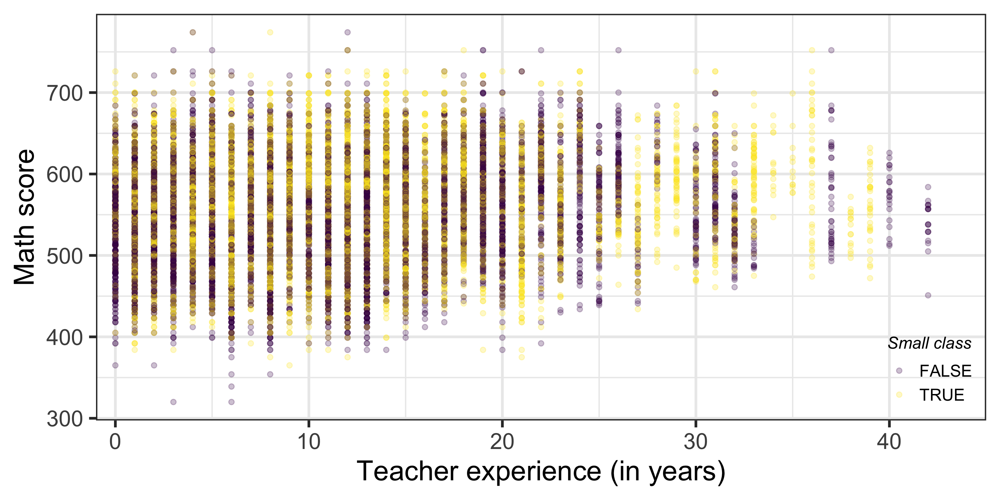
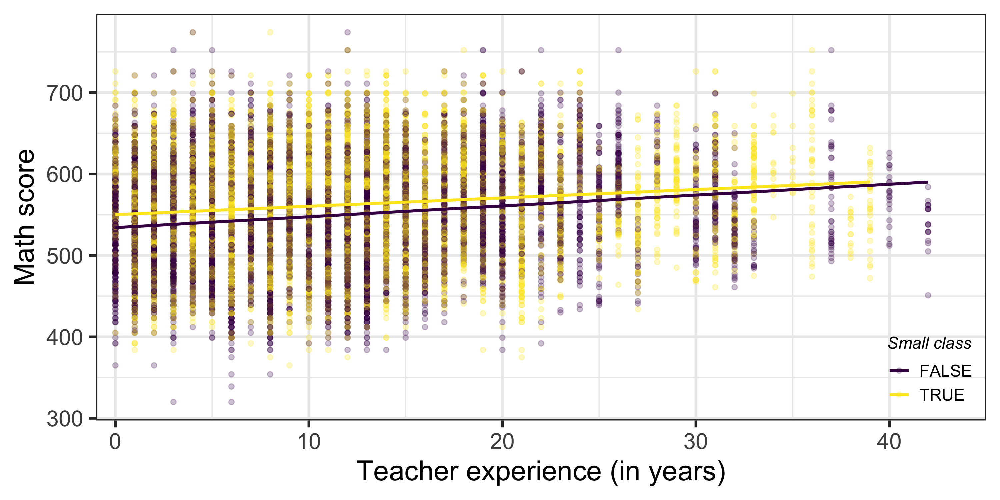
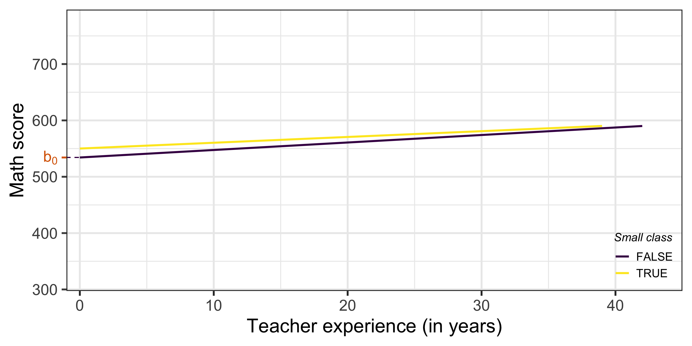
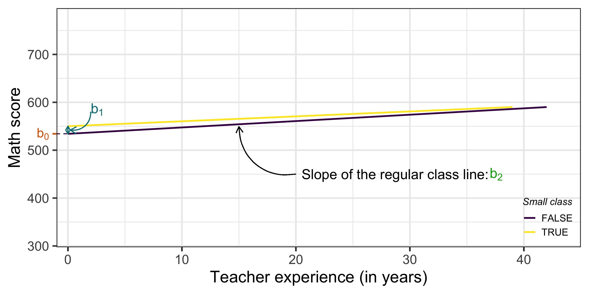
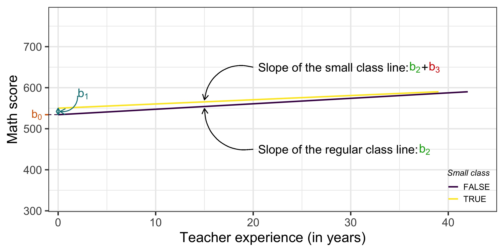
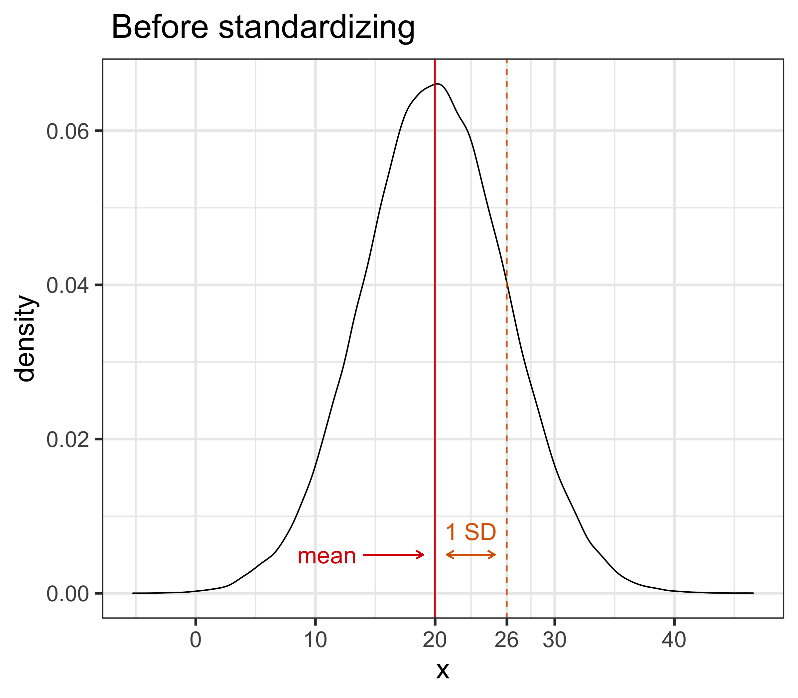
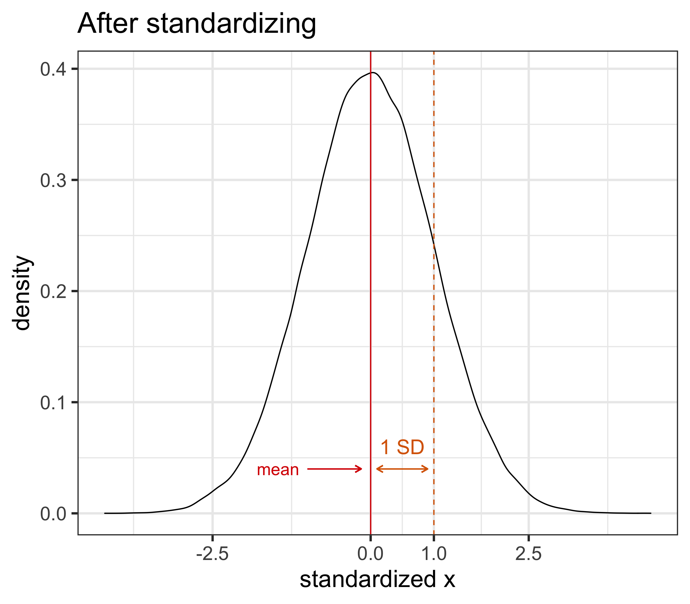

```{r setup, include=FALSE,warning=FALSE,message=FALSE}
options(htmltools.dir.version = FALSE)
knitr::opts_chunk$set(
  message = FALSE,
  warning = FALSE,
  dev = "svg",
  cache = TRUE,
  fig.align = "center"
  #fig.width = 11,
  #fig.height = 5
)

# define vars
om = par("mar")
lowtop = c(om[1],om[2],0.1,om[4])
library(magrittr)
library(plotly)
library(reshape2)
library(haven)
library(tidyverse)
library(AER)
library(gtools)
library(countdown)

# countdown style
countdown(
  color_border              = "#d90502",
  color_text                = "black",
  color_running_background  = "#d90502",
  color_running_text        = "white",
  color_finished_background = "white",
  color_finished_text       = "#d90502",
  color_finished_border     = "#d90502"
)
```

------------------------------------------------------------------------

## Today's Agenda

-   데이터의 특성과 변수 간 관계에 따라, **기본 모델에서 벗어나야 하는 경우**가 있음.

-   3가지 중요한 변형:

    1.  ***비선형 관계 (Non-linear relationships)***
    2.  ***변수 간 교차 (Interaction terms)***
    3.  ***표준화 회귀 (Standardized regression)***

-   이 경우에도 **OLS(최소자승법)** 추정 방법 사용

-   실증 분석 예제: (i) *대학 등록금*과 *소득 잠재력*, (ii) *임금*, *교육 수준* 및 *성별*, (iii) *학급 규모*와 *학생 성취도*

# Non-Linear Relationships

------------------------------------------------------------------------

## 비선형 관계

2 가지 모형:

1.  ***Log*** models

2.  ***Polynomial*** models

------------------------------------------------------------------------

## Log 모델

-   지금까지 본 모델들은 ***수준-수준(Level-Level)*** 모델로 볼 수 있음. 종속 변수와 독립 변수가 원래 단위(수준)로 측정됨.

    -   화폐단위(원), 연도, 학생 수, 퍼센트(%) 등

-   종속 변수 또는 독립 변수에 **자연로그(Natural Logarithm)** 를 취하면 3가지 유형의 회귀 모델을 정의할 수 있음\
    (표기 : $\ln(x) = \log_{e}(x) = \log(x)$)

    -   ***로그 - 수준(Log - Level)***: $\quad \log(y_i) = b_0 + b_1 x_{1,i} + ... + e_i$

    -   ***수준 - 로그(Level - Log)***: $\quad y_i = b_0 + b_1 \log(x_{1,i}) + ... + e_i$

    -   ***로그 - 로그(Log - Log)***: $\quad \log(y_i) = b_0 + b_1 \log(x_{1,i}) + ... + e_i$

------------------------------------------------------------------------

## (자연)로그 함수: 기본 개념

```{r, echo = FALSE, fig.height = 5, fig.width = 10}
data <- data.frame(x = seq(0, 10000, .1))

data %>%
  ggplot(aes(x = x, y = log(x))) +
  geom_line() +
  theme_bw(base_size = 20)
```

------------------------------------------------------------------------

## (자연)로그 함수: 기본 개념

-   [자연로그 함수](https://en.wikipedia.org/wiki/Natural_logarithm)는 지수 함수의 역함수로 정의됨, 즉 $\log(\exp(x))=x$

$\rightarrow$ 모든 $x$에 대해 $\exp(x)>0$ 이므로, **자연로그 함수는 0보다 큰 값에서만 정의됨** (즉, 0에서는 정의되지 않음)

-   변수에 로그를 취하려면 값이 0 또는 음수가 아닌지 확인해야 함! 종속 변수 또는 독립 변수에 로그를 적용할 때 항상 유의해야 함.

------------------------------------------------------------------------

## (자연)로그 함수: 기본 개념

-   데이터 분포가 **한쪽으로 치우친 경우(Skewed Distributions)**, 로그를 취하면 더 정규 분포(Normal Distribution)에 가까워짐.

::::: columns
::: {.column width="50%"}
```{r, echo = FALSE, fig.height = 6}
data <- data.frame(x = rlnorm(1000, meanlog = log(100), sdlog = log(5)))

data %>%
  ggplot(aes(x = x)) +
  geom_density() +
  scale_x_continuous(labels = scales::comma) +
  theme_bw(base_size = 20)
```
:::

::: {.column width="50%"}
```{r, echo = FALSE, fig.height = 6}
data %>%
  ggplot(aes(x = log(x))) +
  geom_density() +
  scale_x_continuous(labels = scales::comma) +
  theme_bw(base_size = 20)
```
:::
:::::

------------------------------------------------------------------------

## 로그 모델: 간단한 해석

| 모델 | 회귀 모델 | $b_1$ 해석 |
|-------------------|:--------------:|:----------------------------------:|
| **수준 - 수준** | $y = b_0 + b_1 x + e$ | $x$가 1 단위 증가하면, 평균적으로 $y$는 $b_1$ 단위 변화 |
| **로그 - 수준** | $\log(y) = b_0 + b_1 x + e$ | $x$가 1 단위 증가하면, 평균적으로 $y$는 $b_1 \times 100$% 변화 |
| **수준 - 로그** | $y = b_0 + b_1 \log(x)  + e$ | $x$가 1% 증가하면, 평균적으로 $y$는 $b_1 / 100$ 단위 변화 |
| **로그 - 로그** | $\log(y) = b_0 + b_1 \log(x) + e$ | $x$가 1% 증가하면, 평균적으로 $y$는 $b_1$% 변화 |

-   이는 해석은 [수학적으로 쉽게 도출 가능](https://stats.idre.ucla.edu/other/mult-pkg/faq/general/faqhow-do-i-interpret-a-regression-model-when-some-variables-are-log-transformed/)합니다.

-   ⚠️ **위 해석은** $x$의 작은 변화와 $b_1$이 작은 경우에만 유효: $x$의 변화가 클 경우 또는 $b_1$ 값이 크다면, 해석이 달라질 수 있음.

------------------------------------------------------------------------

## 로그 모델: 일반적인 해석 {#gen_log}

$x$의 임의의 증가 $\Delta x$ 와 임의의 $b_1$에 대해\
$(\Delta x = 5\% = 0.05 \implies 1 + \Delta x = 1.05)$

| 모델 | 회귀 모델 | $b_1$ 해석 |
|-------------------|:--------------:|:----------------------------------:|
| **수준 - 수준** | $y = b_0 + b_1 x + e$ | $x$가 1 단위 증가하면, 평균적으로 $y$는 $b_1$ 단위 변화 |
| **로그 - 수준** | $\log(y) = b_0 + b_1 x + e$ | $x$가 1 단위 증가하면, 평균적으로 $y$는 $(e^{b_1} - 1) \times 100$% 변화 |
| **수준 - 로그** | $y = b_0 + b_1 \log(x)  + e$ | $\Delta x$% 증가하면, 평균적으로 $y$는 $b_1 \times \log(1 + \Delta x)$ 단위 변화 |
| **로그 - 로그** | $\log(y) = b_0 + b_1 \log(x) + e$ | $\Delta x$% 증가하면, 평균적으로 $y$는 $((1 + \Delta x)^{b_1} - 1) \times 100$% 변화 |

-   위 해석이 왜 유효한지 알고 싶다면? [**부록: 로그 근사 (Appendix: Log Approximation)**](#log_approx) 참고

------------------------------------------------------------------------

## 로그 모델을 언제 사용해야 할까?

1.  $x$와 $y$의 관계가 로그 또는 지수 함수처럼 보이는 경우

::::: columns
::: {.column width="50%"}
```{r, echo = FALSE, fig.height = 6}
gapminder <- dslabs::gapminder

gapminder %>%
    filter(year == 2011) %>%
    ggplot(aes(x = gdp, y = life_expectancy)) +
    geom_point() +
    geom_smooth(method = "lm", se = FALSE) +
    scale_y_continuous(lim = c(40,100)) +
    labs(x = "GDP",
         y = "Life Expectancy",
         title = "Relationship between Life Expectancy and GDP in 2011",
         caption = "Data from gapminder data in dslabs package.") +
    theme_bw(base_size = 20) +
  theme(plot.title = element_text(size = 15))
```
:::

::: {.column width="50%"}
```{r, echo = FALSE, fig.height = 6}
gapminder %>%
    filter(year == 2011) %>%
    ggplot(aes(x = log(gdp), y = life_expectancy)) +
    geom_point() +
    geom_smooth(method = "lm", se = FALSE) +
    scale_y_continuous(lim = c(40,100)) +
    labs(x = "Log GDP",
         y = "Life Expectancy",
         title = "Relationship between Life Expectancy and log GDP in 2011",
         caption = "Data from gapminder data in dslabs package.") +
    theme_bw(base_size = 20) +
  theme(plot.title = element_text(size = 15))
```
:::
:::::

------------------------------------------------------------------------

## 로그 모델을 언제 사용해야 할까?

1.  $x$와 $y$의 관계가 로그 또는 지수 함수처럼 보이는 경우

::::: columns
::: {.column width="50%"}
```{r, echo = FALSE, fig.height = 6}
gapminder <- dslabs::gapminder

gapminder %>%
    filter(year == 2011) %>%
    ggplot(aes(x = fertility, y = gdp)) +
    geom_point() +
    geom_smooth(method = "lm", se = FALSE) +
    scale_x_continuous(lim = c(0,8)) +
    labs(x = "Fertility Rate",
         y = "GDP",
         title = "Relationship between GDP and Fertility in 2011",
         caption = "Data from gapminder data in dslabs package.") +
    theme_bw(base_size = 20) +
  theme(plot.title = element_text(size = 15))
```
:::

::: {.column width="50%"}
```{r, echo = FALSE, fig.height = 6}
gapminder %>%
    filter(year == 2011) %>%
    ggplot(aes(x = fertility, y = log(gdp))) +
    geom_point() +
    geom_smooth(method = "lm", se = FALSE) +
    scale_x_continuous(lim = c(0,8)) +
    labs(x = "Fertility Rate",
         y = "GDP",
         title = "Relationship between log GDP and Fertility in 2011",
         caption = "Data from gapminder data in dslabs package.") +
    theme_bw(base_size = 20) +
  theme(plot.title = element_text(size = 15))
```
:::
:::::

------------------------------------------------------------------------

## 로그 모델을 언제 사용해야 할까?

1.  $x$와 $y$의 관계가 **로그 함수** 또는 **지수 함수**처럼 보이는 경우

2.  <a href="https://en.wikipedia.org/wiki/Elasticity_(economics)">***탄력성(elasticity)***</a>을 쉽게 해석하기 위해

$x$에 대한 $y$의 탄력성:\
$x$가 **1% 증가**할 때, $y$가 **몇 % 변화하는지**를 나타냄

------------------------------------------------------------------------

## 다른 형태의 비선형 관계를 고려

$x$와 $y$의 관계가 **지수 함수(exponential) 또는 로그 함수(logarithm)**가 아니라면?

$\rightarrow$ ***다항 회귀(polynomial regression)***: 회귀 변수에 다항식을 적용!

------------------------------------------------------------------------

## 다항식(polynomial)? 🤔

::::: columns
::: {.column width="50%"}
```{r, echo = FALSE, fig.height=6}
x <- runif(10000, min = -20, max = 20)
y = 2 + 3*x + 5*x^2

data <- data.frame(x = x, y = y)

data %>%
    ggplot(aes(x,y)) +
    geom_line() +
    annotate("text", x = 0, y = 1850, label = "y == 2 + 3 * x + 5 * x^2", parse = TRUE, size = 8) +
    labs(title = "Second Order Polynomial") +
    theme_bw(base_size = 20)
```
:::

::: {.column width="50%"}
```{r, echo = FALSE, fig.height=6}
x <- runif(10000, min = -20, max = 20)
y = 2 + 3*x - 10*x^2 - 5*x^3

data <- data.frame(x = x, y = y)

data %>%
    ggplot(aes(x,y)) +
    geom_line() +
    scale_y_continuous(labels = scales::comma) +
    annotate("text", x = 0, y = 28000, label = "y == 2 + 3 * x  - 10 * x^2 - 5 * x^3", parse = TRUE, size = 8) +
    labs(title = "Third Order Polynomial") +
    theme_bw(base_size = 20)
```
:::
:::::

------------------------------------------------------------------------

## 다항식 회귀 (Polynomial Regressions)

-   시각적 또는 예상되는 관계에 따라 **회귀식에 높은 차수의 독립 변수를 추가**

-   `R`에서 다항식 회귀 사용법

::::: columns
::: {.column width="50%"}
```{r}
lm(y ~ x + I(x^2) + I(x^3), data)
#I() : "as-is" 연산자, 즉 R이 x^2나 x^3을 수식이 아닌 새로운 변수로 인식하게 함
```
:::

::: {.column width="50%"}
```{r}
lm(y ~ poly(x, 3, raw = TRUE), data)
```
:::
:::::

------------------------------------------------------------------------

## 다항식 회귀 (Polynomial Regressions)

::::: columns
::: {.column width="50%"}
***2차 다항식 회귀***

```{r, echo = FALSE, fig.height = 6}
gapminder <- dslabs::gapminder

gapminder %>%
    filter(year == 2011) %>%
    ggplot(aes(x = fertility, y = log(gdp))) +
    geom_point() +
    geom_smooth(method = "lm", se = FALSE, formula = y ~ poly(x, 2, raw = TRUE)) +
    scale_x_continuous(lim = c(0,8)) +
    labs(x = "Fertility rate",
         y = "GDP",
         title = "GDP and Fertility rate in 2011",
         caption = "Source: dslabs gapminder") +
    theme_bw(base_size = 20) +
    theme(plot.title = element_text(size = 15))
```
:::

::: {.column width="50%"}
***3차 다항식 회귀***

```{r, echo = FALSE, fig.height = 6}
gapminder %>%
    filter(year == 2011) %>%
    mutate(log_gdp = log(gdp)) %>%
    ggplot(aes(x = log_gdp, y = life_expectancy)) +
    geom_point() +
    geom_smooth(method = "lm", se = FALSE, formula = y ~ poly(x, 3, raw = T)) +
    scale_y_continuous(lim = c(40,100)) +
    labs(x = "log GDP",
         y = "Life expentancy",
         title = "Life expentancy and log GDP in 2011",
         caption = "Source: dslabs gapminder") +
    theme_bw(base_size = 20) +
    theme(plot.title = element_text(size = 15))
```
:::
:::::

------------------------------------------------------------------------

## 

```{r, echo = F, out.height = "600px", out.width = "378px"}
knitr::include_graphics("chapter_regext_files/figure-html/curve_fitting.png") 
```

------------------------------------------------------------------------

## Task 1 {background-color="#ffebf0"}

::: {style="position: absolute; top: -30px; right: 10px; font-size: 0.8em;"}
`r countdown(minutes = 10, top = 0)`
:::

1.  데이터를 [여기](https://www.dropbox.com/s/2v5mb04nzw2u7bd/college_tuition_income.csv?dl=1)에서 다운로드. 이 데이터셋은 미국 대학의 등록금과 졸업생의 예상 소득 정보를 포함. 데이터에 대한 자세한 설명은 [여기](https://github.com/rfordatascience/tidytuesday/blob/master/data/2020/2020-03-10/readme.md).

2.  예상 중간 경력 소득(`mid_career_pay`)을 종속 변수(𝑦축)로 하고, 주 외 등록금(`out_of_state_tuition`)을 독립 변수(𝑥축)로 하는 산점도를 생성하시오. 관계가 대체로 선형적이라고 볼 수 있는가, 아니면 비선형적인가? 선형 회귀선과 2차 다항 회귀선을 함께 적합하기 위해 `geom_smooth(method = "lm", se = F) + geom_smooth(method = "lm", se = F, formula = y ~ poly(x, 2, raw= T))`을 사용하시오. 어느 모델이 더 적절한가?

3.  주 외 등록금을 1000으로 나눈 새로운 변수를 생성하시오. 이를 이용하여 예상 중간 경력 소득을 회귀 분석하시오. 회귀 계수를 해석하시오.

4.  예상 중간 경력 소득을 주 외 등록금/1000과 그 제곱 항을 포함하여 회귀 분석하시오. *힌트:* `poly(x, 2, raw = T)` 또는 `x + I(x^2)`를 사용할 수 있음. 제곱 항의 계수가 양수라는 것은 무엇을 의미하는가?

```{r, echo=FALSE, eval=FALSE}
ggplot(data, aes(x = out_of_state_tuition, y = mid_career_pay)) +
    geom_point() +
    geom_smooth(method = "lm", se = FALSE, colour = "blue") + # 선형 회귀선
    geom_smooth(method = "lm", se = FALSE, formula = y ~ poly(x, 2, raw=TRUE), colour = "red") # 2차 다항 회귀선

data <- data %>%
    mutate(tuition_scaled = out_of_state_tuition / 1000)

lm(mid_career_pay ~ tuition_scaled, data = data)
lm(mid_career_pay ~ tuition_scaled + I(tuition_scaled^2), data = data)
lm(mid_career_pay ~ poly(tuition_scaled, 2, raw = TRUE), data = data)
```

# Interaction Terms

------------------------------------------------------------------------

## 교차 변수 (Interacting Regressors)

-   ***한 변수의 효과가 다른 변수의 값에 따라 달라질 것***이라고 가정하는 경우.

    -   *예제:* 교육 수준이 임금에 미치는 영향이 **성별**에 따라 달라질 수 있음.

-   만약 $x_1$과 $x_2$를 상호작용 변수로 추가한다면, 회귀 모형을 다음과 같이 만듬:

$$y_i =  b_0 + b_1 x_{1,i} + b_2 x_{2,i} + b_3x_{1,i} \times x_{2,i} + ... + e_i$$

-   $b_1$, $b_2$, 그리고 $b_3$의 해석은 $x_1$과 $x_2$의 유형(연속형 또는 범주형)에 따라 달라짐.

-   우선, 하나의 독립 변수가 ***더미(범주형) 변수***이고, 다른 하나가 ***연속형 변수***인 경우를 살펴보겠음.

-   이러한 개념을 익히면 다음과 같은 경우에도 적용 가능:

    -   두 개의 독립 변수가 모두 더미(범주형) 변수인 경우,

    -   두 개의 독립 변수가 모두 연속형 변수인 경우.

------------------------------------------------------------------------

## 교차 변수 (Interacting Regressors)

-   *STAR* 실험 데이터: 작은 학급과 일반 학급의 효과는 **교사의 경험**ㄴ에 따라 어떻게 달라지는가?

-   회귀 모형은 다음과 같이 변함:

$$ \textrm{score}_i = \color{#d96502}{b_0} + \color{#027D83}{b_1} \textrm{small}_i + \color{#02AB0D}{b_2} \textrm{experience}_i + \color{#d90502}{b_3} \textrm{small}_i \times \textrm{experience}_i + e_i$$

-   교사 경력이 10년인 경우 작은 학급의 효과는?

$$
\mathbb{E}[\textrm{score}_i | \textrm{small}_i = 1 \textrm{ & experience}_i = 10] = \color{#d96502}{b_0} + \color{#027D83}{b_1} + \color{#02AB0D}{b_2}*10 + \color{#d90502}{b_3}*10
$$

$$
\mathbb{E}[\textrm{score}_i | \textrm{small}_i = 0 \textrm{ & experience}_i = 10] = \color{#d96502}{b_0} + \color{#02AB0D}{b_2}*10
$$

$$
\begin{split} 
\mathbb{E}[\textrm{score}_i &| \textrm{small}_i = 1 \textrm{ & experience}_i = 10] - \mathbb{E}[\textrm{score}_i | \textrm{small}_i = 0 \textrm{ & experience}_i = 10] \\ 
&= \color{#d96502}{b_0} + \color{#027D83}{b_1} + \color{#02AB0D}{b_2}*10 + \color{#d90502}{b_3}*10 - (\color{#d96502}{b_0} + \color{#02AB0D}{b_2}*10) \\ 
&= \color{#027D83}{b_1} + \color{#d90502}{b_3}*10 
\end{split}
$$

------------------------------------------------------------------------

## 교차 변수 (Interacting Regressors)

`math` 점수에 대한 회귀 분석을 실행한 결과 (모든 학년 포함):

```{r, echo = FALSE}
star_df = read.csv("https://chung-jiwoong.github.io/FMB819-Slides/chapter_causality/data/star_data.csv")
star_df = star_df %>% filter(star != "regular+aide")
star_df$small = star_df$star == "small"
star_df = star_df[complete.cases(star_df),]
```

```{r}
lm(math ~ small+ experience + small*experience, star_df)
```

***해석***

-   교차항은 작은 학급의 효과가 **교사의 경험**에 따라 달라지도록 함.

-   작은 학급에 배정되는 것이 math 점수에 긍정적인 영향을 줌.

-   그러나 이 효과는 **교사의 경험**이 많아질수록 감소함.

------------------------------------------------------------------------

## 교차 변수: 시각화

$$ \textrm{score}_i = \color{#d96502}{b_0} + \color{#027D83}{b_1} \textrm{small}_i + \color{#02AB0D}{b_2} \textrm{experience}_i + \color{#d90502}{b_3} \textrm{small}_i * \textrm{experience}_i + e_i$$

```{r,echo=F, eval = F}
# graph_base <- star_df %>%
#     ggplot(aes(x = experience, y = math, group = small, color = small)) +
#     geom_point(alpha = 0.25) +
#     scale_color_viridis_d() +
#     scale_x_continuous(lim = c(-1,45), breaks = seq(0,40,10), expand = c(0,0)) +
#     theme_bw(base_size = 20) +
#     labs(x = "Teacher experience (in years)",
#          y = "Math score",
#          color = "Small class") +
#     theme(legend.position = c(1,0),
#           legend.justification = c(1,0),
#           legend.background = element_blank(),
#           legend.key = element_blank(),
#           legend.text = element_text(size = 12),
#           legend.title = element_text(size = 12, face = "italic"))
# graph_base
# ggsave("chapter_regext/chapter_regext_files/figure-html/graph_base.png", height = 5, width = 10)
```

```{r, echo = F, out.width = "90%"}
 
```

------------------------------------------------------------------------

## 교차 변수: 시각화

$$ \textrm{score}_i = \color{#d96502}{b_0} + \color{#027D83}{b_1} \textrm{small}_i + \color{#02AB0D}{b_2} \textrm{experience}_i + \color{#d90502}{b_3} \textrm{small}_i * \textrm{experience}_i + e_i$$

```{r,echo=F, eval = F}
# graph_reg <- graph_base +
#     geom_smooth(method = "lm", se = F)
# graph_reg
# ggsave("chapter_regext/chapter_regext_files/figure-html/graph_reg.png", height = 5, width = 10)
```

```{r, echo = F, out.width = "90%"}
 
```

------------------------------------------------------------------------

## 교차 변수: 시각화

$$ \textrm{score}_i = \color{#d96502}{b_0} + \color{#027D83}{b_1} \textrm{small}_i + \color{#02AB0D}{b_2} \textrm{experience}_i + \color{#d90502}{b_3} \textrm{small}_i * \textrm{experience}_i + e_i$$

```{r,echo=F, eval = F}
# library(latex2exp)
# library(viridis)
# reg_coefs <- lm(math ~ small+ experience + small*experience, star_df)$coefficient
# b0 = reg_coefs[1]
# b1 = reg_coefs[2]
# b2 = reg_coefs[3]
# b3 = reg_coefs[4]
# 
# 
# graph_reg_b0 <- star_df %>%
#     ggplot(aes(x = experience, y = math, group = small, color = small)) +
#     geom_point(col = "transparent") + 
#     geom_smooth(method = "lm", se = F) +
#     geom_segment(aes(x = -1, xend = 0, y = b0, yend = b0), size = .5, linetype = 2, colour = viridis_pal()(2)[1]) +
#     scale_y_continuous(breaks = c(300,400,500,b0,600,700), labels = c("300","400","500",parse(text = TeX("$b_0$")),"600","700"), minor_breaks = seq(350,750,50)) +
#     scale_color_viridis_d() +
#     scale_x_continuous(lim = c(-1,45), breaks = seq(0,40,10), expand = c(0,0)) +
#     theme_bw(base_size = 20) +
#     labs(x = "Teacher experience (in years)",
#          y = "Math score",
#          color = "Small class") +
#     theme(legend.position = c(1,0),
#           legend.justification = c(1,0),
#           legend.background = element_blank(),
#           legend.key = element_blank(),
#           legend.text = element_text(size = 12),
#           legend.title = element_text(size = 12, face = "italic"),
#           axis.text.y = element_text(color = c("grey30", "grey30", "grey30", "#d96502", "grey30", "grey30")),
#           axis.ticks.y = element_line(color = c("grey30", "grey30", "grey30", "#d96502", "grey30", "grey30")),
#           panel.grid.minor = element_line(color = c("grey92", "grey92", "grey92", "grey92", "grey92")),
#           panel.grid.major.y = element_line(color = c("grey92", "grey92", "grey92", NA, "grey92", "grey92")))
# graph_reg_b0
# ggsave("chapter_regext/chapter_regext_files/figure-html/graph_reg_b0.png", height = 5, width = 10)
```

```{r, echo = F, out.width = "90%"}
 
```

------------------------------------------------------------------------

## 교차 변수: 시각화

$$ \textrm{score}_i = \color{#d96502}{b_0} + \color{#027D83}{b_1} \textrm{small}_i + \color{#02AB0D}{b_2} \textrm{experience}_i + \color{#d90502}{b_3} \textrm{small}_i * \textrm{experience}_i + e_i$$

```{r,echo=F, eval = F}
# graph_reg_b0_b1 <- graph_reg_b0 +
#     geom_segment(aes(x = 0, xend = 0, y = b0, yend = b0 + b1), size = .5, linetype = 1, colour = "#027D83", arrow = arrow(length = unit(0.2, "cm"), ends = "both")) +
#     geom_curve(aes(x = 0.2, xend = 2, y = b0 + b1/2, yend = 580), size = .5, color = "#027D83", linetype = 1, arrow = arrow(length = unit(0.3, "cm"), end = "first")) +
#     annotate("text", x = 2, y = 585, hjust = 0, label = "b[1]", parse = TRUE, color = "#027D83", size = 6)
# graph_reg_b0_b1
# ggsave("chapter_regext/chapter_regext_files/figure-html/graph_reg_b0_b1.png", height = 5, width = 10)
```

```{r, echo = F, out.width = "90%"}
knitr::include_graphics("chapter_regext_files/figure-html/graph_reg_b0_b1.png") 
```

------------------------------------------------------------------------

## 교차 변수: 시각화

$$ \textrm{score}_i = \color{#d96502}{b_0} + \color{#027D83}{b_1} \textrm{small}_i + \color{#02AB0D}{b_2} \textrm{experience}_i + \color{#d90502}{b_3} \textrm{small}_i * \textrm{experience}_i + e_i$$

```{r,echo=F, eval = F}
# graph_reg_b0_b1_b2 <- graph_reg_b0_b1 +
#     geom_curve(aes(x = 15, xend = 20, y = b0 + b2*15 - 5, yend = 450), size = .5, color = "black", linetype = 1, arrow = arrow(length = unit(0.3, "cm"), end = "first")) +
#     annotate("text", x = 35.3, y = 450, label = "b[2]", color = "#02AB0D", hjust = 0,  parse = TRUE, size = 6) +
#     annotate("text", x = 20.5, y = 450, label = "Slope of the regular class line:", hjust = 0, size = 6)
# graph_reg_b0_b1_b2
# ggsave("chapter_regext/chapter_regext_files/figure-html/graph_reg_b0_b1_b2.png", height = 5, width = 10)
```

```{r, echo = F, out.width = "90%"}
 
```

------------------------------------------------------------------------

## 교차 변수: 시각화

$$ \textrm{score}_i = \color{#d96502}{b_0} + \color{#027D83}{b_1} \textrm{small}_i + \color{#02AB0D}{b_2} \textrm{experience}_i + \color{#d90502}{b_3} \textrm{small}_i * \textrm{experience}_i + e_i$$

```{r,echo=F, eval = F}
# graph_reg_b0_b1_b2 +
#     geom_curve(aes(x = 20, xend = 15, y = 650, yend = b0 + b1 + (b2+b3)*15 + 5), size = .5, color = "black", linetype = 1, arrow = arrow(length = unit(0.3, "cm"))) +
#     annotate("text", x = 34.5, y = 650, label = "b[2]", color = "#02AB0D", hjust = 0,  parse = TRUE, size = 6) +
#     annotate("text", x = 35.75, y = 650, label = "+", hjust = 0, size = 6) +
#     annotate("text", x = 36.5, y = 650, label = "b[3]", color = "#d90502", hjust = 0,  parse = TRUE, size = 6) +
#     annotate("text", x = 20.5, y = 650, label = "Slope of the small class line:", hjust = 0, size = 6)
# ggsave("chapter_regext/chapter_regext_files/figure-html/graph_reg_b0_b1_b2_b3.png", height = 5, width = 10)
```

```{r, echo = F, out.width = "90%"}
 
```

------------------------------------------------------------------------

## Task 2 {background-color="#ffebf0"}

::: {style="position: absolute; top: -30px; right: 10px; font-size: 0.8em;"}
`r countdown(minutes = 10, top = 0)`
:::


1.  `AER` 패키지에서 `CPS1985` 데이터를 불러오시오.

2.  변수의 정의를 확인하기 위해 도움말을 참조하시오: `?CPS1985`

3.  `wage` 변수의 자연 로그 값을 저장하는 `log_wage` 변수를 생성하시오.

4.  `log_wage`를 `gender`와 `education`에 대해 회귀 분석을 수행하고 이를 `reg1`으로 저장하시오. 각 계수를 해석하시오.

5.  `log_wage`를 `gender`, `education` 및 `gender*education`로 회귀 분석을 수행하고 이를 `reg2`로 저장하시오. 각 계수를 해석하시오. **성별 임금 격차가 교육 수준이 증가할수록 줄어드는가?**

6.  해당 교차 효과를 시각적으로 나타내는 그래프를 생성하시오. (*힌트:* `aes`에서 `color = gender`를 사용하고, `geom_smooth(method = "lm", se = F)`를 활용하여 성별별 회귀선을 그리시오.)


# Standardized Regression

------------------------------------------------------------------------

## 표준화 회귀 분석 (Standardized Regression)

-   변수를 **표준화(standardizing)** 한다는 것은...

> ***표준화***란 변수 $z$의 평균을 빼고, 그 값을 변수의 표준편차로 나누는 것을 의미함:

$$ z_i^{stand} = \frac{z_i - \bar z}{\sigma(z)}$$

-   여기서, $\bar z$는 $z$의 평균이고, $\sigma(z)$는 $z$의 표준편차를 의미함. 즉, $\sigma(z) = \sqrt{\textrm{Var}(z)}$.

-   이제 $z^{stand}$는 평균이 0이고, 표준편차가 1이 됨, 즉:

$$\overline{z^{stand}} = 0, \quad \sigma(z^{stand}) = 1$$

-   직관적으로 표준화는 ***변수들을 동일한 척도로 변환***하여 비교할 수 있도록 해줌.

-   우리의 **학급 규모(class size)와 학생 성과(student performance)** 예제에서 표준화를 사용하면:

    -   효과의 **크기(magnitude)** 해석이 쉬워지고,\
    -   **각 변수의 상대적 중요성**을 비교할 수 있음.

------------------------------------------------------------------------

## 표준화 회귀 분석: 시각화

```{r, echo = FALSE}
# 표준 정규 분포 데이터를 생성하여 시각화
# 원래 데이터 (표준화 이전)
# nrom = data.frame(x = rnorm(100000, mean = 20, sd = 6))
# nrom <- nrom %>%
#     mutate(x_stand = scale(x))
# 
# mean = mean(nrom$x)
# sd = sd(nrom$x)
# mean_stand = mean(nrom$x_stand)
# sd_stand = sd(nrom$x_stand)
# 
# 표준화 전 그래프 저장
# nrom %>%
#     ggplot(aes(x = x)) +
#     geom_density() +
#     geom_vline(xintercept = mean, color = "#d90502") +
#     geom_vline(xintercept = mean + sd, linetype = 2, color = "#d96502") +
#     scale_x_continuous(breaks = c(0,10,20, round(mean+sd,0), 30, 40)) +
#     geom_segment(aes(x = 14, xend = 19, y = 0.005, yend = 0.005), size = .5, linetype = 1, colour = "#d90502", arrow = arrow(length = unit(0.2, "cm"))) +
#     annotate("text", x = 8.5, y = 0.005, hjust = 0, label = "mean", color = "#d90502", size = 6) +
#     geom_segment(aes(x = mean + 1, xend = mean + sd - 1, y = 0.005, yend = 0.005), size = .5, linetype = 1, colour = "#d96502", arrow = arrow(length = unit(0.2, "cm"), ends = "both")) +
#     annotate("text", x = mean + sd/2, y = 0.008, label = "1 SD", color = "#d96502", size = 6) +
#     labs(title = " Before standardizing") +
#     theme_bw(base_size = 20)
# ggsave("chapter_regext/chapter_regext_files/figure-html/graph_before.png", height = 7, width = 8)
# 
# 표준화 후 그래프 저장
# nrom %>%
#     ggplot(aes(x = x_stand)) +
#     geom_density() +
#     geom_vline(xintercept = mean_stand, color = "#d90502") +
#     geom_vline(xintercept = mean_stand + sd_stand, linetype = 2, color = "#d96502") +
#     scale_x_continuous(breaks = c(-2.5,0, round(mean_stand+sd_stand,0), 2.5)) +
#     geom_segment(aes(x = -1, xend = -.15, y = 0.04, yend = 0.04), size = .5, linetype = 1, colour = "#d90502", arrow = arrow(length = unit(0.2, "cm"))) +
#     annotate("text", x = -1.8, y = 0.04, hjust = 0, label = "mean", color = "#d90502", size = 5) +
#     geom_segment(aes(x = mean_stand + .1, xend = mean_stand + sd_stand - .1, y = 0.04, yend = 0.04), size = .5, linetype = 1, colour = "#d96502", arrow = arrow(length = unit(0.2, "cm"), ends = "both")) +
#     annotate("text", x = mean_stand + sd_stand/2, y = 0.06, label = "1 SD", color = "#d96502", size = 6) +
#     labs(x = "standardized x", title = "After standardizing") +
#     theme_bw(base_size = 20)
# ggsave("chapter_regext/chapter_regext_files/figure-html/graph_after.png", height = 7, width = 8)
```

:::: columns
:::{.column width="50%"}
```{r, echo = F}

```
:::

:::{.column width="50%"}

```{r, echo = F}

```
::: 
::::

------------------------------------------------------------------------

## 표준화 회귀 분석: 시각화

***종속 변수*** $y$가 표준화된 경우: $\color{#d90502}{y^{stand}} = b_0 + \sum_{k=1}^Kb_kx_k +e$

-   $b_k$는 $x_k$가 한 단위 증가할 때 $y^{stand}$가 얼마나 변하는지를 나타냄.

-   $y^{stand}$가 1 증가하면 이는 $y$가 **한 표준편차만큼 증가**한다는 의미. 따라서 $b_k$는 $y$ **표준편차의 비율로서** $y$의 변화를 측정함.

***설명 변수*** $x_k$가 표준화된 경우: $y = b_0 + \sum_{k=1}^Kb_k\color{#d90502}{x_k^{stand}} +e$

-   $b_k$는 $x_k^{stand}$가 한 단위 증가할 때 $y$가 얼마나 변하는지를 나타냄.

-   $x_k^{stand}$가 1 증가하면 이는 $x_k$가 한 표준편차만큼 증가한다는 의미. 따라서 $b_k$는 $x_k$가 한 표준편차 증가할 때 예측되는 $y$의 변화를 측정함.

------------------------------------------------------------------------

## Task 3 {background-color="#ffebf0"}

::: {style="position: absolute; top: -30px; right: 10px; font-size: 0.8em;"}
`r countdown(minutes = 10, top = 0)`
:::

[grade5.dta](https://chung-jiwoong.github.io/FMB819-Slides/chapter_slr/data/grade5.dta) 다운로드 `haven` 패키지의 `read_dta()` 함수를 사용. 

아래는 평균 수학 시험 점수를 전체 독립 변수 세트에 대해 회귀 분석한 결과:

```{r echo = FALSE}
grades = read_dta(file = "https://chung-jiwoong.github.io/FMB819-Slides/chapter_slr/data/grade5.dta")

reg_full <- lm(avgverb ~ classize + disadvantaged + school_enrollment + female + religious, grades)
reg_full$coefficients
```

1.  표준화된 수학 점수 변수 생성: `avgmath_stand`라는 새로운 변수를 만들어 표준화된 수학 점수를 저장하시오. scale() 함수를 (mutate와 함께) 사용하거나, 기본 R을 사용하여 직접 계산할 수 있음.

2.  표준화된 수학 점수를 종속 변수로 회귀 분석: 표준화된 수학 점수를 종속 변수로 사용하여 전체 회귀 분석을 수행하시오. 각 계수의 크기와 의미를 해석하시오.

3.  연속형 독립 변수 표준화: 각 연속형 독립 변수에 대해 `변수명_stand` 형태의 표준화된 변수를 만드시오. `religious` 변수를 표준화하는 것이 적절한가?

4.  표준화된 독립 변수로 회귀 분석: `avgmath_stand`를 종속 변수로 하고, 표준화된 모든 독립 변수 및 `religious`를 포함하여 회귀 분석을 수행하시오. 각 독립 변수가 상대적으로 얼마나 중요한지 논의하시오.

------------------------------------------------------------------------

## 다음 수업 예고

-   지금까지 항상 전체 모집단에서 **표본**을 추출하여 작업해 왔음.

-   매번 새로운 표본을 모집단에서 다시 추출한다고 가정하면:

    -   같은 결과를 얻을 수 있을까?

    -   다시 말해, 우리의 추정치(부호, 크기)가 단순히 **무작위성에 의해 결정되지 않았다는 것**을 얼마나 확신할 수 있을까?

-   이러한 질문들에 대한 답을 찾기 위해:

    -   **표본 추출(sampling)** 개념을 소개하고,

    -   **통계적 추론(statistical inference)**이 무엇이며, 어떻게 수행하는지 알아볼 것임.

------------------------------------------------------------------------

## 🔍 인과 관계를 찾아가는 길

✅ 데이터를 어떻게 다룰까?: 읽기(Read), 정리(Tidy), 시각화(Visualize)...

✅ ***변수간 관계를 어떻게 요약할까?*** ...단순 / 다중 선형 회귀...비선형회귀, 교차변수...

✅ 인과 관계(Causality)란 무엇인가?

❌ 전체 모집단을 관측하지 못하면 어떻게 할까?

❌ 우리의 연구 결과가 단순한 무작위(Randomness) 때문일 수도 있을까?

❌ 실제로 외생성을 어떻게 찾아낼 수 있을까?

------------------------------------------------------------------------


<link href="https://fonts.googleapis.com/css2?family=Pacifico&display=swap" rel="stylesheet">

::: {style="display: flex; justify-content: center; align-items: center; height: 70vh;"}
<h2 style="color: #ff6666; text-align: center; font-family: &#39;Pacifico&#39;, cursive; font-size: 50px;">

THE END!

</h2>
:::


# Appendix

---


## 로그 모델: 근사값  {#log_approx}

이전에 제시된 근사값들이 왜 성립하는가?

***로그-레벨 (Log-Level)***

**일반적인 해석:**  $x$가 **1 단위 증가**할 때, 평균적으로 $y$는 $(e^{b_1} - 1) \times 100$ **퍼센트 변화**함.

**단순 해석:**  $x$가 **1 단위 증가**할 때, 평균적으로 $y$는 $b_1 \times 100$ **퍼센트 변화**함.


- 이는 작은 값의 $b_1$에 대해 다음 식이 성립하기 때문: $e^{b_1} \approx 1 + b_1 \iff b_1 \approx e^{b_1} - 1$


$\rightarrow$ $b_1 = \color{#d90502}{0.04}$일 때, $e^{b_1} - 1 = e^{0.04} - 1 = `r round(exp(0.04) - 1,4)`$


$\rightarrow$ $b_1 = \color{#d90502}{0.5}$일 때,  $e^{b_1} - 1 = e^{0.5} - 1 = `r round(exp(0.5) - 1,4)`$

---


## 로그 모델: 근사값

이전에 제시된 근사값들이 왜 성립하는가?

***레벨-로그 (Level-Log)***

**일반적인 해석:**  $x$가 **$\Delta x$ 퍼센트 증가**할 때, 평균적으로 $y$는 $b_1 \times log(1 + \Delta x)$ **단위 변화**함.

**단순 해석:**  $x$가 **1% 증가**할 때, 평균적으로 $y$는 $b_1 / 100$ **단위 변화**함.


- 이는 작은 값의 $\Delta x$에 대해 다음 식이 성립하기 때문:  $log(1 + \Delta x) \approx \Delta x$

$\rightarrow$ $\Delta x = \color{#d90502}{1\%}=0.01$일 때,  $log(1+\Delta x) = log(1.01) = `r round(log(1.01),2)`$  (따라서 단순 해석에서 $/100$이 추가됨)


$\rightarrow$ $\Delta x = \color{#d90502}{20\%}=0.20$일 때,  $log(1+\Delta x) = log(1.20) = `r round(log(1.20),2)`$

---


## 로그 모델: 근사값

이전에 제시된 근사값들이 왜 성립하는가?

***로그-로그 (Log-Log)***

**일반적인 해석:** $x$가 **$\Delta x$ 퍼센트 증가**할 때, 평균적으로 $y$는 $((1 + \Delta x)^{b_1} - 1) \times 100$ **퍼센트 변화**함.

**단순 해석:** $x$가 **1% 증가**할 때, 평균적으로 $y$는 $b_1$ **퍼센트 변화**함.


- 이는 작은 값의 $|b_1| \times \Delta x$에 대해 다음 식이 성립하기 때문:  $(1 + \Delta x)^{b_1} \approx 1 + b_1 \times \Delta x \iff b_1 \times \Delta x \times 100 \approx ((1 + \Delta x)^{b_1} - 1) \times 100$


$\rightarrow$ $\Delta x = \color{#d90502}{1\%}=0.01$이고 $b_1 = \color{#d90502}{0.5}$일 때,  
$((1+\Delta x)^{b_1} - 1) \times 100 = (1.01^{0.5} - 1) \times 100 = `r round(((1.01)^0.5 - 1) * 100,2)`$  

$\rightarrow$ $\Delta x = \color{#d90502}{10\%}=0.10$이고 $b_1 = \color{#d90502}{10}$일 때,  
$((1+\Delta x)^{b_1} - 1) \times 100= (1.1^{10} - 1) \times 100 = `r round(((1.10)^10 -1) * 100,2)`$

[돌아가기](#gen_log)

