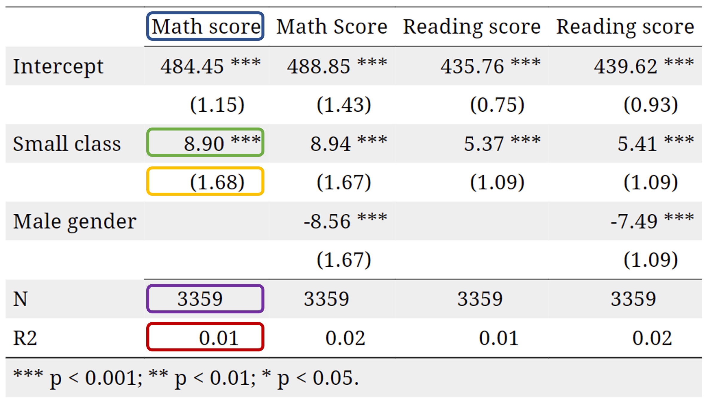
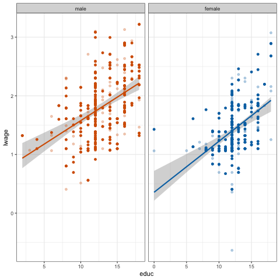

```{r setup, include=FALSE,warning=FALSE,message=FALSE}
options(htmltools.dir.version = FALSE)

def.chunk.hook  <- knitr::knit_hooks$get("chunk")


knitr::opts_chunk$set(
  message = FALSE,
  warning = FALSE,
  dev = "svg",
  cache = TRUE,
  fig.align = "center"
  #fig.width = 11,
  #fig.height = 5
)

knitr::knit_hooks$set(chunk = function(x, options) {
  x <- def.chunk.hook(x, options)
  ifelse(options$size != "normalsize", paste0("\n \\", options$size,"\n\n", x, "\n\n \\normalsize"), x)
})

# define vars
om = par("mar")
lowtop = c(om[1],om[2],0.1,om[4])

overwrite = FALSE

library(countdown)

# countdown style
countdown(
  color_border              = "#d90502",
  color_text                = "black",
  color_running_background  = "#d90502",
  color_running_text        = "white",
  color_finished_background = "white",
  color_finished_text       = "#d90502",
  color_finished_border     = "#d90502"
)

library(jtools)
```

------------------------------------------------------------------------

## Today's Agenda

-   ***회귀 테이블 (regression table)*** 이해하기

-   ***이론 기반 (theory-based)*** vs. ***시뮬레이션 기반 (simulation-based)*** 추론 비교

-   ***고전적 회귀 모델 (Classical Regression Model)*** 가정

-   실증적 응용 사례:

    -   학급 크기와 학생 성취도
    -   성별에 따른 교육의 수익률

------------------------------------------------------------------------

## 학급 크기와 학생 성취도 {#star_again}

-   ***STAR*** 실험 데이터를 다시 살펴보자:

    -   *소규모 학급 (small)* 과 *일반 학급 (regular)*
    -   *유치원 (Kindergarten) 학년*

-   다음 회귀 모델을 고려하고 OLS로 추정:

$$ \text{math score}_i = b_0 + b_1 \text{small}_i + e_i$$

::::: columns
::: {.column width="50%"}
```{r, echo = TRUE}
library(tidyverse)

star_df = read.csv("https://www.dropbox.com/s/bf1fog8yasw3wjj/star_data.csv?dl=1")
star_df = star_df[complete.cases(star_df),]
star_df = star_df %>%
  filter(star %in% c("small","regular") &
           grade == "k") %>% 
  mutate(small = (star == "small"))
```
:::

::: {.column width="50%"}
```{r, echo = TRUE}
reg_star = lm(math ~ small, star_df)
reg_star
```
:::
:::::

-   테네시에서 다른 무작위 표본을 선택하여 실험을 다시 수행하면, $b_1$ 값이 다르게 나올까?

-   답은 Yes, 하지만 이 추정값이 얼마나 다르게 나올 가능성이 있을까?

------------------------------------------------------------------------

## 회귀 추론: $b_k$ vs $\beta_k$

-   $b_0, b_1$ 는 우리가 표본에서 계산한 ***점 추정치 (point estimates)*** 임.

    -   마치 파스타 예제에서 본 표본 비율 $\hat{p}$ 과 같음!

::::: columns
::: {.column width="50%"}
-   사실, 우리가 추정한 모델은...

$$\hat{y} = b_0 + b_1 x_1$$
:::

::: {.column width="50%"}
... 알 수 없는 **진짜 모집단 회귀선**에 대한 **추정치**임.

$$y = \beta_0 + \beta_1 x_1$$
:::
:::::

여기서 $\beta_0, \beta_1$ 는 관심 있는 ***모집단 모수 (population parameters)*** 임.

-   보통 $b_k$ 대신 $\hat{\beta_k}$ 를 사용하기도 하며, 둘 다 $\beta_k$ 에 대한 표본 추정치를 의미함.

-   이제 우리가 배운 ***신뢰구간 (confidence intervals)***, ***가설검정 (hypothesis testing)***, 그리고 ***표준오차 (standard errors)*** 를 활용하여 $\hat{\beta_k}$ 에 적용해 보겠음!

------------------------------------------------------------------------

## 회귀 테이블 이해하기

-   다음은 `tidy` 처리된 회귀 결과임:

```{r}
library(broom)
tidy(lm(math ~ small, star_df))
```

```{r echo=FALSE}
reg_summary_star_df = round(summary(reg_star)$coefficients,2)
coeff_star = coef(reg_star)
```

-   여기서 새로운 3개의 열이 추가됨: `std.error`, `statistic`, `p.value`.

| Entry | Meaning |
|----------|--------------------------------|
| `std. error` | $b_k$ 의 표준오차 (standard error) |
| `statistic` | 귀무가설 $H_0:\beta_k = 0$ vs 대립가설 $H_A:\beta_k \neq 0$ 에 대한 검정 통계량 |
| `p.value` | 귀무가설 $H_0:\beta_k = 0$ vs 대립가설 $H_A:\beta_k \neq 0$ 에 대한 p-값 |

-   `small` 변수의 계수를 중심으로 각각의 항목을 이해해보자.

------------------------------------------------------------------------

## $b_k$의 표준 오차 (Standard Error)

> $b_k$의 표준 오차 (Standard Error of $b_k$): $b_k$의 샘플링 분포의 표준 편차.

우리가 실험을 1,000번 반복하고, 1,000개의 서로 다른 표본을 사용할 수 있다고 가정하자:

-   그러면 1,000개의 회귀분석을 실행하고, $\beta_k$에 대한 1,000개의 추정치 $b_k$를 얻게 됨.

-   $b_k$의 표준 오차는 (*무한히 많은*) 표본에서 $b_k$가 얼마나 변동할지를 정량화함.

------------------------------------------------------------------------

## $b_\textrm{small}$의 표준 오차 (Standard Error)

-   회귀 테이블에서 얻은 값: $\hat{\textrm{SE}}(b_\textrm{small}) = `r reg_summary_star_df[2,2]`$

    -   여기서 $\hat{\textrm{SE}}$를 사용한 이유는, 우리가 얻은 `r reg_summary_star_df[2,2]` 값이 표본에서 추정된 표준 오차이기 때문임. 실제 표준 오차는 ${\textrm{SE}}$로 표현됨.

    -   실제 표준 오차 ${\textrm{SE}}$를 알고 싶지만, 우리는 단 하나의 표본만 가지고 있음!

-   이제 $b_\textrm{small}$의 샘플링 분포를 시뮬레이션하여, 표준 오차가 어떻게 계산되는지 확인해 보자.

------------------------------------------------------------------------

## Task 1 {background-color="#ffebf0"}

::: {style="position: absolute; top: -30px; right: 10px; font-size: 0.8em;"}
`r countdown(minutes = 10, top = 0)`
:::

**녹색 파스타 비율**의 샘플링 분포를 생성한 것처럼, $b_\textrm{small}$의 부트스트랩 분포를 생성하자.

1.  학급 크기와 학생 성취도 슬라이드([링크](#star_again))에서 데이터 로딩 및 정리 코드**를 복사하여 실행.

2.  **`star_df`에서 1,000개의 샘플을 추출하여** $b_\textrm{small}$의 부트스트랩 분포를 생성하시오. 아래 코드를 사용하면 됨:

```{r, echo=TRUE, eval=FALSE}
library(infer)
bootstrap_distrib <- star_df %>% 
    mutate(small=as.numeric(small)) %>% 
    specify(response = math, explanatory = small) %>%
    generate(reps = 1000, type = "bootstrap") %>%
    calculate(stat = "slope")
```

3.  이 시뮬레이션된 샘플링 분포를 시각화하고, $b_\textrm{small}$의 평균과 표준 오차를 계산하시오.

------------------------------------------------------------------------

## 부트스트랩 분포

```{r, echo=FALSE, eval=TRUE,  fig.height = 4.25, fig.width = 8}
library(infer)
bootstrap_distrib = star_df %>% 
    mutate(small=as.numeric(small)) %>% 
    specify(formula = math ~ small) %>%
    generate(reps = 1000, type = "bootstrap") %>%
    calculate(stat = "slope")
se_simul = round(sd(bootstrap_distrib$stat),3)

bootstrap_distrib %>%
    ggplot(aes(x = stat)) +
    geom_histogram(boundary = 9, binwidth = 0.5, col = "white", fill = "#d90502") +
    labs(
        x = "Bootstrap sample slope estimate",
        y = "Frequency"
    ) +
    theme_bw(base_size = 14)
```

***표준 오차 (Standard error)***: `r round(se_simul,2)` $\rightarrow$ 테이블의 값 (`r reg_summary_star_df[2,2]`)과 매우 유사함!

-   정확히 일치하지 않는 이유는 `R`이 사용하는 이론적 접근법 대신 부트스트랩 (시뮬레이션) 방법을 사용했기 때문임.

------------------------------------------------------------------------

## 회귀분석 결과 다시 확인

```{r, echo=T}
library(broom)
tidy(lm(math ~ small, star_df))
```

-   std.error 열의 의미를 이해했음.

-   위에서 다음 두 개의 열은 statistic과 p.value임.

-   이전 수업에서 **가설 검정 (hypothesis testing)**에 대해 배웠음.

-   하지만 이 값들은 어떤 가설 검정에 해당하는 것일까?

------------------------------------------------------------------------

## $\beta_k = 0$ vs $\beta_k \neq 0$ 검정

-   기본적으로 회귀 분석 출력은 다음과 같은 가설 검정 결과를 제공함:

$$\begin{align}H_0:& \beta_k = 0\\H_A:& \beta_k \neq 0\end{align}$$

-   이를 통해 종속 변수(결과 변수)와 독립 변수(설명 변수) 간에 **실제 관계**가 있는지 통계적으로 검정할 수 있음.

-   만약 $H_0$이 참이라면, 종속 변수와 독립 변수 간에 **관계가 없음**.

    -   이 경우 $b_1 \neq 0$을 관측한 것은 단순한 우연일 가능성이 있음.

-   만약 $H_0$이 거짓이라면, 두 변수 사이에 **실제 관계가 있음**.

-   ***중요:*** 이 검정은 ***양측 검정 (two-sided test)***임!

------------------------------------------------------------------------

## 검정 통계량과 p-값

-   이미 살펴보았듯이, 가설 검정을 수행하려면 다음을 수행해야 함:

    -   **검정 통계량** (`statistic`)의 **표본 분포**를 유도하여 귀무 가설 $H_0$이 참일 때의 *귀무 분포*를 생성함.

    -   관측된 **검정 통계량**이 이 가상의 세계에서 얼마나 극단적인지를 정량화함.

-   *관측된 검정 통계량* (`statistic`)은 $\frac{b}{\hat{SE}(b)}$로 계산됨.

    -   왜 단순히 $b$가 아니라 이 공식을 사용하는가? 나중에 이에 대해 설명할 예정.

::::: columns
::: {.column width="50%"}
```{r, echo=T}
observed_stat = reg_star$coefficients[2]/sd(bootstrap_distrib$stat)
round(observed_stat,2)
```
:::

::: {.column width="50%"}
-   표에서 얻은 검정 통계량 `statistic` = `r reg_summary_star_df[2,3]`과 매우 유사함.: .
:::
:::::

-   p-값은 귀무 분포에서 $\pm$ ***관측된 검정 통계량*** 바깥쪽의 면적을 측정함.

-   마지막으로, 일반적인 유의 수준 $\alpha$ = 0.1, 0.05, 0.01에서 $H_0$을 기각할 수 있는지 확인함.

------------------------------------------------------------------------

## $\beta_\textrm{small} = 0$ vs $\beta_\textrm{small} \neq 0$ 검정

-   $\frac{b_\textrm{small}}{\hat{SE}(b_\textrm{small})}$의 귀무 분포(null distribution)를 시뮬레이션을 통해 근사화할 것임.

-   만약 수학 점수와 학급 크기 사이에 관계가 없다면, 즉 $H_0$가 참이고 $\beta_\textrm{small} = 0$이라면, `small` 값을 학생들 사이에서 **재배열(reshuffling) / 순열(permuting)** 하더라도 결과에 영향을 주지 않아야 함.

::::: columns
::: {.column width="50%"}
-   1,000개의 순열된 샘플 생성 및 $b_\textrm{small}$ 계산

```{r, echo=T}
null_distribution <- star_df %>% 
  mutate(small=as.numeric(small)) %>% 
  specify(formula = math ~ small) %>%
  hypothesize(null = "independence") %>% 
  generate(reps = 1000, type = "permute") %>% 
  calculate(stat = "slope")
```
:::

::: {.column width="50%"}
-   귀무 가설 하에서 검정 통계량 $\frac{b_\textrm{small}}{\hat{SE}(b_\textrm{small})}$ 계산

```{r, echo=T}
null_distribution <- null_distribution %>%
  mutate(test_stat = stat/sd(bootstrap_distrib$stat))
```

-   부트스트랩 분포에서 $\hat{SE}(b_\textrm{small})$ 값은 `r round(sd(bootstrap_distrib$stat),2)`로 계산되었음.
:::
:::::

------------------------------------------------------------------------

## $\beta_\textrm{small} = 0$ vs $\beta_\textrm{small} \neq 0$ 검정

```{r echo=FALSE, fig.height = 4.75, fig.width = 8}
plot_null_distrib = null_distribution %>%
  ggplot(aes(x = test_stat)) +
  geom_histogram(binwidth = 0.2, col = "white", fill = "#d90502") +
  labs(x = "Test statistic under the null hypothesis",
       y = "Frequency",
       title = "Simulation-Based Null Distribution") +
  theme_bw(base_size = 14)
plot_null_distrib
```

------------------------------------------------------------------------

## $\beta_\textrm{small} = 0$ vs $\beta_\textrm{small} \neq 0$ 검정

```{r echo=FALSE, fig.height = 4.75, fig.width = 8}
plot_null_distrib +
  geom_vline(xintercept = observed_stat, size = 1.25) +
  annotate("text", x = 4.1, y = 75, label = "observed test statistic", size = 4)

```

-   귀무 가설($H_0$)이 참일 때, $b_\textrm{small}$ = `r round(coeff_star[2],2)` 값을 얻을 확률은 매우 낮음.

------------------------------------------------------------------------

## $\beta_\textrm{small} = 0$ vs $\beta_\textrm{small} \neq 0$ 검정

-   $H_0$ 를 기각할지 여부를 결정하기 위해, **양측 검정**을 고려해야 함.

-   즉, *더 극단적인 값*이란 `r round(-observed_stat,3)`보다 작거나 **또는** `r round(observed_stat,3)`보다 큰 경우를 의미함.

------------------------------------------------------------------------

## $\beta_\textrm{small} = 0$ vs $\beta_\textrm{small} \neq 0$ 검정

```{r echo=FALSE, fig.height = 4.75, fig.width = 8}
plot_null_distrib +
  geom_vline(xintercept = observed_stat, size = 1.25) +
  geom_vline(xintercept = -observed_stat, size = 1.25)

```

-   p-value는?

------------------------------------------------------------------------

## $\beta_\textrm{small} = 0$ vs $\beta_\textrm{small} \neq 0$ 검정

-   귀무가설 ($H_0$)을 기각할지 결정하려면, **양측 검정**을 고려해야 함.\
    *더 극단적인 값*이란 `r round(-observed_stat,2)` 이하이거나 `r round(observed_stat,2)` 이상을 의미함.

-   *p-값*을 계산하면 다음과 같음:

```{r, echo=T}
p_value = mean(abs(null_distribution$test_stat) >= observed_stat)
p_value
```

-   이 값은 회귀 분석 표에 나오는 값과 동일함.

-   ***질문:*** 5% 유의수준에서 귀무가설을 기각할 수 있는가?

------------------------------------------------------------------------

## $\beta_\textrm{small} = 0$ vs $\beta_\textrm{small} \neq 0$ 검정

-   귀무가설 ($H_0$)을 기각할지 결정하려면, **양측 검정**을 고려해야 함.\
    *더 극단적인 값*이란 `r round(-observed_stat,2)` 이하이거나 `r round(observed_stat,2)` 이상을 의미함.

-   *p-값*을 계산하면 다음과 같음:

```{r, echo=T}
p_value = mean(abs(null_distribution$test_stat) >= observed_stat)
p_value
```

-   이 값은 회귀 분석 표에 나오는 값과 동일함.

-   ***답:***

    -   *p-값*이 0이므로, 어떤 유의수준에서도 ($H_0$)를 기각할 수 있음.\
        p-값은 항상 ($\alpha$)보다 작음.

    -   다시 말해, ($b_\textrm{small}$)은 **어떤 유의수준에서도 0과 통계적으로 다름**.

    -   또한 ($b_\textrm{small}$)이 *통계적으로 유의함* (어떤 유의수준에서도) 라고 할 수 있음.

# Regression Inference: Theory

------------------------------------------------------------------------

## 회귀 추론: 이론

-   지금까지는 시뮬레이션 기반 추론을 설명했음.

-   하지만 `R`의 통계 패키지에서 제공하는 값들은 이론적 방법으로 얻어진 것임.

-   이론적 추론은 **대표본 근사**를 기반으로 함.

    -   표본 분포가 적절한 분포로 *수렴*함을 보일 수 있음 ⟶ ***중심극한정리***

-   이제 이론 기반 접근법을 간단히 살펴보겠음.

------------------------------------------------------------------------

## 회귀 추론: 이론

-   이론 기반 접근법 근간: 표본 통계량 $\frac{b - \beta}{\hat{\textrm{SE}(b)}}$ 은 표본 크기가 커질수록 ***표준 정규 분포***로 *수렴*함.

    -   $\hat{\textrm{SE}(b)}$ 는 $b$ 의 표준편차에 대한 표본 추정량임.
    -   이 값은 이론적 공식을 통해 얻어짐 ([링크](https://scpoecon.github.io/ScPoEconometrics/std-errors.html#se-theory)에서 확인 가능) 하지만 여기서는 다루지 않겠음.

-   ***표준 정규 분포***는 평균이 0이고 표준편차가 1인 *정규 분포*임.

-   여기서는 표본 분포를 시뮬레이션할 필요가 없음. 이론적으로 유도된 분포를 사용하여 신뢰구간을 구성하거나 가설 검정을 수행할 수 있음.

-   만약 $\frac{b - \beta}{\hat{\textrm{SE}(b)}}$가 ***표준 정규 분포***로 *수렴*한다면, $b$는 평균이 $\beta$이고 표준편차가 $\hat{\textrm{SE}(b)}$인 ***정규 분포***로 수렴함.

------------------------------------------------------------------------

## 정규분포(Normal Distribution)

```{r, echo = FALSE, out.width = "850px"}
knitr::include_graphics("../img/photos/standard_normal_distrib.png")
```

------------------------------------------------------------------------

## 이론 기반 추론: 신뢰구간

-   95% 신뢰구간을 예로 들어보겠음.

-   $b$의 표본 분포가 정규 분포를 따른다고 가정하면, 정규 분포에 대한 ***95% 근사 규칙***을 적용할 수 있음.

-   정규 분포에서 95%의 값이 평균으로부터 약 2 표준편차(정확히는 1.96) 내에 존재함을 알고 있음.

-   따라서, $\beta$에 대한 95% 신뢰구간은 다음과 같이 계산할 수 있음:\
    $$
    \textrm{CI}_{95\%} = [ b \pm 1.96*\hat{\textrm{SE}}(b)]
    $$

::::: columns
::: {.column width="50%"}
```{r, echo=T}
tidy(lm(math ~ small, star_df),
     conf.int = TRUE, conf.level = 0.95) %>%
  filter(term == "smallTRUE") %>%
  select(term, conf.low, conf.high)
```
:::

::: {.column width="50%"}
```{r, echo=T}
bootstrap_distrib %>%
  summarise(
    lower_bound = 8.895 - 1.96*sd(stat),
    upper_bound = 8.895 + 1.96*sd(stat))
```
:::
:::::

-   적절한 정규 분포의 분위수를 사용하면, 이를 쉽게 임의의 신뢰수준으로 일반화할 수 있음.

------------------------------------------------------------------------

## Task 2 {background-color="#ffebf0"}

::: {style="position: absolute; top: -30px; right: 10px; font-size: 0.8em;"}
`r countdown(minutes = 5, top = 0)`
:::

1.  Task 1에서 생성한 부트스트랩 분포를 사용하여 *퍼센타일 방법*으로 95% 신뢰구간을 계산하시오.

2.  이전 슬라이드에서 구한 신뢰구간과 얼마나 유사한가?

------------------------------------------------------------------------

## 신뢰구간: 시각화

```{r, echo = FALSE, fig.width = 10, fig.height = 5.5}
ci_pctile = bootstrap_distrib %>%
    summarise(
        lower = quantile(stat, 0.025),
        upper = quantile(stat, 0.975)
    )

ci_stderror <- bootstrap_distrib %>%
  summarise(
    lower = 8.895 - 1.96*sd(stat),
    upper = 8.895 + 1.96*sd(stat))

ci_theory <- tidy(lm(math ~ small, star_df),
     conf.int = TRUE, conf.level = 0.95) %>%
  filter(term == "smallTRUE") %>%
  select(term, conf.low, conf.high)

bootstrap_distrib %>%
    ggplot(aes(x = stat)) +
    geom_histogram(boundary = 9, binwidth = 0.5, col = "white", fill = "#d90502") +
    labs(
        x = "Bootstrap sample slope estimate",
        y = "Frequency",
        title = "95% confidence interval computed with different methods",
        subtitle = "percentile (dashed), standard error (longdashed) and theory (solid)"
    ) +
  geom_vline(xintercept = c(ci_pctile$lower, ci_pctile$upper), linetype = "dashed", show.legend = TRUE) +
  geom_vline(xintercept = c(ci_stderror$lower, ci_stderror$upper), linetype = "longdash", show.legend = TRUE) +
  geom_vline(xintercept = c(ci_theory$conf.low, ci_theory$conf.high)) +
  theme_bw(base_size = 14)
```

------------------------------------------------------------------------

## 이론 기반 추론: 가설 검정

-   이론적으로, $\frac{b - \beta_k}{\hat{\textrm{SE}(b)}}$ 는 표준 정규 분포로 수렴함.

-   앞서 언급했듯이, 모든 통계 소프트웨어에서 기본적으로 수행하는 검정은 다음과 같음:

    $$
    \begin{align}
    H_0:& \beta_k = 0 \\
    H_A:& \beta_k \neq 0
    \end{align}
    $$

-   따라서, **귀무가설** $H_0$ 하에서 $\beta_k=0$이고, 이론적으로 표본 통계량 $\frac{b}{\hat{\textrm{SE}(b)}}$ 의 분포가 표준 정규 분포를 따름.

-   즉, *표준 정규 분포*가 검정 통계량의 **귀무 분포**가 됨.

-   해당 검정에 대한 ***p-값***은 표준 정규 분포에서$\pm$ 관측된 값 $\frac{b}{\hat{\textrm{SE}(b)}}$ 바깥쪽 영역의 면적과 같음.

-   일반적인 기준: *추정값*이 ***표준 오차의 두 배 이상***이면 5% 유의수준에서 유의함. 왜 그런가?

------------------------------------------------------------------------

## 회귀 분석 표 정리

-   이제 회귀 분석 표의 모든 구성 요소를 배웠으므로, 직접 생성하고 해석하는 방법을 익혀보겠음!

```{r, echo=T, eval=FALSE}
reg_simple_math <- lm(math ~ small, data=star_df)
reg_gender_math <- lm(math ~ small + gender , data=star_df)
reg_simple_read <- lm(read ~ small, data=star_df)
reg_gender_read <- lm(read ~ small + gender , data=star_df)

export_summs(reg_simple_math, reg_gender_math, reg_simple_read, reg_gender_read,
             model.names = c("Math score", "Math Score",
                             "Reading score", "Reading score"),
             coefs=c("Intercept" = "(Intercept)",
                     "Small class" = "smallTRUE",
                     "Male gender" = "gendermale"))
```

------------------------------------------------------------------------

## 회귀 분석 표 정리

```{r, eval=T, echo=F, results='asis'}
reg_simple_math <- lm(math ~ small, data=star_df)
reg_gender_math <- lm(math ~ small + gender , data=star_df)
reg_simple_read <- lm(read ~ small, data=star_df)
reg_gender_read <- lm(read ~ small + gender , data=star_df)

export_summs(reg_simple_math, reg_gender_math, reg_simple_read, reg_gender_read,
             model.names = c("Math score", "Math Score",
                             "Reading score", "Reading score"),
             coefs=c("Intercept" = "(Intercept)",
                     "Small class" = "smallTRUE",
                     "Male gender" = "gendermale"))
```

------------------------------------------------------------------------

## 회귀 분석 표 해석

```{r, echo = FALSE, out.width = "500px"}

```


-   각 열은 하나의 회귀 분석을 나타냄. 첫 번째 회귀 분석에서 다음을 확인할 수 있음:

    -   결과 변수 이름: [파란색]{style="color: #2F528F;"}
    -   소규모 학급에 대한 추정 계수 $\hat{\beta_\textrm{small}}$: [초록색]{style="color:#70AD47;"}
    -   추정된 표준 오차: [노란색]{style="color: #FFC000;"}
    -   관측치 수: [보라색]{style="color: #7030A0;"}
    -   결정계수 ($R^2$): [빨간색]{style="color: #C00000;"}
    -   표 하단의 별(\*)에 대한 해석

# Classical Regression Model

------------------------------------------------------------------------

## 고전적 회귀 모형 (CRM)

-   추론이 이론을 기반으로 하든 시뮬레이션을 기반으로 하든, 유효한 추론을 위해서는 몇 가지 가정이 충족되어야 함.

-   이러한 가정들을 만족하는 모형을 *고전적 회귀 모형* (Classical Regression Model, CRM)이라고 함.

-   본격적으로 가정을 살펴보기 전에, 회귀 모형에 적용하는 몇 가지 작지만 중요한 수정 사항을 확인하겠음 ([*단순선형회귀 강의*] 참조).

-   이미 표본 추정량 $b_k$ (또는 $\hat{\beta_k}$)와 모집단 모수 $\beta_k$의 차이를 언급했음.

-   같은 방식으로, 표본 오차 (*잔차*, $e$)와 모집단 모형의 오차항 $\varepsilon$을 구별해야 함.

    $$
    y_i = \beta_0 + \beta_1 x_{1,i} + ... + \beta_k x_{k,i} + \varepsilon_i
    $$

-   고전적 회귀 모형은 **올바르게 지정된 선형 회귀**에 적용됨. 즉,

    -   모형은 계수에 대해 선형적이어야 하며,\
    -   모든 관련 변수를 포함해야 하고,\
    -   변수들 간 다중공선성이 없어야 함.

------------------------------------------------------------------------

## CRM 가정

1.  ***기대값 독립성 (Mean Independence):*** 오차의 조건부 평균이 0이어야 함.\
    $$ E[\varepsilon | x] = 0 $$\
    이는 또한 $$ Cov(\varepsilon, x) = 0 $$ 를 의미하며, 즉 오차항과 설명변수(들)가 *상관이 없어야* 함.

-   이 가정을 위반하면 $\beta_k$의 추정값이 **편향됨**.

------------------------------------------------------------------------

## 오차 기대값 독립성: $E[u | small] = ?$

```{r, echo = FALSE, warning = FALSE, message = FALSE,fig.width=8,fig.height=5}
library(ggridges)
library(ggthemes)
library(viridis)

# Data work ------------------------------------------------------------------------------
# Set seed
set.seed(555)
# Sample size
n <- 1e5
# Exogenous
e_good <- tibble(
    x = runif(n = n, min = -1, max = 1),
    e = rnorm(n)
) %>% mutate(x = if_else(x < 0, FALSE, TRUE))
# Endogenous
e_bad <- tibble(
    x = runif(n = n, min = -1, max = 1),
    e = rnorm(n) + 2.5 * x
) %>% mutate(x = if_else(x < 0, FALSE, TRUE))

# Figures: Joint densities ---------------------------------------------------------------
# The joint plot: good
joint_good <- ggplot(data = e_good, aes(x = e)) +
    geom_density() +
    theme_pander()
# The joint plot: bad
joint_bad <- ggplot(data = e_bad, aes(x = e)) +
    geom_density() +
    theme_pander()

# Figures: Conditional densities ---------------------------------------------------------
cond_good <- ggplot(data = e_good, aes(x = e, y = as.factor(x))) +
    geom_density_ridges_gradient(
        aes(fill = ..x..),
        color = "white",
        scale = 2.5,
        size = 0.2
    ) +
    # geom_vline(xintercept = 0, alpha = 0.3) +
    scale_fill_viridis(option = "magma") +
    scale_x_continuous(breaks = c(-4,4),limits = c(-6,6)) +
    xlab("u") +
    ylab("small class?") +
    theme_bw() +
    ggtitle("E[u | small] = 0") +
    theme(
        legend.position = "none"
    )
cond_bad <- ggplot(data = e_bad, aes(x = e, y = as.factor(x))) +
    geom_density_ridges_gradient(
        aes(fill = ..x..),
        color = "white",
        scale = 2.5,
        size = 0.2
    ) +
    # geom_vline(xintercept = 0, alpha = 0.3) +
    scale_fill_viridis(option = "magma") +
    scale_x_continuous(breaks = c(-4,4),limits = c(-6,6)) +
    xlab("u") +
    ylab("small class?") +
    ggtitle("E[u | small] != E[u | not small] != 0") +
    theme_bw() +
    theme(
        legend.position = "none"
    )

cond_good
```

------------------------------------------------------------------------

## 오차 기대값 독립성: $E[u | small] = ?$

```{r, echo = FALSE,fig.width=8,fig.height=5}
cond_bad
```

------------------------------------------------------------------------

## 외생성 (Exogeneity) 가정

-   CRM 가정 #1은 (엄격한) **외생성 가정**이라고도 불림.

-   이 가정이 위반되면, 추정량 $b$는 $\beta$의 ***편향된*** 추정값이 됨, 즉\
    $$ \mathop{\mathbb{E}}[b] \neq \beta $$

-   예를 들어, 교육이 임금에 미치는 영향을 분석한다고 가정하자.

    $$ \text{wage}_i = \beta_0 + \beta_1 \text{education}_i + \varepsilon_i $$

    -   외생성 가정이 성립하면, $\beta_1$은 모집단에서 교육의 인과적 효과를 나타냄.

-   하지만 *관찰되지 않은* 능력 $a_i$가 존재한다고 가정하자.

    -   높은 능력을 가진 사람은 더 높은 임금을 받을 가능성이 큼.
    -   또한, 능력이 높으면 학교 생활이 더 쉬워지고, 따라서 더 많은 교육을 받게 될 가능성이 높음.

------------------------------------------------------------------------

## 외생성 (Exogeneity) 가정

-   능력 $a_i$는 *관찰되지 않기* 때문에, 오차항 $\varepsilon_i$에 포함됨.

-   따라서, *기타 모든 조건이 동일하다*는 가정 (*ceteris paribus*) 이 성립하지 않음.

-   그러면 임금을 교육 수준에 회귀 분석하면, 실제로는 능력 $a_i$가 *원인*이 된 임금 효과를 `education`의 효과로 잘못 귀속하게 됨.

-   **누락된 변수 편향 (Omitted Variable Bias, OVB)** 공식:

    $$ \text{OVB} = \text{다중 회귀에서 누락된 변수의 회귀 계수} \times \frac{Cov(x,z)}{Var(x)} $$

-   따라서, 다음을 얻음:

    $$ \mathbb{E}(b_1) = \beta_1 + OVB > \beta_1 $$

-   **해석**: 모집단에서 반복적으로 표본을 추출하고 매번 $b_1$을 계산하면, 교육이 임금에 미치는 효과를 **체계적으로 과대평가**하게 됨.

------------------------------------------------------------------------

## CRM 가정

1.  ***기대값 독립성 (Mean Independence):*** 오차의 조건부 평균이 0이어야 함.\
    $$ E[\varepsilon | x] = 0 $$\
    이는 또한 $$ Cov(\varepsilon, x) = 0 $$ 를 의미하며, 즉 오차항과 설명변수(들)가 *상관이 없어야* 함.

-   이 가정을 위반하면 $\beta_k$의 추정값이 **편향됨**.

2.  ***독립적이고 동일한 분포 (Independently and Identically Distributed, i.i.d.):*** 데이터는 크기 $n$의 **랜덤 표본**에서 추출됨. 각 관측치 $(x_i, y_i)$는 동일한 분포에서 나왔으며, 모든 $i \neq j$에 대해 $(x_j, y_j)$와 **독립적**이어야 함.

    -   이 가정을 위반하면 표본이 모집단을 덜 대표하게 됨. 결과적으로 $\beta_k$의 추정값이 **편향됨**.

------------------------------------------------------------------------

## CRM 가정

3.  ***등분산성 (Homoskedasticity):*** 오차항 $\varepsilon$의 분산이 모든 $x$ 값에 대해 동일해야 함. $$ Var(\varepsilon|x) = \sigma^2 $$

    -   이 가정이 위반되더라도 $\beta_k$의 추정값은 여전히 편향되지 않음. 그러나 $\hat{\textrm{SE}}(b_k)$의 추정값이 편향될 수 있으며, 이는 검정 통계량과 p-값에 영향을 미침.

4.  ***정규성 가정 (Normally Distributed Errors):*** 오차항이 정규 분포를 따라야 함. $\varepsilon \sim \mathcal{N}(0, \sigma^2)$

    -   엄격히 필수적인 것은 아니지만, 표본 크기가 작을 때도 추론이 가능하도록 도움을 줌.

👉 **핵심 정리**: 가정이 위반되면, 추론이 유효하지 않음!

------------------------------------------------------------------------

## Task 3-1 {background-color="#ffebf0"}

::: {style="position: absolute; top: -30px; right: 10px; font-size: 0.8em;"}
`r countdown(minutes = 10, top = 0)`
:::

다시 교육과 성별이 임금에 미치는 효과에 대한 질문으로 돌아가 보겠음.

1.  `AER` 패키지에서 `CPS1985` 데이터를 로드하고, 각 변수의 정의를 확인: `?CPS1985`

```{r, eval=F}
library(AER)
data("CPS1985")
?CPS1985
```

2.  `wage`의 로그 값을 `log_wage` 변수로 생성.

```{r, eval=F}
CPS1985$log_wage <- log(CPS1985$wage)
```

3.  `log_wage`를 `gender`와 `education`에 회귀 분석하고, 결과를 `reg1`으로 저장.

```{r, eval=F}
reg1 <- lm(log_wage ~ gender + education, data = CPS1985)
summary(reg1)
```

-   각 계수를 해석하시오.
-   계수들이 통계적으로 유의한가? 어느 유의수준에서 유의한가?

4.  `log_wage`를 `gender`, `education` 그리고 `gender*education`의 상호작용 항과 함께 회귀 분석하고, 결과를 `reg2`로 저장.

```{r, eval=F}
reg2 <- lm(log_wage ~ gender * education, data = CPS1985)
summary(reg2)
```

-   $female \times education$ 에 해당하는 계수를 어떻게 해석할 수 있는가?
-   이 계수의 귀무가설을 5% 유의수준에서 기각할 수 있는가? 10% 유의수준에서는?

------------------------------------------------------------------------

## Task 3-2 {background-color="#ffebf0"}

::: {style="position: absolute; top: -30px; right: 10px; font-size: 0.8em;"}
`r countdown(minutes = 10, top = 0)`
:::

1.  로그 임금과 교육 수준 간의 관계를 나타내는 산점도를 생성하라.

```{r, eval=FALSE}
ggplot(CPS1985, aes(x = education, y = log_wage)) +
  geom_point()
```

2.  `geom_smooth`를 사용하여 *회귀선*을 추가하라. 이 선이 무엇을 나타내는가?

```{r, eval=FALSE}
ggplot(CPS1985, aes(x = education, y = log_wage)) +
  geom_point() +
  geom_smooth(method = "lm")
```

3.  음영 영역이 무엇을 의미하는지 설명하라.

-   `cps` 데이터에서 하나의 부트스트랩 표본을 추출하라.

```{r, eval=FALSE}
set.seed(123)
cps_bootstrap <- CPS1985[sample(nrow(CPS1985), replace = TRUE), ]
```

-   `log_wage`를 `gender`, `education`, 그리고 `gender*education`의 상호작용 항과 함께 회귀 분석하고, 결과를 `reg_bootstrap`으로 저장하라.

```{r, eval=FALSE}
reg_bootstrap <- lm(log_wage ~ gender * education, data = cps_bootstrap)
```

-   `reg_bootstrap`에서 남성의 절편 값을 `intercept_men_bootstrap`으로, 기울기 값을 `slope_men_bootstrap`으로 추출하여 저장하라. 여성의 경우도 동일하게 수행하라.

```{r, eval=FALSE}
intercept_men_bootstrap <- coef(reg_bootstrap)["(Intercept)"]
slope_men_bootstrap <- coef(reg_bootstrap)["education"]

intercept_women_bootstrap <- intercept_men_bootstrap + coef(reg_bootstrap)["genderfemale"]
slope_women_bootstrap <- slope_men_bootstrap + coef(reg_bootstrap)["education:genderfemale"]
```

-   이전 플롯에 이 부트스트랩 표본에서 예측된 두 회귀선을 추가하라 (*힌트*: `geom_abline`을 두 번 사용하라).

```{r, eval=FALSE}
ggplot(CPS1985, aes(x = education, y = log_wage)) +
  geom_point() +
  geom_smooth(method = "lm") +
  geom_abline(intercept = intercept_men_bootstrap, slope = slope_men_bootstrap, color = "blue") +
  geom_abline(intercept = intercept_women_bootstrap, slope = slope_women_bootstrap, color = "red")
```

------------------------------------------------------------------------

## 불확실성 시각화

::::: columns
::: {.column width="50%"}
이제 동일한 절차를 100번 반복해 보겠음!

```{r, echo=T, eval=FALSE}
library(AER)
data("CPS1985")
cps = CPS1985 %>% mutate(log_wage = log(wage))

set.seed(1)
bootstrap_sample = cps %>% 
    rep_sample_n(size = nrow(cps), reps = 100, replace = TRUE)

ggplot(data=cps,aes(y = log_wage, x = education, colour = gender)) +
  geom_point(size = 1, alpha = 0.7) +
  geom_smooth(method = "lm", alpha = 2) +
  geom_smooth(data=bootstrap_sample,
              size = 0.2,
              aes(y = log_wage, x = education, group = replicate),
              method = "lm", se = FALSE) +
  facet_wrap(~gender) +
  scale_colour_manual(values = c("darkblue", "darkred")) +
  labs(x = "Education", y = "Log wage") +
  guides(colour=FALSE) +
  theme_bw(base_size = 20)
```
:::

::: {.column width="50%"}
```{r,fig.height=9}
library(AER)
data("CPS1985")
cps = CPS1985 %>% mutate(log_wage = log(wage))

set.seed(1)
bootstrap_sample = cps %>% 
    rep_sample_n(size = nrow(cps), reps = 100, replace = TRUE)

ggplot(data=cps,aes(y = log_wage, x = education, colour = gender)) +
  geom_point(size = 1, alpha = 0.7) +
  geom_smooth(method = "lm", alpha = 2) +
  geom_smooth(data=bootstrap_sample,
              size = 0.2,
              aes(y = log_wage, x = education, group = replicate),
              method = "lm", se = FALSE) +
  facet_wrap(~gender) +
  scale_colour_manual(values = c("darkblue", "darkred")) +
  labs(x = "Education", y = "Log wage") +
  guides(colour=FALSE) +
  theme_bw(base_size = 20)
```
:::
:::::

------------------------------------------------------------------------

## 불확실성 시각화

::::: columns
::: {.column width="50%"}

:::

::: {.column width="50%"}
</br>

[`ungeviz`](https://github.com/wilkelab/ungeviz)와 `gganimate`를 사용하면 움직이는 선을 만들 수 있음!

-   데이터에서 20개의 부트스트랩 표본을 추출했음.
-   각 부트스트랩 표본에 포함된 데이터 포인트가 다름을 확인할 수 있음.
-   이러한 차이는 서로 다른 회귀선을 의미함.
-   평균적으로, 이 회귀선의 95%가 음영 영역 안에 포함되어야 함.
-   음영 영역을 볼 때, 이 움직이는 선을 기억해야 함!
:::
:::::

# THE END!
