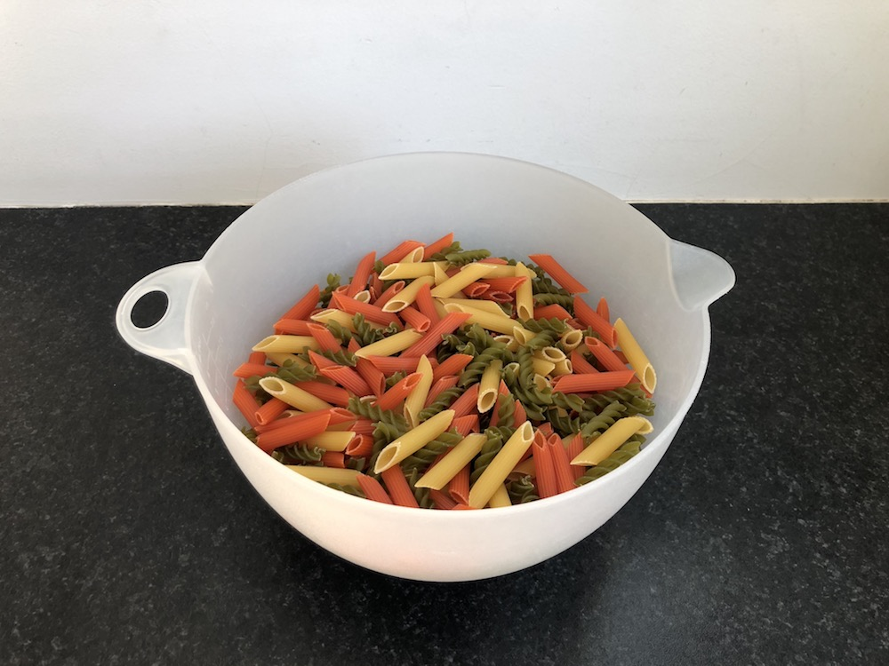
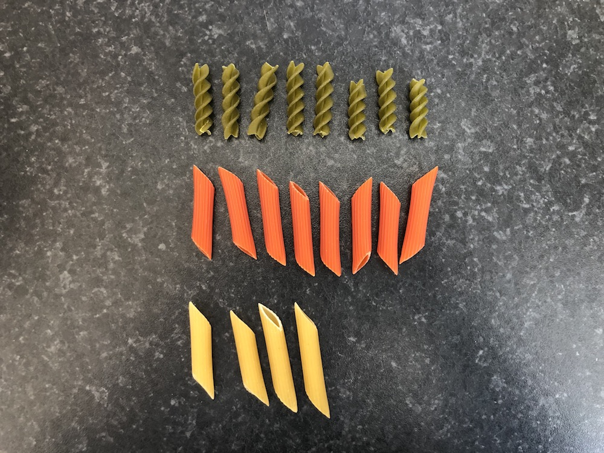
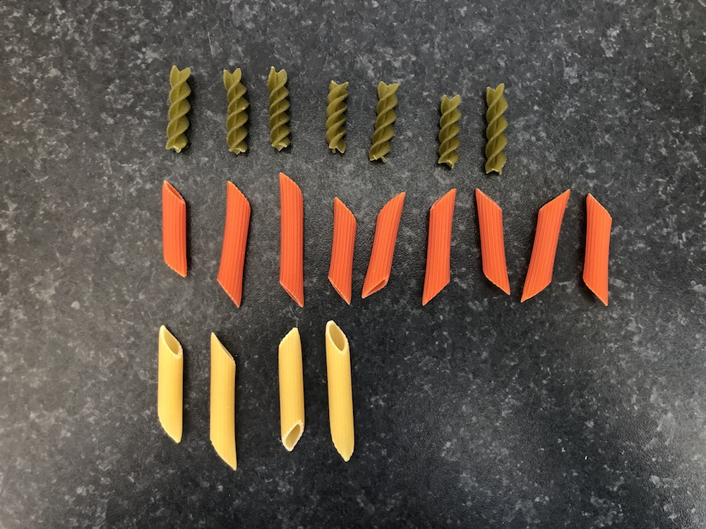
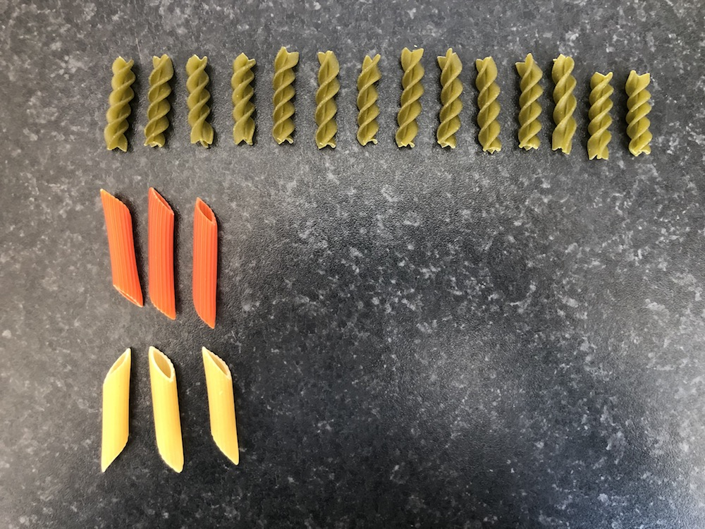
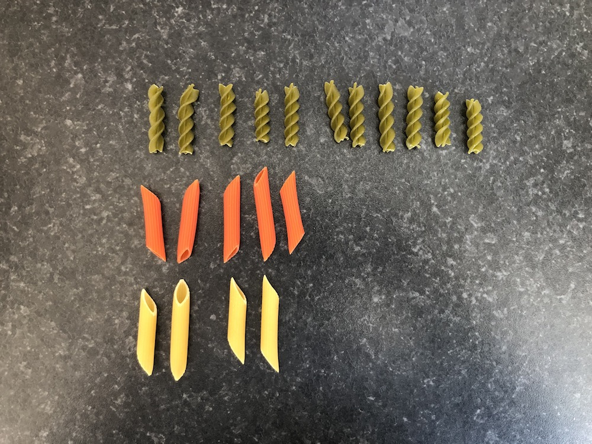
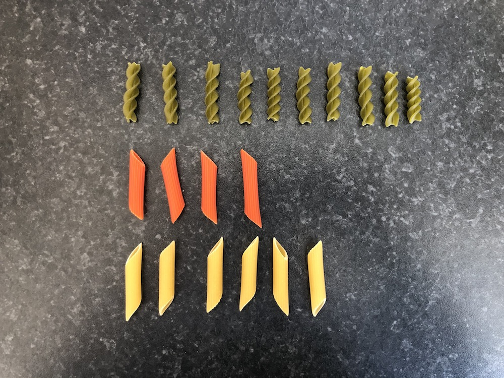
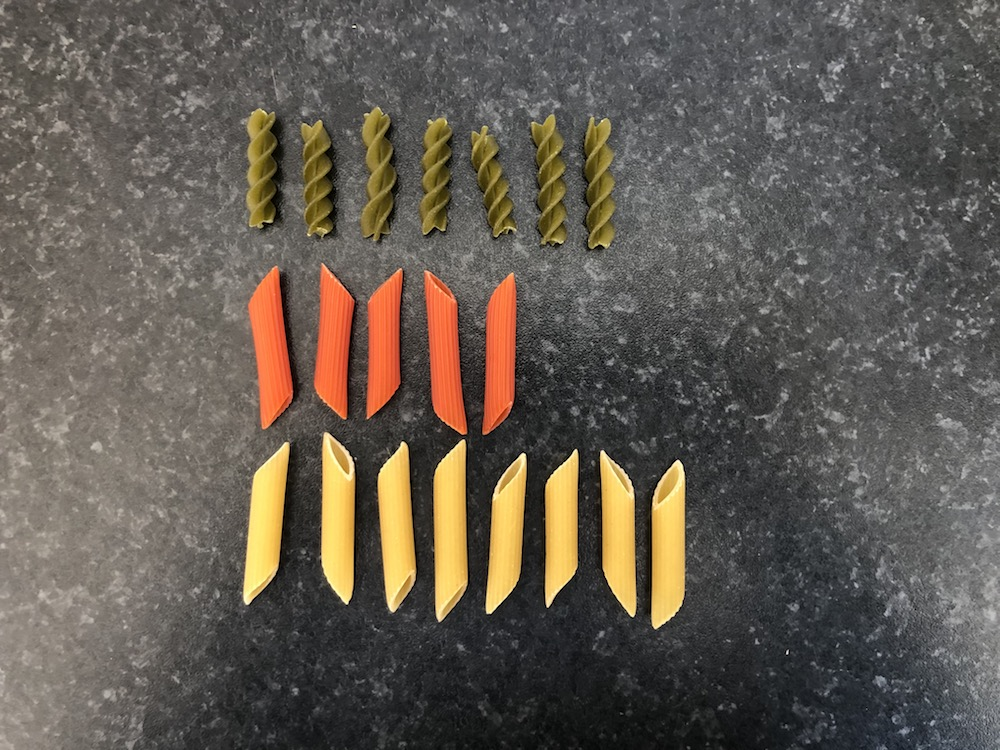
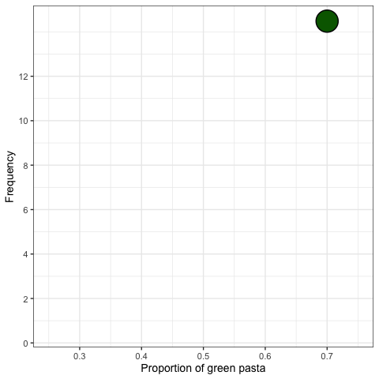

```{r setup, include=FALSE,warning=FALSE,message=FALSE}
options(htmltools.dir.version = FALSE)
knitr::opts_chunk$set(
  message = FALSE,
  warning = FALSE,
  dev = "svg",
  cache = TRUE,
  fig.align = "center",
  comment = "##"
  #fig.width = 11,
  #fig.height = 5
)

library(tidyverse)
library(tweenr)
library(ggforce)
library(gganimate)
library(countdown)

# countdown style
countdown(
  color_border              = "#d90502",
  color_text                = "black",
  color_running_background  = "#d90502",
  color_running_text        = "white",
  color_finished_background = "white",
  color_finished_text       = "#d90502",
  color_finished_border     = "#d90502"
)

set.seed(1234)
```

------------------------------------------------------------------------

## Today's Agenda

-   **샘플링**, **샘플링 변동성**, **샘플링 분포** 개념을 익히기.

-   **샘플링 용어**:

    -   **모집단 (Population)**
    -   **표본 (Sample)**
    -   **모수 (Population Parameter)**
    -   **점 추정치 또는 표본 통계량 (Point Estimate or Sample Statistic)**

-   ***불편추정량 (Unbiased Estimator)***의 정의.

-   통계적 추론의 핵심 정리: ***중심극한정리 (Central Limit Theorem, CLT)***.

------------------------------------------------------------------------

## 초록색 파스타의 비율은 얼마일까?

```{r, echo = FALSE, out.width = "500px"}

```

-   모든 초록색 파스타를 세는 것은 너무 힘듦! 😩 다른 방법은?

------------------------------------------------------------------------

## 표본 추출 (Sampling)

::::: columns
::: {.column width="50%"}
-   파스타 20개를 표본으로 선택함.

-   **무작위(random)** 로 선택되었음.

-   결과는 다음과 같음.

|  색상  | 개수 |                  비율                   |
|:------:|:----:|:---------------------------------------:|
| 초록색 |  14  | `r format(signif(14/20,2), nsmall = 2)` |
| 빨간색 |  5   |  `r format(round(5/20,2), nsmall = 2)`  |
| 노란색 |  1   |  `r format(round(1/20,2), nsmall = 2)`  |

-   `r format(signif(14/20,2), nsmall = 2)` 값은 전체 그릇에서 초록색 파스타의 비율을 추정하는 값으로 볼 수 있음.
:::

::: {.column width="50%"}

:::
:::::

------------------------------------------------------------------------

## 표본 변동성 (Sampling Variation)

-   만약 *새로운* 표본을 추출한다면 (이전에 뽑은 20개의 파스타를 다시 그릇에 넣고)? 이전처럼 *녹색* 파스타 14개가 나올까?

-   아마 아닐 것임. 표본은 추출할 때마다 달라질 것임.

-   핵심 포인트: 표본은 **무작위로** 추출.

------------------------------------------------------------------------

## 18개의 표본 추출

-   20개의 파스타를 *복원 추출*하여 18개의 표본을 뽑아 보면

-   각각의 표본은 다음과 같음:

|   |   |   |   |   |   |
|:----------:|:----------:|:----------:|:----------:|:----------:|:----------:|
|  |  |  |  |  |  |
|  |  |  |  |  |  |


------------------------------------------------------------------------

## 18개의 표본 추출

-   20개의 파스타를 *복원 추출*하여 18개의 표본을 뽑아 보면

-   각각의 표본은 다음과 같음:

::::: columns
::: {.column width="50%"}
| 표본 번호 | 개수 |                  비율                  |
|:---------:|:----:|:--------------------------------------:|
|     1     |  14  | `r format(round(14/20,2), nsmall = 2)` |
|     2     |  14  | `r format(round(14/20,2), nsmall = 2)` |
|     3     |  10  | `r format(round(10/20,2), nsmall = 2)` |
|     4     |  10  | `r format(round(10/20,2), nsmall = 2)` |
|     5     |  6   | `r format(round(6/20,2), nsmall = 2)`  |
|     6     |  10  | `r format(round(10/20,2), nsmall = 2)` |
|     7     |  8   | `r format(round(8/20,2), nsmall = 2)`  |
|     8     |  9   | `r format(round(9/20,2), nsmall = 2)`  |
|     9     |  11  | `r format(round(11/20,2), nsmall = 2)` |
:::

::: {.column width="50%"}
| 표본 번호 | 개수 |                  비율                  |
|:---------:|:----:|:--------------------------------------:|
|    10     |  8   | `r format(round(8/20,2), nsmall = 2)`  |
|    11     |  7   | `r format(round(7/20,2), nsmall = 2)`  |
|    12     |  9   | `r format(round(9/20,2), nsmall = 2)`  |
|    13     |  9   | `r format(round(9/20,2), nsmall = 2)`  |
|    14     |  14  | `r format(round(14/20,2), nsmall = 2)` |
|    15     |  11  | `r format(round(11/20,2), nsmall = 2)` |
|    16     |  10  | `r format(round(10/20,2), nsmall = 2)` |
|    17     |  7   | `r format(round(7/20,2), nsmall = 2)`  |
|    18     |  13  | `r format(round(13/20,2), nsmall = 2)` |
:::
:::::


------------------------------------------------------------------------

## Task 1 {background-color="#ffebf0"}

`r countdown(minutes = 5, top = "20px", right = "10px", font_size = "0.8em", color_border = "blue")`


1.  이전 슬라이드에서 녹색 파스타 비율을 포함하는 `data.frame`을 생성하시오. 이 데이터 프레임의 이름을 `pasta`로 지정하고, 비율을 포함하는 변수를 `prop_green`으로 설정하시오.\
    (힌트: `data.frame()` 함수를 사용하여 데이터 프레임을 생성할 수 있음.)\
    비율 값은 다음과 같음: `(0.7, 0.7, 0.5, 0.5, 0.3, 0.5, 0.4, 0.45, 0.55, 0.4, 0.35, 0.45, 0.45, 0.7, 0.55, 0.5, 0.35, 0.65)`

2.  `ggplot2`를 사용하여 이 비율의 히스토그램을 생성하시오.\
    `geom_histogram()` 함수에서 다음 매개변수를 사용하시오:\
    `boundary = 0.325, binwidth = 0.05`.

3.  무엇을 관찰할 수 있는가?

------------------------------------------------------------------------

## 표본 분포 (Sampling distribution): 히스토그램

::::: columns
::: {.column width="50%"}
```{r, echo=FALSE, eval = TRUE, fig.height=8}
pasta_samples <- data.frame(replicate = 1:18, prop_green = c(0.7,0.7,0.5,0.5,0.3,0.5,0.4,0.45,0.55,0.4,0.35,0.45,0.45,0.7,0.55,0.5,0.35,0.65))

# set.seed(2)
# x = pasta_samples[,2]
# 
# df <- data.frame(x = x, y = 15)
# dfs <- list(df)
# for(i in seq_len(nrow(df))) {
#     dftemp <- tail(dfs, 1)
#     dftemp[[1]]$y[i] <- sum(dftemp[[1]]$x[seq_len(i)] == dftemp[[1]]$x[i])
#     dfs <- append(dfs, dftemp)
# }
# dfs <- append(dfs, dfs[rep(length(dfs), 3)])
# dft <- tween_states(dfs, 10, 1, 'cubic-in', 200)
# dft$y <- dft$y - 0.5
# dft <- dft[dft$y != 14.5, ]
# dft$type <- 'Animate'
# 
# p <- ggplot(dft) +
#   geom_point(aes(x, y), shape = 21, colour = "black", fill = "darkgreen", size = 12.5, stroke = 1) +
#   labs(
#     x = "Proportion of green pasta",
#     y = "Frequency"
#   ) +
#   xlim(0.25, 0.75) +
#   scale_y_continuous(breaks = seq(0,12, 2)) +
#   theme_bw(base_size = 14) +
#   transition_manual(.frame)
# p
# anim_save(filename = "img/photos/hist_building.gif", animation = p)


```
:::

::: {.column width="50%"}
```{r, echo=FALSE, eval = TRUE, fig.height=7}
pasta_samples %>%
  ggplot(aes(x = prop_green)) +
  geom_histogram(boundary = 0.325, binwidth = 0.05, col = "white", fill = "darkgreen") +
  labs(
    x = "Proportion of green pasta",
    y = "Frequency"
  ) +
  xlim(0.25, 0.75) +
  theme_bw(base_size = 20)
```
:::
:::::

------------------------------------------------------------------------

## 방금 뭘 한 것임??

-   ***표본 추출***이라는 통계 개념을 실험함.

-   **목표**: 녹색 파스타의 비율을 알고자 함.

-   **방법**:

    1.  **전수 조사(Census)**: 시간이 많이 걸리고, 많은 경우 매우 비용이 많이 듦.

    2.  **표본 추출(Sampling)**: 그룻에서 20개의 파스타를 무작위로 뽑아 ***추정값***을 얻음.\
        첫 번째 ***추정값***은 0.70이었지만, 이는 대부분의 다른 ***추정값***보다 높았음.

-   **중요**: 각 *표본*은 ***무작위***로 추출됨 → 표본이 서로 다름! → 추출된 비율이 달라짐 → ***표본 변동(Sampling Variation)***

------------------------------------------------------------------------

## 가상의 표본 추출하기 (실제 표본 아님)

::::: columns
::: {.column width="50%"}
-   볼 안의 녹색, 빨간색, 노란색 파스타 개수를 정확히 셈.
-   볼 안의 모든 파스타 데이터는 [여기]("https://raw.githack.com/chung-jiwoong/FMB819/refs/heads/main/chapter_sampling/data/pasta.csv") CSV 파일에 저장됨.

```{r, echo = TRUE}
bowl <- read.csv("https://raw.githack.com/chung-jiwoong/FMB819-Slides/refs/heads/main/chapter_sampling/data/pasta.csv")
head(bowl)
```
:::

::: {.column width="50%"}
-   pasta_ID: 파스타 ID
-   color: 파스타 색상

```{r, echo = TRUE}
nrow(bowl)
```

-   손으로 직접 파스타를 고르는 대신, 가상으로 표본을 추출할 것임.
-   *가상 삽*을 사용하여 가상 그룻에서 50개의 파스타를 무작위로 선택함.
:::
:::::

------------------------------------------------------------------------

## 가상 삽사용하여 한 번 표본 추출

-   `moderndive` 패키지의 `rep_sample_n` 함수를 사용하여 크기 50의 첫 번째 표본을 추출할 것임.

```{r, echo=TRUE}
# moderndive 패키지 로드
library(moderndive)

virtual_shovel <- bowl %>%  # moderndive 함수는 파이프 연산자와 함께 사용 가능
  rep_sample_n(size = 50)   # 50개의 파스타를 무작위로 추출
```

::::: columns
::: {.column width="50%"}
```{r, echo = TRUE}
# 표본의 첫 6개 행 표시
head(virtual_shovel)
```

-   replicate 열은 표본의 ID를 나타냄. 여기서는 1.
:::

::: {.column width="50%"}
```{r, echo = TRUE}
# 표본의 관측값 개수 확인
nrow(virtual_shovel)
```
:::
:::::

------------------------------------------------------------------------

## 초록색 파스타 비율 계산

::::: columns
::: {.column width="50%"}
```{r, echo=TRUE}
sample_1 <- virtual_shovel %>% 
  summarize(
    # 표본 내 초록색 파스타 개수
    num_green = sum(color == "green"),
    # 표본 내 전체 관측값 개수
    sample_n = n()) %>% 
  mutate(
    # 초록색 파스타 비율 계산
    prop_green = num_green / sample_n)
sample_1
```
:::

::: {.column width="50%"}
1.  다음을 계산:

-   표본 내 초록색 파스타 개수
-   표본 내 전체 관측값 개수 (여기서는 50)

2.  초록색 파스타 비율 계산

-   초록색 파스타 비율은 `r sample_1$prop_green`! 이것은 **그릇 내 초록색 파스타 비율의 추정치(estimate)**임. 한 번 더 해보면 어떨까?

3.  만약 여러 번, 예를 들어 33번 시도하면 어떻게 될까?
:::
:::::

------------------------------------------------------------------------

## 가상 삽을 33번 사용하기

::::: columns
::: {.column width="50%"}
-   33개의 크기 50인 표본을 생성.

```{r, echo=TRUE}
virtual_samples <- bowl %>%
  # 크기 50인 표본을 33개 추출
  rep_sample_n(size = 50, reps = 33)
virtual_samples
```
:::

::: {.column width="50%"}
-   각 표본에서 초록색 파스타의 비율을 계산.

```{r, echo=TRUE}
virtual_prop_green <- virtual_samples %>% 
  group_by(replicate) %>% # 각 표본별로 계산
  summarize(
    num_green = sum(color == "green"),
    sample_n = n()) %>% 
  mutate(prop_green = num_green / sample_n)
virtual_prop_green
```
:::
:::::

------------------------------------------------------------------------

## (가상!) 표본 변동성

::::: columns
::: {.column width="50%"}
-   실제 실험처럼 가상 샘플도 **무작위 표본**을 생성함.

-   `virtual_prop_green` 데이터 프레임의 `prop_green` 열은 표본마다 값이 다름.

-   다시 말해, ***표본 분포***를 시각화할 수 있음:

```{r,echo=TRUE, eval=FALSE}
ggplot(virtual_prop_green, aes(x = prop_green)) +
  geom_histogram(binwidth = 0.02, 
                 boundary = 0.51,
                 color = "white",
                 fill = "darkgreen") +
  scale_y_continuous(breaks = seq(0, 12, by = 2)) +
  labs(x = "Proportion of 50 pasta that were green",
       y = "Frequency",
       title = "Distribution of 33 samples of size 50") +
  theme_bw(base_size = 20)
```
:::

::: {.column width="50%"}
```{r,echo = FALSE,fig.height=6}
ggplot(virtual_prop_green, aes(x = prop_green)) +
  geom_histogram(binwidth = 0.02, 
                 boundary = 0.51,
                 color = "white",
                 fill = "darkgreen") +
  scale_y_continuous(breaks = seq(0, 12, by = 2)) +
  labs(x = "Proportion of 50 pasta that were green",
       y = "Frequency",
       title = "Distribution of 33 samples of size 50") +
  theme_bw(base_size = 20)
```
:::
:::::

------------------------------------------------------------------------

## Task 2 {background-color="#ffebf0"}

`r countdown(minutes = 5, top = "20px", right = "10px", font_size = "0.8em", color_border = "blue")`

33개의 표본만 추출하는 대신, 이번에는 ***1000개***를 추출해보자!

1.  데이터 [링크](https://raw.githack.com/chung-jiwoong/FMB819/refs/heads/main/chapter_sampling/data/pasta.csv)를 불러와 `pasta` 객체에 저장하라.

2.  `moderndive` 패키지의 `rep_sample_n()` 함수를 사용하여 크기 50인 표본을 1000개 생성하라.

3.  각 표본에서 초록색 파스타의 비율을 계산하라.

4.  각 표본에서 얻은 초록색 파스타 비율의 히스토그램을 그리시오.

5.  무엇을 관찰할 수 있는가? 어떤 비율이 가장 자주 발생하는가? 33개의 표본을 사용할 때와 비교하여 히스토그램의 모양이 어떻게 달라지는가?

6.  추출한 50개의 파스타 중 초록색 파스타가 20% 미만일 확률은 얼마나 되는가?

------------------------------------------------------------------------

## 1000개의 표본 분포

```{r, echo = FALSE, eval = TRUE, fig.height = 4.5, fig.width = 7.75}
virtual_samples <- bowl %>% 
  rep_sample_n(size = 50, reps = 1000)

virtual_prop_green <- virtual_samples %>% 
  group_by(replicate) %>% 
  summarize(
    num_green = sum(color == "green"),
    sample_n = n()) %>% 
  mutate(prop_green = num_green / sample_n)

virtual_prop_green %>% ggplot(
  aes(x = prop_green)) +
  geom_histogram(
    binwidth = 0.02,
    boundary = 0.41,
    color = "white",
    fill = "darkgreen") +
  labs(x = "Proportion of green pasta in sample",
       y = "Frequency",
       title = "Distribution of 1000 samples of size 50") +
  theme_bw(base_size = 14)
```

-   놀랍게도 정규 분포와 매우 유사한 모양을 보임 $\rightarrow$ 표본을 많이 추출할수록, 표본 분포는 점점 더 정규 분포를 닮아감.

------------------------------------------------------------------------

## 표본 크기의 역할

-   만약 표본 크기를 변경할 수 있고, 25, 50, 100 중에서 선택할 수 있다면?

-   여전히 목표가 그릇 속 초록색 파스타의 비율을 추정하는 것이라면, 어떤 크기의 삽을 선택하겠는가?

------------------------------------------------------------------------

## 표본 크기의 역할

-   이전에 했던 작업을 다른 표본 크기에 대해서 반복해 보자.

-   각 표본 크기에 대해 1000개의 표본을 추출해 보자: $n=25$, $n=50$, $n=100$.

-   `rep_sample_n()` 함수를 다시 사용한다.

::::: columns
::: {.column width="50%"}
-   다양한 표본 크기의 생성

```{r, echo=TRUE}
# Sample size: 25
virtual_samples_25 <- bowl %>% 
  rep_sample_n(size = 25, reps = 1000)

# Sample size: 50
virtual_samples_50 <- bowl %>% 
  rep_sample_n(size = 50, reps = 1000)

# Sample size: 100
virtual_samples_100 <- bowl %>% 
  rep_sample_n(size = 100, reps = 1000)
```
:::

::: {.column width="50%"}
\*초록색 파스타의 비율 계산

```{r, echo=TRUE}
# Sample size: 25
# The same code is used for the other sample sizes
virtual_prop_green_25 <- virtual_samples_25 %>% 
  group_by(replicate) %>% 
  summarize(
    num_green = sum(color == "green"),
    sample_n = n()) %>% 
  mutate(prop_green = num_green / sample_n)
```
:::
:::::

------------------------------------------------------------------------

## 표본 크기의 역할

```{r, echo = FALSE, fig.height=5, fig.width=10}

# Sample size: 50
virtual_prop_green_50 <- virtual_samples_50 %>% 
  group_by(replicate) %>% 
  summarize(
    num_green = sum(color == "green"),
    sample_n = n()) %>% 
  mutate(prop_green = num_green / sample_n)

# Sample size: 100
virtual_prop_green_100 <- virtual_samples_100 %>% 
  group_by(replicate) %>% 
  summarize(
    num_green = sum(color == "green"),
    sample_n = n()) %>% 
  mutate(prop_green = num_green / sample_n)

df = rbind(virtual_prop_green_25,virtual_prop_green_50,virtual_prop_green_100)

df %>% 
  ggplot(aes(x = prop_green)) +
    geom_histogram(data = df %>% filter(sample_n == 25), binwidth = 0.04, boundary = 0.42, color = "white", fill = "darkgreen") +
  geom_histogram(data = df %>% filter(sample_n == 50), binwidth = 0.02, boundary = 0.41, color = "white", fill = "darkgreen") +
  geom_histogram(data = df %>% filter(sample_n == 100), binwidth = 0.01, boundary = 0.405, color = "white", fill = "darkgreen") +
  scale_x_continuous(breaks = round(seq(0, 1, by = 0.2),1), limits = c(0.2,0.8)) +
  labs(
    x = "Proportion of green pasta in sample",
    y = "Frequency",
    title = "Comparing distributions of proportions of green pasta for different sample sizes"
  ) +
    facet_wrap(~sample_n, scales = "free_y", labeller = as_labeller(
        c(`25` = "1000 samples of size 25",
          `50` = "1000 samples of size 50",
          `100` = "1000 samples of size 100"))) +
    theme_bw(base_size = 14)
```

------------------------------------------------------------------------

## 표본 크기와 표본 분포

-   표본 크기가 커질수록 **표본 분포**는 더 *좁아진다*.

-   즉, **표본 변동성**에 의한 차이가 더 적어진다.

-   반복 횟수(여기서는 1000개)를 일정하게 유지하면, **더 큰 표본**일수록 **정규 분포에 더 가까워지고**, **표준 편차가 더 작아진다**.

-   표본 크기별 표준 편차 계산

```{r, echo = FALSE}
# n = 25
sd25 = virtual_prop_green_25 %>% 
  summarize(sd = sd(prop_green))

# n = 50
sd50 = virtual_prop_green_50 %>% 
  summarize(sd = sd(prop_green))

# n = 100
sd100 = virtual_prop_green_100 %>% 
  summarize(sd = sd(prop_green))
```

| Sample Size |            Standard Deviation             |
|:-----------:|:-----------------------------------------:|
|     25      | `r format(round(sd25$sd,2), nsmall = 2)`  |
|     50      | `r format(round(sd50$sd,2), nsmall = 2)`  |
|     100     | `r format(round(sd100$sd,2), nsmall = 2)` |

-   표준 편차는 평균 주변의 분포의 확산 정도를 측정한다.

-   따라서 표본 크기가 증가하면, 전체 그린 파스타 비율에 대한 추정값이 더 **정확**해진다.

------------------------------------------------------------------------

## 표본 추출 개념

-   **추정**을 목적으로 표본을 추출함.

-   전체 그린 파스타의 비율을 **추정**하기 위해 표본을 추출함.

**표본 추출과 관련된 핵심 개념**

1.  **표본 변동성**이 추정값에 미치는 영향: 서로 다른 표본은 서로 다른 추정값을 제공함.

2.  표본 크기가 **표본 변동성**에 미치는 영향: 표본 크기가 커질수록 추정값이 실제 값에 가까워짐.

------------------------------------------------------------------------

## 표본 추출 용어 📖

::::: columns
::: {.column width="50%"}
***모집단 (Population)*** 우리가 관심 있는 개체 또는 관측치의 전체 집합. $N = 713$개의 파스타.

***모집단 모수 (Population Parameter)*** 모집단에 대한 알려지지 않은 수치적 요약값으로, 우리가 알고자 하는 값. *예:* 모집단 평균 $(\mu)$, 그린 파스타의 비율 $(p)$.

***전수 조사 (Census)*** 모집단의 모든 $N$개의 개체나 관측치를 철저하게 조사하여 모집단 모수 값을 *정확하게* 계산하는 방법.

***표본 추출 (Sampling)*** 모집단의 크기 $N$에서 크기 $n$인 표본을 수집하는 과정.
:::

::: {.column width="50%"}
***점 추정량 (Point Estimate) 또는 표본 통계량 (Sample Statistic)*** 모집단의 알려지지 않은 모수를 추정하기 위해 표본에서 계산한 요약 통계량. *예:* *표본 비율* $(\hat{p})$은 모집단 비율 $p$의 *추정값*을 나타내며, "hat(모자)" 기호로 표시됨.

***대표 표본 추출 (Representative Sampling)*** 표본이 모집단을 *잘 대표하는가*?

***편향된 표본 추출 (Biased Sampling)*** 모든 파스타가 동일한 확률로 표본에 포함될 기회를 가졌는가?

***무작위 표본 추출 (Random Sampling)*** 편향 없이 무작위로 표본을 선택하는 방식.
:::
:::::

------------------------------------------------------------------------

## 통계적 정의

-   우리는 계속해서 $\hat{p}$을 추정해 왔음.

-   *표본 비율* $\hat{p}$의 *표본 분포*를 그려서 *표본 변동성*을 시각적으로 확인.

-   $\hat{p}$의 *표본 분포*의 *표준 편차*를 계산했음. 이 표준 편차는 특별한 이름을 가짐: *점 추정량* $\hat{p}$의 ***표준 오차 (Standard Error)***.

-   다시 아래 표 확인:

| 표본 크기 $(n)$ |           $\hat{p}$의 표준 오차           |
|:---------------:|:-----------------------------------------:|
|       25        | `r format(round(sd25$sd,2), nsmall = 2)`  |
|       50        | `r format(round(sd50$sd,2), nsmall = 2)`  |
|       100       | `r format(round(sd100$sd,2), nsmall = 2)` |

-   핵심 요점: *표본 크기* $n$이 커질수록 *점 추정량*의 일반적인 오차 크기는 줄어듦.
    -   이는 *표준 오차(Standard error)*를 통해 정량적으로 확인 가능.

------------------------------------------------------------------------

## 전체 과정 정리

-   ***무작위 표본 (random samples)***에서 얻은 ***점 추정량 (point estimates)***은 ***모집단 모수 (population parameter)***의 *좋은 추측값*을 제공함.

-   하지만 얼마나 좋은 추정값일까?

    -   어떤 경우에는 $\hat{p}$가 $p$와 크게 다를 수도 있고, 어떤 경우에는 매우 가까울 수도 있음.\
    -   이러한 차이는 ***표본 변동성 (sampling variation)*** 때문임.

-   ***평균적으로*** 우리의 추정값은 정확할 것임. 이는 표본을 무작위로 추출하기 때문임.\
    -   즉, $\hat{p}$는 $p$의 불편 추정량 (unbiased estimator)이며, $\mathop{\mathbb{E}}[\hat{p}] = p$ 임.

-   그렇다면, 전체 $N=713$개의 파스타 중 ***녹색 파스타의 실제 모집단 비율*** $p$는 얼마일까?

```{r, echo=TRUE}
sum(bowl$color == "green")/nrow(bowl)
```

-   그래프에 ***실제 모집단 비율*** $p=`r round(sum(bowl$color == "green")/nrow(bowl), 2)`$ 값을 추가.

------------------------------------------------------------------------

## 불편성(Unbiasedness)과 표본 변동성(Sampling variation) 시각화

```{r,echo = FALSE,fig.width=10,fig.height=5}
# 모집단 내 녹색 파스타의 실제 비율 계산
p <- bowl %>% 
  summarize(p = mean(color == "green")) %>% 
  pull(p)

# 모집단 비율 라벨 생성
dat_text <- data.frame(
  sample_n   = c(25, 50, 100),
  # x     = c(0.655, 0.655, 0.655),
  # y     = c(175, 95, 45),
  label = rep("True population proportion", 3)
)

# 표본 크기별 분포 비교
df %>% 
  ggplot(aes(x = prop_green)) +
    geom_histogram(data = df %>% filter(sample_n == 25), binwidth = 0.04, boundary = 0.42, color = "white", fill = "darkgreen") +
  geom_histogram(data = df %>% filter(sample_n == 50), binwidth = 0.02, boundary = 0.41, color = "white", fill = "darkgreen") +
  geom_histogram(data = df %>% filter(sample_n == 100), binwidth = 0.01, boundary = 0.405, color = "white", fill = "darkgreen") +
  scale_x_continuous(breaks = round(seq(0, 1, by = 0.2),1), limits = c(0.2,0.8)) +
  labs(
    x = "Proportion of green pasta in sample",
    y = "Frequency",
    title = "Comparing distributions of proportions of green pasta for different sample sizes"
  ) +
    facet_wrap(~sample_n, scales = "free_y", labeller = as_labeller(
        c(`25` = "1000 samples of size 25",
          `50` = "1000 samples of size 50",
          `100` = "1000 samples of size 100"))) +
    theme_bw(base_size = 14) +
  geom_vline(xintercept = p, col = "black", size = 0.75) +
  geom_text(data = dat_text, mapping = aes(x = 0.662, y = Inf, label = label), vjust = 2, size = 3)
```

------------------------------------------------------------------------

## 다양한 표본 추출 시나리오

| 시나리오 | 모집단 모수 | 기호 | 점 추정량 | 표기법 |
|:-------------:|:-------------:|:-------------:|:-------------:|:-------------:|
| 1 | 모집단 비율 | $p$ | 표본 비율 | $\widehat{p}$ |
| 2 | 모집단 평균 | $\mu$ | 표본 평균 | $\overline{x}$ 또는 $\widehat{\mu}$ |
| 3 | 모집단 비율 차이 | $p_1 - p_2$ | 표본 비율 차이 | $\widehat{p}_1 - \widehat{p}_2$ |
| 4 | 모집단 평균 차이 | $\mu_1 - \mu_2$ | 표본 평균 차이 | $\overline{x}_1 - \overline{x}_2$ |
| 5 | 모집단 회귀 계수 (기울기) | $\beta_1$ | 표본 회귀 계수 (기울기) | $b_1$ 또는 $\widehat{\beta}_1$ |
| 6 | 모집단 회귀 절편 | $\beta_0$ | 표본 회귀 절편 | $b_0$ 또는 $\widehat{\beta}_0$ |

------------------------------------------------------------------------

## 중심극한정리 (Central Limit Theorem; CLT)

-   표본 통계량이 **수렴**하여 특정한 *중심 극한*에 도달하는 것은 통계학에서 잘 알려진 사실임.

-   이는 ***중심극한정리(Central Limit Theorem)*** 때문임.

> ### *중심극한정리:* 모집단 분포의 형태가 어떠하든 상관없이, **표본 *평균*이 큰 표본 크기를 기반으로 계산될 때, 이러한 표본 *평균*의 표본 분포는 점점 더 정규 분포 형태를 띠며, 동시에 점점 더 좁아짐.**

-   즉, 표본 평균의 표본 분포는 점점 ***정규 분포***를 따르게 되고, 이러한 표본 분포의 *변동성*이 점점 줄어들며, 이는 ***표준 오차(Standard Error)***로 정량화될 수 있음.


<!-- 

------------------------------------------------------------------------
## 중심극한정리 - NYTimes video

::: {style="text-align: center;"}
<iframe width="684" height="464" src="https://www.youtube.com/embed/jvoxEYmQHNM" frameborder="0" allow="accelerometer; autoplay; encrypted-media; gyroscope; picture-in-picture" allowfullscreen>

</iframe>
::: -->


# THE END!
