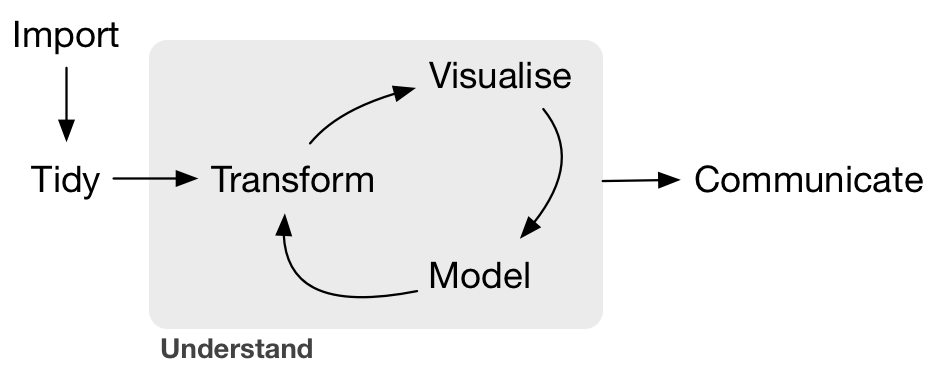
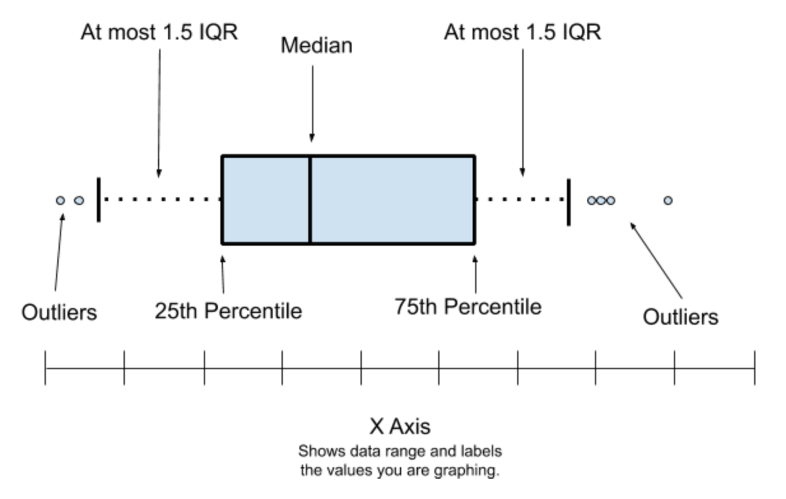
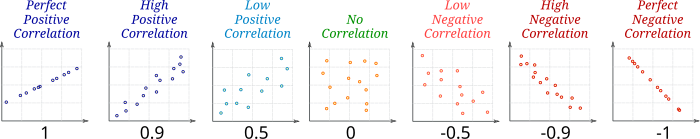

```{r setup, include=FALSE,warning=FALSE,message=FALSE}
options(htmltools.dir.version = FALSE)
knitr::opts_chunk$set(
  message = FALSE,
  warning = FALSE,
  dev = "svg",
  cache = TRUE,
  fig.align = "center"
  #fig.width = 11,
  #fig.height = 5
)
library(countdown)
# countdown style
countdown(
  color_border              = "#d90502",
  color_text                = "black",
  color_running_background  = "#d90502",
  color_running_text        = "white",
  color_finished_background = "white",
  color_finished_text       = "#d90502",
  color_finished_border     = "#d90502"
)
```

## Working With Data

<!-- * Economists work with `data`. -->

<!-- ```{r, echo = F, out.width = "400px"} -->

<!--  -->

<!-- ``` -->

<!-- -- -->

-   [2014년 뉴욕타임즈 기사](https://www.nytimes.com/2014/08/18/technology/for-big-data-scientists-hurdle-to-insights-is-janitor-work.html)에 따르면, "데이터 과학자들은 데이터를 분석하기 전에 **50%에서 80%의 시간**을 데이터 수집 및 정리에 소비한다."라고 함.

-   다음 두 강의에서는 **데이터 정리, 시각화, 요약**의 기본을 배움.

# Tidying Data

------------------------------------------------------------------------

## `dplyr` 소개

-   [`dplyr`](https://dplyr.tidyverse.org)은 [`tidyverse`](https://www.tidyverse.org) 패키지군의 일부.
-   [`data.table`](https://github.com/Rdatatable/data.table/wiki)도 대안으로 사용 가능하며, 대용량 데이터에 최적화되어 있음.
-   여기서는 `dplyr`을 다룸.

------------------------------------------------------------------------

## `dplyr` 개요

-   Hadley Wickham의 "R for Data Science" [영문](https://r4ds.had.co.nz/transform.html) [국문](https://bookdown.org/sulgi/r4ds/)
-   [치트시트](https://github.com/rstudio/cheatsheets/blob/master/data-transformation.pdf)도 매우 유용.
-   `dplyr`은 여러 **verbs** 중심으로 구성되어 있음.
-   `data.frame` 또는 `tibble` 형식의 데이터를 다룰 것임.

$$\text{verb}(\underbrace{\text{data.frame}}_{\text{1st argument}}, \underbrace{\text{what to do}}_\text{2nd argument})$$

-   또는 `pipe` 연산자 `%>%` 이용 (`magrittr` 패키지):

$$\underbrace{\text{data.frame}}_{\text{1st argument}} \underbrace{\text{ %>% }}_{\text{"pipe" operator}} \text{verb}(\underbrace{\text{what to do}}_\text{2nd argument})$$

------------------------------------------------------------------------

## 주요 `dplyr` verbs

1.  `filter()`: 특정 조건을 만족하는 행 선택
2.  `arrange()`: 행 정렬
3.  `select()`: 특정 열 선택
4.  `mutate()`: 기존 열을 이용하여 새 변수 생성
5.  `summarise()`: 요약 통계 계산
6.  `group_by()`: 그룹별 연산 수행 가능

------------------------------------------------------------------------

## 예제 데이터: 2016년 미국 대선 여론조사 (`dslabs` 패키지)

-   2016년 미국 대선과 관련된 여론조사 데이터를 포함

```{r dslabs, echo = TRUE}
library(dslabs)
library(tidyverse)
data(polls_us_election_2016, package = "dslabs")
polls_us_election_2016 <- as_tibble(polls_us_election_2016) # 데이터를 'tibble' 형식으로 변환
head(polls_us_election_2016[,1:6]) # 데이터의 첫 6개의 행과 첫 6개의 열을 출력
```

------------------------------------------------------------------------

## 예제 데이터: 2016년 미국 대선 여론조사 (`dslabs` 패키지)

-   이 데이터셋에 어떤 변수가 포함되어 있는지 확인

```{r, echo=TRUE}
str(polls_us_election_2016) # 데이터의 구조를 요약하여 출력
```

------------------------------------------------------------------------

## `dplyr`: `filter()`

```{r, echo=TRUE}
# 표본 크기(samplesize)가 2000보다 큰 행만 선택, 츨력
polls_us_election_2016 %>%
  filter(samplesize > 2000)
```

------------------------------------------------------------------------

## `dplyr`: `filter()`

기본적인 비교 연산자:

-   `>`: 크다 (greater than)

-   `<`: 작다 (smaller than)

-   `>=`: 크거나 같다 (greater than or equal to)

-   `<=`: 작거나 같다 (smaller than or equal to)

-   `!=`: 같지 않다 (not equal to)

-   `==`: 같다 (equal to)

논리 연산자:

1.  `x & y`: `x` **그리고** `y` (둘 다 참일 때만 참)

2.  `x | y`: `x` **또는** `y` (둘 중 하나라도 참이면 참)

3.  `!y`: **y가 아닐 때** (논리 반전)

------------------------------------------------------------------------

## `dplyr`: `filter()`

-   `%in%` 연산자의 이용

-   `x %in% y`는 `x`가 `y`의 요소인지 확인

-   `!(x %in% y)`를 사용하면 반대의 논리 적용

```{r, echo=TRUE}
# 3이 1부터 3까지의 숫자 중 하나인지 확인 (TRUE)
3 %in% 1:3  

# 벡터화된 연산: 2와 5가 2부터 10 사이의 숫자 중 하나인지 확인 (각각 TRUE와 TRUE)
c(2,5) %in% 2:10  

# 문자열 비교: "S" 또는 "Po"가 벡터 `c("Sciences","Po")`의 요소인지 확인
c("K","Uni") %in% c("Korea","University")  
```

------------------------------------------------------------------------

## `dplyr`: `filter()`

A 등급을 받은 여론조사 중 표본 크기가 2,000명 이상이고, 트럼프가 최소 45%의 지지를 받은 여론조사는?

```{r, echo=TRUE}
# polls_us_election_2016 데이터에서 
# 1. 등급(grade)이 "A"이고
# 2. 표본 크기(samplesize)가 2000명보다 크며
# 3. 트럼프의 여론조사 지지율(rawpoll_trump)이 45% 이상인 행을 필터링합니다.
polls_us_election_2016 %>%
  filter(grade == "A" & samplesize > 2000 & rawpoll_trump > 45) 
```

------------------------------------------------------------------------

## `dplyr`: `mutate()`

1.  각 여론조사에서 트럼프와 클린턴의 지지율 합계
2.  트럼프의 원래(raw) 지지율과 FiveThirtyEight의 조정(adjusted) 지지율 간의 차이

```{r, echo=TRUE}
#| code-line-numbers: "|5|6|7"
# 1. trump_clinton_tot: 트럼프와 클린턴의 지지율 합계
# 2. trump_raw_adj_diff: 트럼프의 원래 지지율과 538 조정 지지율 간의 차이
# 마지막으로 names() 함수를 사용하여 데이터의 변수명을 확인.
polls_us_election_2016 %>%
  mutate(trump_clinton_tot = rawpoll_trump + rawpoll_clinton, # 트럼프와 클린턴 지지율 합계
         trump_raw_adj_diff = rawpoll_trump - adjpoll_trump) %>% # 원래 지지율과 조정 지지율 차이
  names() # 변수명 출력
```

------------------------------------------------------------------------

## `dplyr`: `select()`

-   다음 변수만 선택: `state, startdate, enddate, pollster, rawpoll_clinton, rawpoll_trump`

```{r, echo = TRUE}
# select() 함수를 사용하여 특정 열만 선택.
# 1. state: 조사된 주(State)
# 2. startdate: 여론조사가 시작된 날짜
# 3. enddate: 여론조사가 종료된 날짜
# 4. pollster: 여론조사 기관
# 5. rawpoll_clinton: 힐러리 클린턴의 원래(raw) 지지율
# 6. rawpoll_trump: 도널드 트럼프의 원래(raw) 지지율

polls_us_election_2016 %>%
  select(state, startdate, enddate, pollster, rawpoll_clinton, rawpoll_trump) %>% 
  names() # 데이터 프레임의 변수명을 출력하여 올바르게 선택되었는지 확인
```

------------------------------------------------------------------------

## `dplyr`: `summarise()`

-   트럼프의 최대 지지율은 얼마인가?

```{r, echo = TRUE}
# summarise() 함수를 사용하여 트럼프의 최대(raw) 지지율을 계산
# max() 함수는 주어진 열에서 가장 큰 값을 반환

polls_us_election_2016 %>%
  summarise(max_trump = max(rawpoll_trump)) # 트럼프의 최대 지지율 계산
```

------------------------------------------------------------------------

## `dplyr`: `group_by()`

-   여론조사 등급(grade)별 클린턴의 평균 지지율은 얼마인가?

```{r, echo = TRUE}
# group_by()를 사용하여 여론조사 등급(grade)별로 그룹을 나눔.
# summarise()를 사용하여 각 그룹에서 rawpoll_clinton(클린턴의 원래 지지율)의 평균 계산

polls_us_election_2016 %>%
  group_by(grade) %>% # 여론조사 등급별 그룹화
  summarise(mean_vote_clinton = mean(rawpoll_clinton, na.rm = TRUE)) # 각 그룹에서 클린턴의 평균 지지율 계산
```

------------------------------------------------------------------------

## 명령어 연결하기

::::: columns
::: {.column width="40%"}
```{r, echo=TRUE, eval = FALSE}
polls_us_election_2016
```
:::

::: {.column width="60%"}
```{r, echo = FALSE}
polls_us_election_2016
```
:::
:::::

------------------------------------------------------------------------

## 명령어 연결하기

::::: columns
::: {.column width="40%"}
```{r, echo=TRUE, eval = FALSE}
polls_us_election_2016 %>%
    mutate(trump_clinton_diff = 
             rawpoll_trump - 
             rawpoll_clinton) 
```
:::

::: {.column width="60%"}
```{r, echo = FALSE}
polls_us_election_2016 %>%
    mutate(trump_clinton_diff = 
             rawpoll_trump - 
             rawpoll_clinton) 
```
:::
:::::

------------------------------------------------------------------------

## 명령어 연결하기

::::: columns
::: {.column width="40%"}
```{r, echo=TRUE, eval = FALSE}
polls_us_election_2016 %>%
    mutate(trump_clinton_diff = 
             rawpoll_trump - 
             rawpoll_clinton) %>%
    filter(trump_clinton_diff>5 &
           state == "Iowa" &
           is.na(rawpoll_johnson))
```
:::

::: {.column width="60%"}
```{r, echo = FALSE}
polls_us_election_2016 %>%
    mutate(trump_clinton_diff = 
             rawpoll_trump - 
             rawpoll_clinton) %>%
    filter(trump_clinton_diff>5 &
           state == "Iowa" &
           is.na(rawpoll_johnson))
```
:::
:::::

## 명령어 연결하기

::::: columns
::: {.column width="40%"}
```{r, echo=TRUE, eval = FALSE}
polls_us_election_2016 %>%
    mutate(trump_clinton_diff = 
             rawpoll_trump - 
             rawpoll_clinton) %>%
    filter(trump_clinton_diff>5 &
           state == "Iowa" &
           is.na(rawpoll_johnson)) %>%
    select(pollster) # pollster(여론조사 기관) 열만 선택
```
:::

::: {.column width="60%"}
```{r, echo = FALSE}
polls_us_election_2016 %>%
    mutate(trump_clinton_diff = 
             rawpoll_trump - 
             rawpoll_clinton) %>%
    filter(trump_clinton_diff>5 &
           state == "Iowa" &
           is.na(rawpoll_johnson)) %>%
    select(pollster)
```
:::
:::::

---


## 명령어 연결하기

::::: columns
::: {.column width="40%"}
```{r, echo=TRUE, eval = FALSE}
polls_us_election_2016 %>%
    mutate(trump_clinton_diff = 
             rawpoll_trump - 
             rawpoll_clinton) %>%
    filter(trump_clinton_diff>5 &
           state == "Iowa" &
           is.na(rawpoll_johnson)) %>%
    pull(pollster) # pollster(여론조사 기관) 열의 값을 추출하여 벡터로 반환
```
:::

::: {.column width="60%"}
```{r, echo = FALSE}
polls_us_election_2016 %>%
    mutate(trump_clinton_diff = 
             rawpoll_trump - 
             rawpoll_clinton) %>%
    filter(trump_clinton_diff>5 &
           state == "Iowa" &
           is.na(rawpoll_johnson)) %>%
    pull(pollster) 
```
:::
:::::

------------------------------------------------------------------------

## 다른 `R` 명령어에서도 사용 가능

::::: columns
::: {.column width="50%"}
```{r, echo=TRUE}
polls_us_election_2016$samplesize %>% 
    mean(na.rm = TRUE) #samplesize 값들의 평균을 계산하되, NA(결측값)는 제거 
```
:::

::: {.column width="50%"}
```{r, echo=TRUE}
polls_us_election_2016 %>% 
    count() # 총 행 개수를 계산 (즉, 수행된 여론조사의 총 개수) 
```
:::
:::::

-   `%>%` 연산자는 magrittr 패키지에서 제공. 
-   R v4.1.0부터 기본 제공(native) 파이프 연산자인 `|>` 추가

```{r, echo=TRUE}
polls_us_election_2016$samplesize |> mean(na.rm = TRUE)
```


------------------------------------------------------------------------

## 결측값(`NA`) 처리

::::: columns
::: {.column width="50%"}
-   값이 *누락(missing)* 되었을 경우 `NA`로 표시됨.

```{r, echo=TRUE}
x <- NA  # x에 결측값(NA) 할당
```

-   `NA`가 포함된 연산을 수행하면, 결과도 `NA`가 됨.

```{r, echo=TRUE}
NA > 5    # NA는 숫자가 아니므로 비교 불가능 -> NA 반환
NA + 10   # NA와 연산하면 결과도 NA
```

-   `is.na(x)` 함수를 사용하면 값이 `NA`인지 확인 가능.

```{r, echo=TRUE}
is.na(x)  # x가 NA인지 확인 -> TRUE 반환
```
:::

::: {.column width="50%"}
-   NA 값은 서로 비교할 수 없음.

```{r, echo=TRUE}
NA == NA  # NA끼리 비교하면 결과도 NA
```

-   예제

```{r, echo=TRUE}
# x는 Mary의 나이, 정확한 나이를 모름.
x <- NA

# y는 John의 나이, 정확한 나이를 모름.
y <- NA

# John과 Mary의 나이가 같은가?
x == y
```

-   `NA == NA`는 `TRUE`가 아니라 `NA`를 반환하는데, 이는 두 값이 같은지 여부를 판단할 수 없기 때문임.
:::
:::::

------------------------------------------------------------------------

## Task 1 {background-color="#ffebf0"}

::: {style="position: absolute; top: -30px; right: 10px; font-size: 0.8em;"}
`r countdown(minutes = 10, top = 0)`
:::

다음 코드를 실행하여 데이터를 로드합니다.

```{r, echo = T, eval = F}
library(dslabs)
data(polls_us_election_2016)
```

1.  grade 값이 결측치(NA)인 여론조사는?

2.  다음 조건을 모두 만족하는 여론조사는? (i) American Strategies, GfK Group, Merrill Poll에서 조사한 경우, (ii) 표본 크기가 1,000명 이상인 경우, (iii) 2016년 10월 20일에 시작된 경우. **힌트**: (i) 조건에서는 %in% 연산자가 유용, 벡터는 `c()`함수로 만들 수 있음. (iii)에서는 날짜 변수의 형식을 확인 "yyyy-mm-dd"

3.  다음 조건을 모두 만족하는 여론조사는? (i) Johnson 후보의 여론조사 데이터가 누락되지 않은 경우, (ii) 트럼프와 클린턴의 원본 여론조사 지지율 합이 95%를 초과하는 경우, (iii) 오하이오(OH) 주에서 실시된 경우 **힌트**: 트럼프와 클린턴의 지지율 합계를 계산하는 새로운 변수를 생성한 후 `filter()` 를 적용

4.  표본 크기가 2,000명 이상인 여론조사에서 트럼프의 평균 지지율이 가장 높은 주는? **힌트**: `filter(), group_by(), summarise(), arrange()` 사용. 내림차순 정렬하려면 `arrange()` 함수 사용.
  


# Visualising Data

## 기본 `R` 그래프와 `ggplot2`

-   `ggplot2` (이 패키지는 `tidyverse`의 일부) 기본 `R`의 그래프 기능은 보다 훨씬 강력함

-   예제를 실행하기 위해 `gapminder` 데이터셋 사용.

------------------------------------------------------------------------

## `gapminder` 개요

-   먼저 `gapminder` 데이터를 로드:

```{r, echo = TRUE}
library(dslabs) # dslabs 패키지 로드
data(gapminder, package = "dslabs") # gapminder 데이터셋 불러오기
```

-   데이터의 처음 3개 행과 마지막 2개 행을 확인.

```{r, echo = TRUE}
head(gapminder, n = 3) # 데이터의 처음 3행 출력
tail(gapminder, n = 2) # 데이터의 마지막 2행 출력
```

------------------------------------------------------------------------

## Task 2 {background-color="#ffebf0"}

::: {style="position: absolute; top: -30px; right: 10px; font-size: 0.8em;"}
`r countdown(minutes = 5, top = 0)`
:::

다음 코드를 실행하여 데이터를 로드합니다.

```{r, eval = F}
library(dslabs)
data(gapminder, package = "dslabs")
```

1.  대륙/연도별 평균 인구(변수명: mean_pop)를 계산하고, 결과를 새로운 객체 gapminder_mean에 저장하시오. **힌트**: 각 연도별 대륙당 하나의 관측치(행)만 있어야 함. `group_by` 및 `summarise` 사용

```{r, echo=F}
gapminder_mean <- gapminder %>%
  group_by(continent, year) %>%
  summarise(mean_pop = mean(population))
```

------------------------------------------------------------------------

## gg = Grammar of Graphics

::::: columns
::: {.column width="40%"}
Data

``` r
data %>%
  ggplot()
```

or

``` r
ggplot(data)
```
:::

::: {.column width="60%"}
-   Tidy Data

    -   각 변수는 ***열(column)***을 형성

    -   각 관측치는 ***행(row)***을 형성


-   시각화를 시작할 때 고려 사항

    -   시각화에서 어떤 정보를 사용할 것인가?

    -   해당 데이터가 하나의 열 또는 행에 포함되어 있는가?
:::
:::::

------------------------------------------------------------------------

## gg = Grammar of Graphics

::::: columns
::: {.column width="40%"}
Data

Aesthetics

``` r
+ aes()
```
:::

::: {.column width="60%"}
데이터를 시각적 요소 또는 매개변수에 매핑

-   year (연도)

-   population (인구)

-   country (국가)
:::
:::::

------------------------------------------------------------------------

## gg = Grammar of Graphics

::::: columns
::: {.column width="40%"}
Data

Aesthetics

``` r
+ aes()
```
:::

::: {.column width="60%"}
데이터를 시각적 요소 또는 매개변수에 매핑

-   year (연도) → **x**

-   population (인구) → **y**

-   country (국가) → *shape*, *color*, etc.
:::
:::::

------------------------------------------------------------------------

## gg = Grammar of Graphics

::::: columns
::: {.column width="40%"}
Data

Aesthetics

``` r
+ aes()
```
:::

::: {.column width="60%"}
``` r
aes(
  x = year,
  y = population,
  color = country
)
```
:::
:::::

------------------------------------------------------------------------

## gg = Grammar of Graphics

::::: columns
::: {.column width="40%"}
Data

Aesthetics

Geoms

``` r
+ geom_*()
```
:::

::: {.column width="60%"}
Geometric objects:

```{r geom_demo, echo=FALSE, fig.width=6, fig.height=3.5,  out.width="650px"}
minimal_theme <- theme_bw() +
  theme(
    axis.text = element_blank(),
    axis.ticks = element_blank(),
    panel.grid = element_blank(),
    panel.border = element_blank(),
    axis.title = element_blank(),
    plot.title = element_text(hjust = 0.5),
    text = element_text(family = "Fira Mono"),
    plot.background = element_rect(fill = "white", color = NA),
    panel.background = element_rect(fill = "white", color = NA)
  )
set.seed(4242)
df_geom <- data_frame(y = rnorm(10), x = 1:10)
g_geom <- list()
g_geom$point <- ggplot(df_geom, aes(x, y)) + geom_point() + ggtitle("geom_point()")
g_geom$line <- ggplot(df_geom, aes(x, y)) + geom_line() + ggtitle("geom_line()")
g_geom$bar <- ggplot(df_geom, aes(x, y)) + geom_col() + ggtitle("geom_col()")
g_geom$boxplot <- ggplot(df_geom, aes(y = y)) + geom_boxplot() + ggtitle("geom_boxplot()")
g_geom$histogram <- ggplot(df_geom, aes(y)) + geom_histogram(binwidth = 1) + ggtitle("geom_histogram()")
g_geom$density <- ggplot(df_geom, aes(y)) + geom_density(fill = "grey40", alpha = 0.25) + ggtitle("geom_density()") + xlim(-4, 4)
g_geom <- map(g_geom, ~ . + minimal_theme)
cowplot::plot_grid(plotlist = g_geom)
```
:::
:::::

------------------------------------------------------------------------

## gg = Grammar of Graphics

::::: columns
::: {.column width="40%"}
Data

Aesthetics

Geoms

``` r
+ geom_*()
```
:::

::: {.column width="60%"}
[링크: 많이 사용되는 geoms](https://eric.netlify.com/2017/08/10/most-popular-ggplot2-geoms/)

|    유형     |            함수            |
|:-----------:|:--------------------------:|
|   포인트    |       `geom_point()`       |
|     선      |       `geom_line()`        |
| 막대 그래프 | `geom_bar()`, `geom_col()` |
| 히스토그램  |     `geom_histogram()`     |
|   회귀선    |      `geom_smooth()`       |
|  박스플롯   |      `geom_boxplot()`      |
|   텍스트    |       `geom_text()`        |
| 수직/수평선 |     `geom_{vh}line()`      |
|  개수 세기  |       `geom_count()`       |
| 밀도 그래프 |      `geom_density()`      |
:::
:::::


------------------------------------------------------------------------

## gg = Grammar of Graphics

::::: columns
::: {.column width="40%"}
Data

Aesthetics

Geoms

``` r
+ geom_*()
```
:::

::: {.column width="60%"}
`RStudio`에서 `geom_`을 입력하면 자동 완성 기능을 통해 사용할 수 있는 모든 옵션 확인 가능


:::
:::::

------------------------------------------------------------------------

## (Y)Our first plot!

::::: columns
::: {.column width="40%"}
```{r first-plot0a, echo=TRUE, eval=FALSE}
gapminder_mean
```
:::

::: {.column width="60%"}
```{r first-plot0a-out, ref.label='first-plot0a', echo=FALSE}
```
:::
:::::

------------------------------------------------------------------------

## (Y)Our first plot!

::::: columns
::: {.column width="40%"}
```{r first-plot1a, echo=TRUE, eval=FALSE}
gapminder_mean %>%
  ggplot() 
```
:::

::: {.column width="60%"}
```{r first-plot1a-out, ref.label='first-plot1a', echo=FALSE, fig.height = 3.5, out.width="100%"}
```
:::
:::::

------------------------------------------------------------------------

## (Y)Our first plot!

::::: columns
::: {.column width="40%"}
```{r first-plot1b, echo=TRUE, eval=FALSE}
gapminder_mean %>%
  ggplot() +
  aes(x = year, #<<
      y = mean_pop) #<<
```
:::

::: {.column width="60%"}
```{r first-plot1b-out, ref.label='first-plot1b', echo=FALSE, fig.height = 3.5, out.width="100%"}
```
:::
:::::

------------------------------------------------------------------------

## (Y)Our first plot!

::::: columns
::: {.column width="40%"}
```{r first-plot1c, echo=TRUE, eval=FALSE}
gapminder_mean %>%
  ggplot() +
  aes(x = year,
      y = mean_pop) +
  geom_point() #<<
```
:::

::: {.column width="60%"}
```{r first-plot1c-out, ref.label='first-plot1c', echo=FALSE, fig.height = 3.5, out.width="100%"}
```
:::
:::::

------------------------------------------------------------------------

## (Y)Our first plot!

::::: columns
::: {.column width="40%"}
```{r first-plot1,  echo=TRUE, eval=FALSE}
gapminder_mean %>%
  ggplot() +
  aes(x = year,
      y = mean_pop,
      color = continent) + #<<
  geom_point()
```
:::

::: {.column width="60%"}
```{r first-plot1-out, ref.label='first-plot1', echo=FALSE, fig.height = 3.5, out.width="100%"}
```
:::
:::::

------------------------------------------------------------------------

## (Y)Our first plot!

::::: columns
::: {.column width="40%"}
```{r first-plot2-fake, echo=TRUE, eval=FALSE}
gapminder_mean %>%
  ggplot() +
  aes(x = year,
      y = mean_pop,
      color = continent) +
  geom_point() +
  geom_line() #<<
```
:::

::: {.column width="60%"}
```{r first-plot2-fake-out, ref.label='first-plot2-fake', fig.height = 3.5, echo=FALSE, out.width="100%"}
```
:::
:::::

------------------------------------------------------------------------

## (Y)Our first plot!

::::: columns
::: {.column width="40%"}
```{r first-plot2-line, echo=TRUE, eval=FALSE}
gapminder_mean %>%
  ggplot() +
  aes(x = year,
      y = mean_pop,
      color = continent) +
  # geom_point() + #<<
  geom_line()
```
:::

::: {.column width="60%"}
```{r first-plot2-line-out, ref.label='first-plot2-line', fig.height = 3.5, echo=FALSE, out.width="100%"}
```
:::
:::::

------------------------------------------------------------------------

## (Y)Our first plot!

::::: columns
::: {.column width="40%"}
```{r save-plot, echo=TRUE, eval=FALSE}
g = gapminder_mean %>% #<<
  ggplot() +
  aes(x = year,
      y = mean_pop,
      color = continent) +
  # geom_point() + 
  geom_line()
g   #<<
# graphs can be saved as
# objects!
```
:::

::: {.column width="60%"}
```{r save-plot-out, ref.label='save-plot', fig.height = 3.5, echo=FALSE, out.width="100%"}
```
:::
:::::

------------------------------------------------------------------------

## gg = Grammar of Graphics

::::: columns
::: {.column width="40%"}
Data

Aesthetics

Geoms

Facet

``` r
+ facet_wrap() 
+ facet_grid()
```
:::

::: {.column width="60%"}
:::
:::::

------------------------------------------------------------------------

## gg = Grammar of Graphics

::::: columns
::: {.column width="40%"}
Data

Aesthetics

Geoms

Facet

``` r
+ facet_wrap() 
+ facet_grid()
```
:::

::: {.column width="60%"}
```{r geom_facet_setup, include=FALSE}
g <- ggplot(gapminder_mean) +
  aes(x = year,
      y = mean_pop,
      color = continent) +
  geom_point() +
  geom_line()
```

```{r geom_facet, echo=TRUE, out.width="90%", fig.height = 3.5, fig.width=6}
g + facet_wrap(~ continent)
```
:::
:::::

------------------------------------------------------------------------

## gg = Grammar of Graphics

::::: columns
::: {.column width="40%"}
Data

Aesthetics

Geoms

Facet

``` r
+ facet_wrap() 
+ facet_grid()
```
:::

::: {.column width="60%"}
```{r geom_grid, echo=TRUE, out.width="90%", fig.height = 3.5, fig.width=6}
g + facet_grid(~ continent)
```
:::
:::::

------------------------------------------------------------------------

## gg = Grammar of Graphics

::::: columns
::: {.column width="40%"}
Data

Aesthetics

Geoms

Facet

Labels

``` r
+ labs()
```
:::

::: {.column width="60%"}
```{r labs-ex, echo=TRUE, out.width="90%", fig.height = 3.5, fig.width=6}
g + labs(x = "Year", y = "Average Population", color = "Continent")
```
:::
:::::

------------------------------------------------------------------------

## gg = Grammar of Graphics

::::: columns
::: {.column width="40%"}
Data

Aesthetics

Geoms

Facet

Labels

Scales

``` r
+ scale_*_*()
```
:::

::: {.column width="60%"}
`scale` + `_` + `<aes>` + `_` + `<type>` + `()`

어떤 매개변수를 조정하고 싶은가? → `<aes>`

그 매개변수의 유형은 무엇인가? → `<type>`
      
- 이산형(x축) 조정 <br> `scale_x_discrete()`
- 연속형 변수에서 포인트 크기 조정 <br>`scale_size_continuous()`
- y축을 로그 스케일로 변환 <br>`scale_y_log10()`
- 색상 세팅 변환 <br>`scale_fill_discrete()`<br>`scale_color_manual()`

:::
:::::

---


## gg = Grammar of Graphics

::::: columns
::: {.column width="40%"}
Data

Aesthetics

Geoms

Facet

Labels

Scales

``` r
+ scale_*_*()
```
:::

::: {.column width="60%"}
```{r scale_ex1, out.width="90%", fig.height = 3.5, fig.width=6, echo=TRUE}
g + scale_color_viridis_d()
```
:::
:::::

## gg = Grammar of Graphics

::::: columns
::: {.column width="40%"}
Data

Aesthetics

Geoms

Facet

Labels

Scales

``` r
+ scale_*_*()
```
:::

::: {.column width="60%"}
```{r scale_ex2, out.width="90%", fig.height = 3.5, fig.width=6, echo=TRUE}
g + scale_y_log10()
```
:::
:::::

## gg = Grammar of Graphics

::::: columns
::: {.column width="40%"}
Data

Aesthetics

Geoms

Facet

Labels

Scales

``` r
+ scale_*_*()
```
:::

::: {.column width="60%"}
```{r scale_ex4, out.width="90%", fig.height = 3.5, fig.width=6, echo=TRUE}
g + scale_x_continuous(breaks = seq(1950, 2020, 10))
```
:::
:::::

------------------------------------------------------------------------

## `ggplot` 심화 탐구

-   `ggplot2`는 사용자가 정의할 수 있는 무수한 옵션을 제공.

-   [ggplot 웹사이트](https://ggplot2.tidyverse.org)에 있는 치트시트를 참고.

-   [Garrick Aden-Buie](https://www.garrickadenbuie.com/)의 [Gentle Guide to the Grammar of Graphics with `ggplot2`](https://pkg.garrickadenbuie.com/gentle-ggplot2/#1)

------------------------------------------------------------------------

## Plot의 종류

***Histograms:*** 특정 구간(bin) 내의 관측값 개수를 나타냄

***Boxplots:*** 변수의 분포를 나타냄

```{r, echo = F, out.width = "850px"}

```

------------------------------------------------------------------------

## Plot의 종류

***Histograms:*** 특정 구간(bin) 내의 관측값 개수를 나타냄

***Boxplots:*** 변수의 분포를 나타냄

***Scatter plots:*** 두 변수 간의 관계를 보여줌

------------------------------------------------------------------------

## Task 3 {background-color="#ffebf0"}

::: {style="position: absolute; top: -30px; right: 10px; font-size: 0.8em;"}
`r countdown(minutes = 10, top = 0)`
:::

`gapminder` 데이터를 사용하여 다음의 그래프를 `ggplot2`로 생성하시오

1.  2015년 기대수명(Life Expectancy)의 히스토그램을 작성하시오. **힌트**: 히스토그램을 만들 때 aes()에 y 값을 지정해야 할까? `geom_*` 내에서 다음 옵션을 설정하시오: `binwidth` = 5, `boundary` = 45, `colour` = "white", `fill` = "#d90502". x축은 "기대 수명", y축은 "빈도"로 레이블 하시오. 이러한 옵션이 무엇을 의미하는지 설명하시오.

    *Optional:* 생성한 히스토그램을 대륙(Continent)별로 나누어 (`facet_grid()`) 각 대륙이 새로운 행(row)에 표시되도록 만드시오. **힌트**: `facet_grid(rows_vars(continent)`

2.  연도/대륙별 평균 기대수명을 구하고 대륙별로 평균 기대수명에 대한 Boxplot 으로 그리시오. `geom_*` 옵션: `colour` = "black", `fill` = "#d90502". **힌트**: continent 및 year 두 개의 변수로 그룹화해야함.

3.  2015년 출산율(Fertility Rate, y축)과 영아 사망률(Infant Mortality, x축) 간의 관계를 나타내는 산점도 (Scatter Plot)를 작성하시오. `geom_*` 옵션: `size` = 3, `alpha` = 0.5, `colour` = "#d90502". `labs()`를 사용하여 레이블을 추가 (x = "영아 사망률", y = "출산율")


# Summarising


## Summarising Data

-   일반적으로 데이터를 시각화하거나 요약 통계를 통해 데이터를 분석을 시작.

-   이제 **요약 통계(summary statistics)**를 살펴보겠음.

-   특히, **중심 경향(central tendency)**과 **산포도(spread)**를 중점적으로 다룰 것임.

------------------------------------------------------------------------

## Central Tendency

::::: columns
::: {.column width="45%"}
-   평균 (Mean)

`mean(x)`: `x`의 모든 값의 평균을 계산. $$\bar{x} = \frac{1}{N}\sum_{i=1}^N x_i$$

```{r, echo=T}
x <- c(1,2,2,2,2,100)  # 데이터 샘플
mean(x)  # 평균 계산
mean(x) == sum(x) / length(x)  # 평균 공식 확인
```
:::

::: {.column width="45%"}
-   중앙값 (Median)

`median(x)`: `x`의 값들 중 **50%가 해당 값보다 작거나 같고, 50%가 크거나 같은 값**을 찾음. $m$이 중앙값이라면: $$\Pr(X \leq m) \geq 0.5 \text{ 그리고 } \Pr(X \geq m) \geq 0.5$$

중앙값은 **이상치(outliers)**에 강건(robust).

```{r}
median(x, echo=T)  # 중앙값 계산
```
:::
:::::

------------------------------------------------------------------------

## Spread

::::: columns
::: {.column width="45%"}
중심(평균)에서 얼마나 퍼져 있는지를 측정

분산(Variance)은 이러한 분포의 척도 중 하나

$$Var(X) = \frac{1}{N} \sum_{i=1}^N(x_i-\bar{x})^2$$

평균이 0인 두 개의 `정규 분포`를 비교해 보자.
:::

::: {.column width="55%"}
```{r, echo = FALSE, fig.height=4, message = FALSE, warning = FALSE}
library(ggplot2)

ggplot(data = data.frame(x = c(-5, 5)), aes(x)) +
  stat_function(fun = dnorm, n = 101, args = list(mean = 0, sd = 1), aes(color = "1"), size = 2) +
  stat_function(fun = dnorm, n = 101, args = list(mean = 0, sd = 2), aes(color = "4"), size = 2) +
  ylab(NULL) +
  scale_y_continuous(breaks = NULL) +
  scale_color_manual("분산:", values = c("#d90502", "#DE9854")) +
  theme_bw() +
  theme(legend.position = c(0.02,0.98),
        legend.justification = c(0,1),
        text = element_text(size=20))
```

분산 계산:

```{r, eval = FALSE, echo=TRUE}
var(x)
```
:::
:::::

------------------------------------------------------------------------

## Tabulating Data

-   `table(x)` 함수는 `x` 내 각 고유 값의 발생 횟수를 계산하는 데 유용.

```{r, echo=TRUE}
table(gapminder$continent)
```

-   동일한 작업을 dplyr의 count 함수를 사용하여 수행할 수도 있음.

```{r, echo=TRUE}
gapminder %>% count(continent)
```

------------------------------------------------------------------------

## Tabulating Data

-   Contingency Table 생성

```{r, echo=TRUE}
gapminder_new <- gapminder %>%
  filter(year == 2015) %>%
  mutate(fertility_above_2 = (fertility > 2)) # dummy variable for fertility rate above replacement rate
```

::::: columns
::: {.column width="45%"}
```{r, echo=TRUE}
table(gapminder_new$fertility_above_2)
```
:::

::: {.column width="55%"}
```{r, echo=TRUE}
table(gapminder_new$fertility_above_2,gapminder_new$continent)
```
:::
:::::

- `prop.table`을 사용하여 비율을 계산 가능:

```{r, echo=TRUE}
# proportions by row
prop.table(table(gapminder_new$fertility_above_2,gapminder_new$continent), margin = 1)
# proportions by column
prop.table(table(gapminder_new$fertility_above_2,gapminder_new$continent), margin = 2) 
```

-   `NA` 값을 포함한 `table` 또는 `crosstable`을 얻으려면 `useNA = "always"` 또는 `useNA = "ifany"` 옵션을 사용

------------------------------------------------------------------------

## Tabulating Data

-   count 함수를 사용한 데이터 요약

```{r, echo=T}
gapminder_new %>%
  count(continent, fertility_above_2)
```

        
- `count` 함수는 `NA` 값이 포함된 경우에만 이를 표시.


------------------------------------------------------------------------

## 공분산 (Covariance)과 상관계수 (Correlation)

```{r x-y-corr,echo=TRUE,eval=TRUE,fig.align='center',fig.height = 4,fig.width=8}
ggplot(gapminder_new, aes(x=infant_mortality, y=fertility)) +
  geom_point(color="#d90502") +
  labs(
    title = "Relationship between fertility and infant mortality in 2015",
    x = "Infant mortality",
    y = "Fertility rate"
  ) +  theme_minimal()
```

------------------------------------------------------------------------

## Covariance

-   공분산은 두 변수의 공동 변동성(joint variability) 을 측정하는 지표

    $$Cov(x,y) = \frac{1}{N} \sum_{i=1}^N(x_i-\bar{x})(y_i-\bar{y})$$

```{r, echo=T}
cov(gapminder_new$fertility,gapminder_new$infant_mortality, use = "complete.obs")
```

------------------------------------------------------------------------

## Correlation

-   상관관계는 두 변수 간의 선형 관계(linear association) 의 강도를 측정하는 지표 $$Cor(x,y) = \frac{Cov(x,y)}{\sqrt{Var(x)}\sqrt{Var(y)}}$$

```{r, echo=T}
cor(gapminder_new$fertility,gapminder_new$infant_mortality, use = "complete.obs")
```

------------------------------------------------------------------------

## Correlation

-   상관계수는 항상 -1과 1 사이의 값을 가짐

```{r, echo = F, out.width = "100%"}

```

\[ *Source: [mathisfun](https://www.mathsisfun.com/data/correlation.html)*\]

------------------------------------------------------------------------

## Correlation

<!-- * [App](https://gustavek.shinyapps.io/corr_continuous/) -->

```{r, echo = F}
knitr::include_url("https://gustavek.shinyapps.io/corr_continuous/")
```

------------------------------------------------------------------------

## Task 4 {background-color="#ffebf0"}

1.  2011년 GDP의 평균을 계산하고 mean이라는 객체에 할당하시오. 결측값은 제외. **힌트**: `mean` 함수의 도움말을 읽고 `NA`를 제거하는 방법을 확인

2.  2011년 GDP의 중앙값을 계산하고 median이라는 객체에 할당하시오. 마찬가지로 결측값을 제외. 중앙값이 평균보다 큰가, 작은가?

3.  `geom_density`를 사용하여 2011년 GDP의 밀도 그래프(density plot)를 생성하시오. 밀도 그래프는 숫자형 변수의 분포를 나타내는 방법임. 또한 다음 코드를 추가하여 평균과 중앙값을 수직선으로 표시하시오.

    ``` r
    geom_vline(xintercept = as.numeric(mean), colour = "red") +
    geom_vline(xintercept = as.numeric(median), colour = "orange")
    ```

4.  2015년 출산율(fertility)과 유아 사망률(infant mortality)의 상관관계를 계산하시오. NA 값을 제외하려면 `cor()` 함수의 `use` 인수를 "pairwise.complete.obs"로 설정. 이 상관관계 값이 Task 3에서 생성한 그래프와 일치하는가?


------------------------------------------------------------------------

## 🔍 인과 관계를 찾아가는 길

✅ **데이터를 어떻게 다룰까?** : 읽기(Read), 정리(Tidy), 시각화(Visualize)...

❌ 변수 간 관계를 어떻게 요약할까? 단순 선형 회귀(Simple Linear Regression)

❌ 인과 관계(Causality)란 무엇인가?

❌ 전체 모집단을 관측하지 못하면 어떻게 할까?

❌ 우리의 연구 결과가 단순한 무작위(Randomness) 때문일 수도 있을까?

❌ 실제로 외생성을 어떻게 찾아낼 수 있을까?

------------------------------------------------------------------------

<link href="https://fonts.googleapis.com/css2?family=Pacifico&display=swap" rel="stylesheet">

::: {style="display: flex; justify-content: center; align-items: center; height: 70vh;"}
<h2 style="color: #ff6666; text-align: center; font-family: &#39;Pacifico&#39;, cursive; font-size: 50px;">

THE END!

</h2>
:::
